# TeamMoa - 팀 협업 플랫폼

> Django 기반의 **실시간 협업 플랫폼**
> WebSocket, 서비스 레이어 아키텍처, CI/CD 자동화를 적용한 프로젝트

### 🌐 Live Demo
**[https://teammoa.shop](https://teammoa.shop)**

### 🖼️ 서비스 미리보기
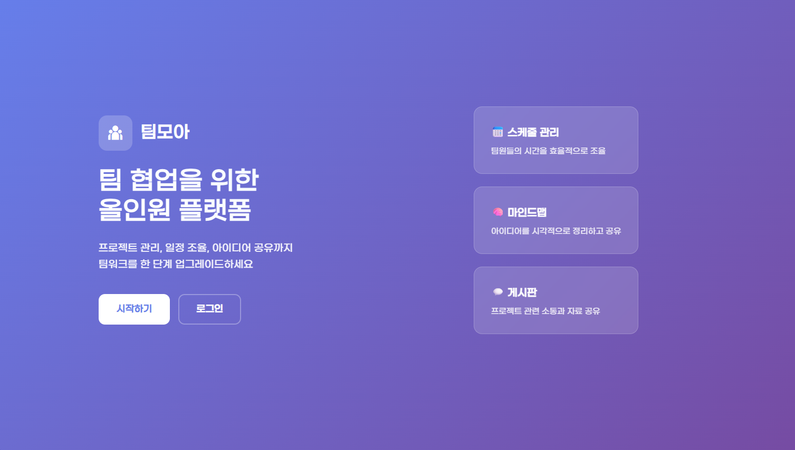
*TeamMoa 랜딩 페이지 - 팀 협업을 위한 올인원 플랫폼*

---

[](https://djangoproject.com/) [](https://python.org/) [](https://mysql.com/) [](https://docker.com/)

---

## 💡 프로젝트 소개

**TeamMoa**는 팀 협업에 필요한 모든 도구를 하나로 모은 올인원 플랫폼입니다.

### 🤔 왜 TeamMoa가 필요한가?

팀 프로젝트를 진행하다 보면 **"언제 만날 수 있지?", "아이디어를 어떻게 정리하지?", "누가 뭘 하고 있지?"** 같은 고민에 여러 툴을 오가며 시간을 낭비합니다.
TeamMoa는 이러한 불편함을 해소하기 위해 **스케줄 조율, 마인드맵 협업, TODO 관리를 하나의 플랫폼**에서 제공합니다.

### 🎯 핵심 가치

- **실시간 협업** - WebSocket 기반 마인드맵 동시 편집, 팀원 커서 실시간 표시
- **직관적인 UX** - 드래그앤드롭으로 TODO 할당, 마일스톤 일정 조정
- **스마트 스케줄** - 팀원 가용 시간 자동 분석, 최적의 회의 시간 제안
<!-- AUTO:TEST_COUNT -->
- **검증된 안정성** - 249개 테스트, 부하 테스트 통과 (95%ile 70ms)
- **프로덕션 운영** - AWS ALB + Multi-AZ 고가용성, 무중단 배포

---

## 🎨 주요 기능

### 1️⃣ 팀 대시보드
> 팀 현황을 한눈에, 마일스톤과 멤버 관리

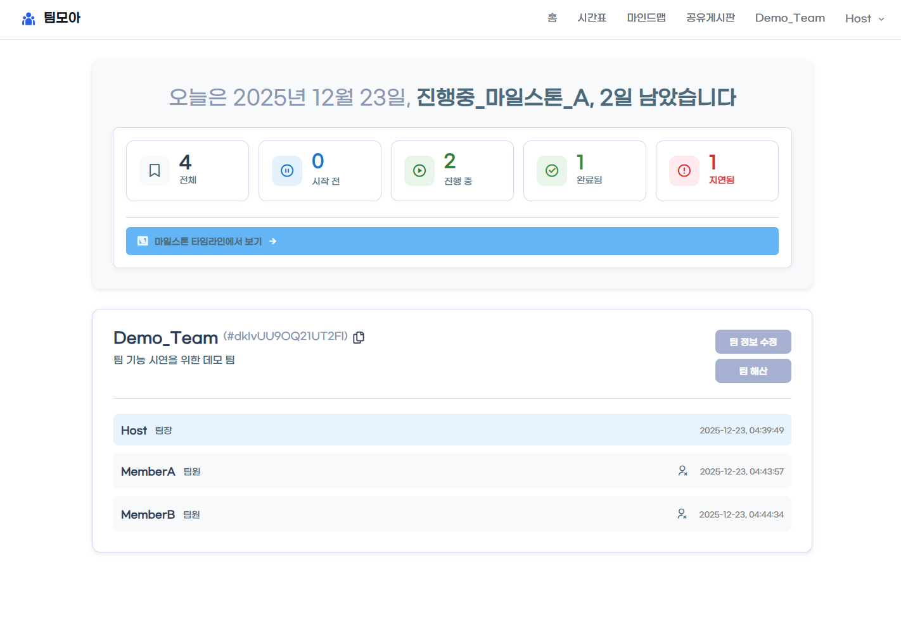

**핵심 기능**:
- ✅ 마일스톤 진행 현황 요약 (전체/진행 중/완료/지연)
- ✅ 팀원 목록 및 가입 시간 표시
- ✅ 팀 정보 카드 (팀 코드, 설명)
- ✅ 팀 관리 및 해체 기능 (팀장 권한)

---

### 2️⃣ 직관적인 TODO 관리
> 드래그앤드롭으로 할 일 관리, 팀원 간 협업

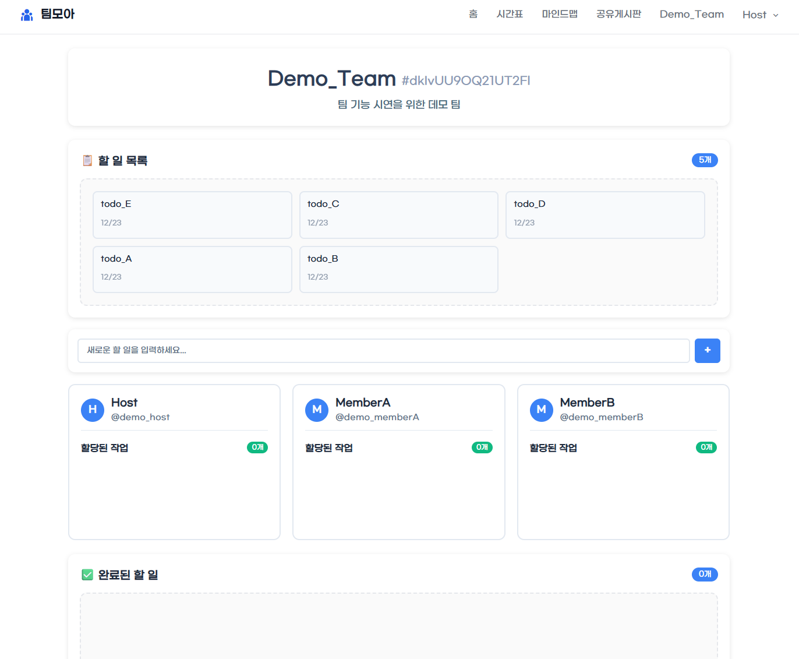

**팀장 관점 - TODO 할당**:

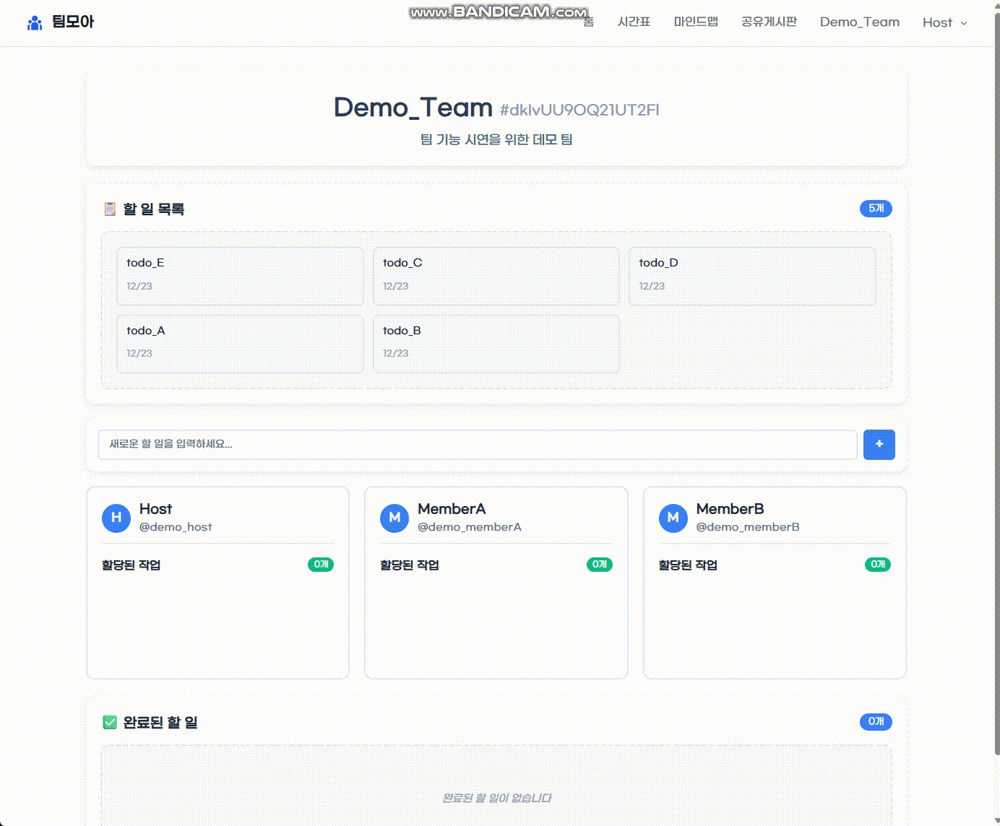

**팀원 관점 - TODO 처리**:

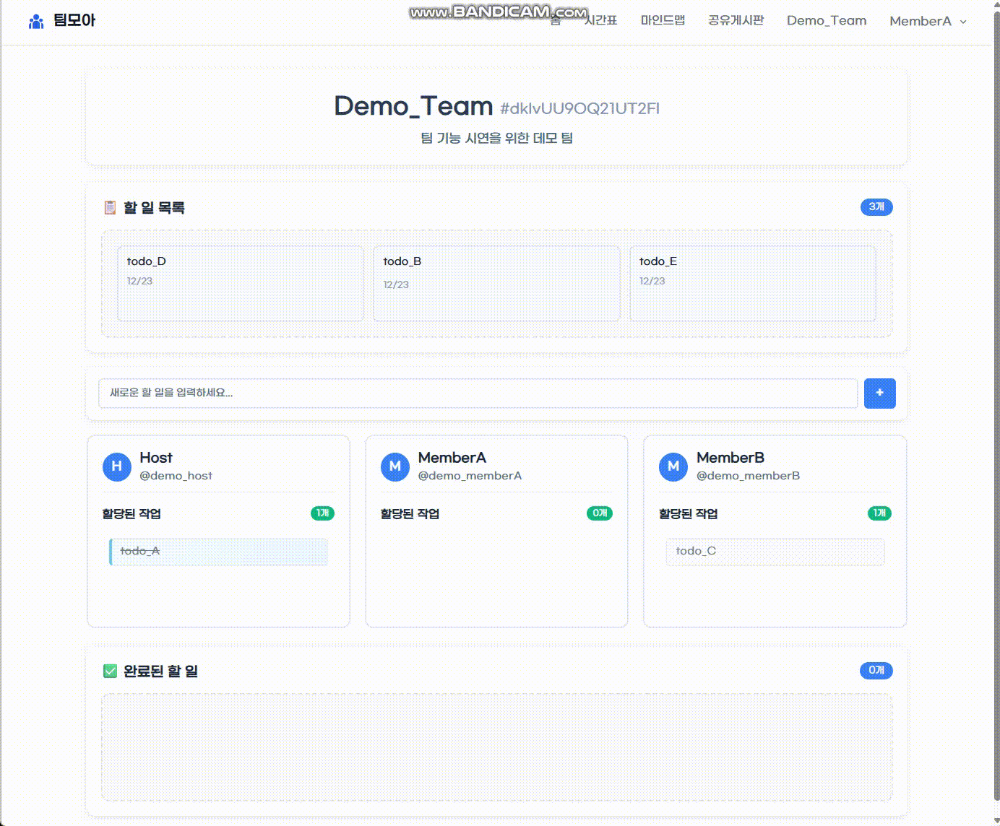

**핵심 기능**:
- ✅ 3단 보드 구조 (할 일 → 팀원 → 완료)
- ✅ 드래그앤드롭으로 TODO 할당
- ✅ 권한 기반 UI (팀장/팀원 구분)
- ✅ 실시간 상태 업데이트

---

### 3️⃣ 실시간 마인드맵 협업
> WebSocket 기반 동시 편집, Canvas API 활용

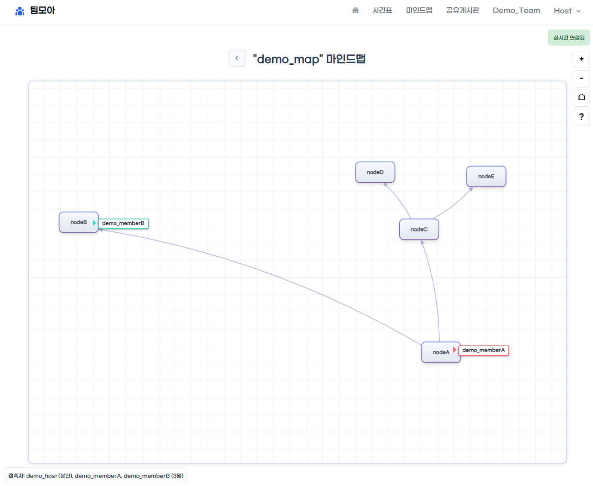

**실시간 협업 시연**:

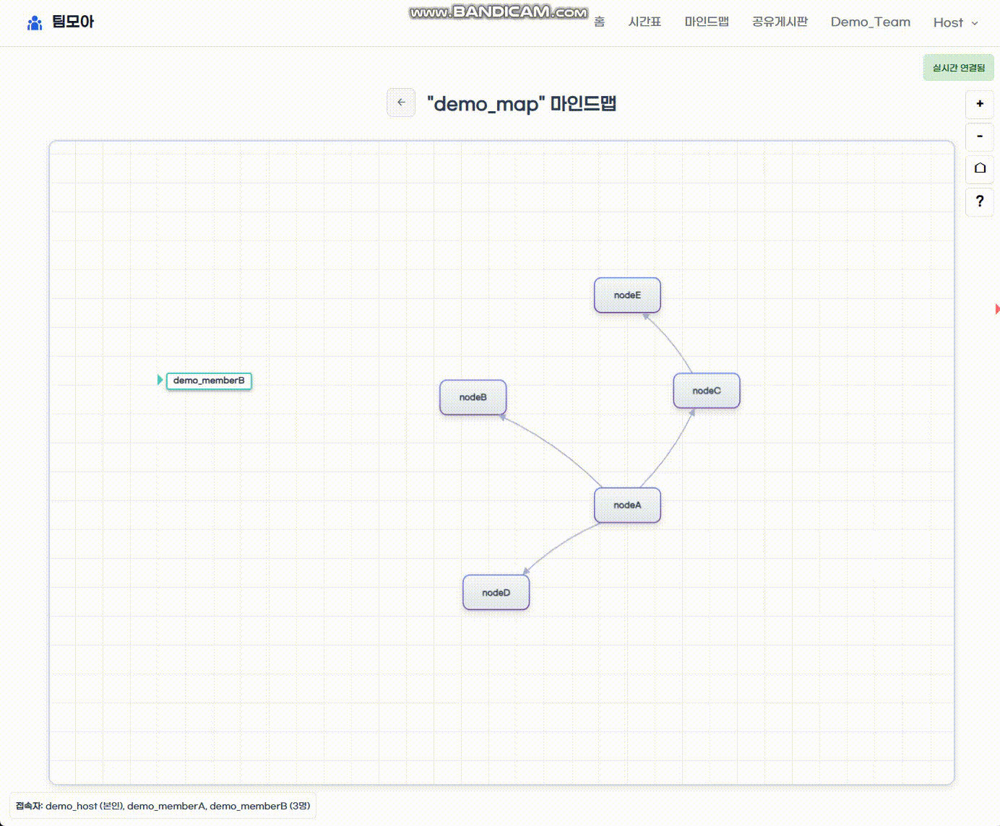

**핵심 기능**:
- ✅ Canvas 기반 노드 에디터
- ✅ 드래그앤드롭으로 노드 이동
- ✅ Ctrl + 드래그로 연결선 생성
- ✅ WebSocket 실시간 동기화
- ✅ 다중 사용자 커서 표시

---

### 4️⃣ 마일스톤 타임라인
> 프로젝트 일정을 한눈에, 드래그로 간편하게 조정

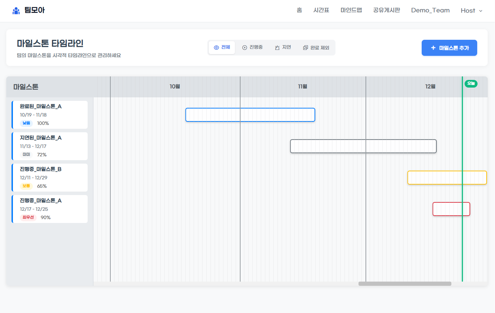

**핵심 기능**:
- ✅ 연간 타임라인 캘린더
- ✅ 드래그로 마일스톤 날짜 변경
- ✅ 상태별 색상 구분 (진행 중, 완료, 지연)
- ✅ 진행률(%) 실시간 추적

---

### 5️⃣ 팀 스케줄 & 가용성 관리
> 팀원들의 일정을 자동으로 분석하여 최적의 회의 시간 제안

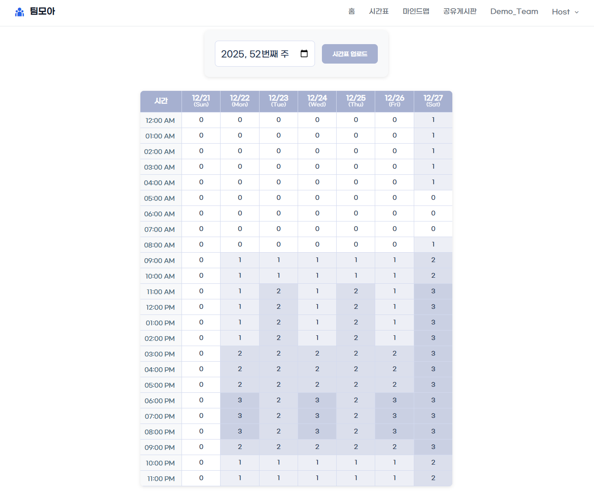

**핵심 기능**:
- ✅ 주간 가용성 그리드 (7일 × 24시간)
- ✅ 팀원별 가용 시간 시각화
- ✅ 교차 분석: 모든 팀원이 가능한 시간 자동 표시
- ✅ CSV 업로드로 일정 간편 등록

---

## 🏗️ 기술 스택 & 아키텍처

```
Backend:   Django 5.2.4 | Django Channels | Django REST Framework | MySQL 8.0 | Redis 7.0
Frontend:  HTML, CSS, JavaScript (Canvas API, Fetch API)
Infrastructure: AWS ALB | EC2 (Multi-AZ) | Docker Compose | Nginx | ACM SSL
DevOps:    GitHub Actions (Rolling Update) | Docker Hub
Architecture: Service Layer Pattern | Hybrid SSR + API
<!-- AUTO:TEST_COUNT -->
Testing:   pytest (249 tests) | Locust (부하 테스트)
```

### 아키텍처 다이어그램

#### 1. AWS 인프라 아키텍처
> 프로덕션 배포 환경: AWS ALB + Multi-AZ EC2 + Docker + CI/CD 파이프라인


#### 2. CI/CD 파이프라인 흐름
> GitHub Actions 기반 자동화된 테스트, 빌드, 배포 워크플로우


#### 3. 데이터베이스 ERD
> 팀 중심의 협업 데이터 구조

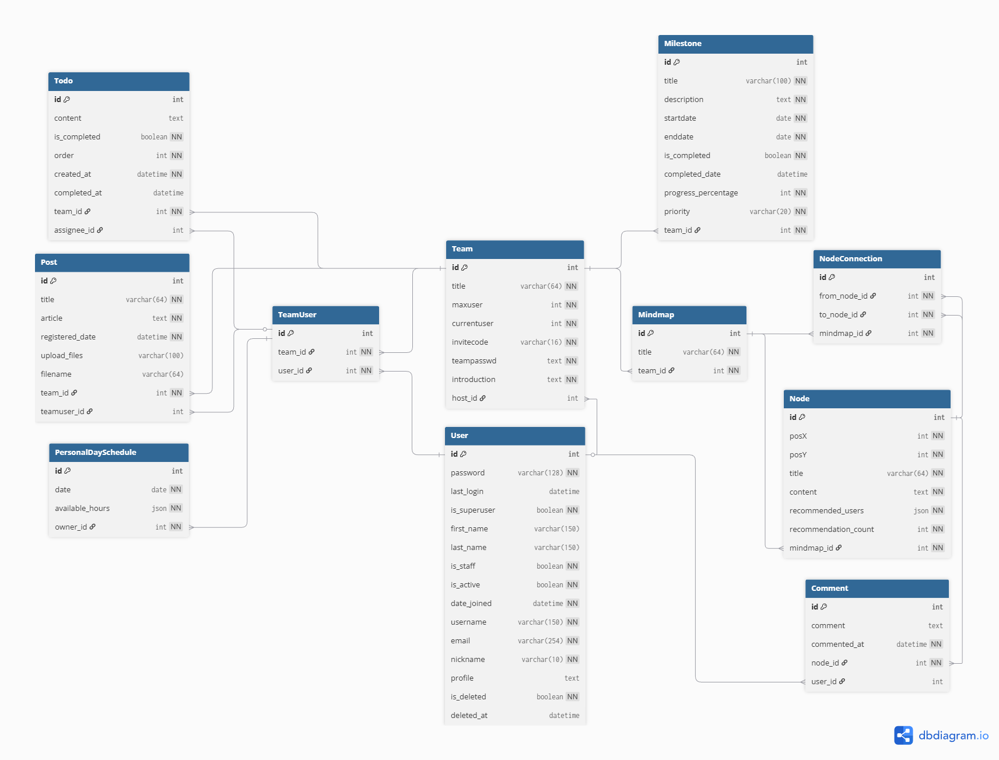

---

## 📊 프로덕션 성능 검증

> **Locust 부하 테스트** (2025.12.16 실시)

### 테스트 환경
- **인프라**: AWS ALB + EC2 t3.micro × 2대 (Multi-AZ)
- **도구**: Locust (오픈소스 부하 테스트 프레임워크)
- **전략**: 점진적 부하 증가 (20명 → 50명 → 100명 → 150명)
- **총 요청 수**: 56,903건 (로그인 제외, 4회 반복 테스트)

### 테스트 시나리오 (실제 사용자 행동 시뮬레이션)

8가지 주요 작업을 가중치에 따라 무작위 실행:

| 번호 | 작업 | 가중치 | 총 요청 | 설명 |
|------|------|--------|---------|------|
| 01 | 홈 페이지 조회 | 25% | 14,069건 | 랜딩 페이지 |
| 02 | 팀 목록 조회 (API) | 20% | 11,507건 | 소속 팀 확인 |
| 03 | 팀 상세 정보 (API) | 15% | 8,537건 | 팀 정보, 마일스톤 |
| 04 | TODO 목록 조회 (API) | 15% | 8,582건 | 실시간 TODO |
| 05 | 공유게시판 조회 | 10% | 5,632건 | 팀 게시판 |
| 06 | 스케줄 조회 (API) | 10% | 5,736건 | 주간 가용 시간 |
| 07 | Health Check | 5% | 2,840건 | 헬스 체크 |
| | **합계** | **100%** | **56,903건** | |

```python
# locustfile.py - 실제 코드 일부
@task(25)  # 가중치 25%
def view_home(self):
    self.client.get("/", name="02_홈_페이지")

@task(20)  # 가중치 20%
def view_teams(self):
    self.client.get("/api/v1/teams/", name="03_API_팀_목록")
```

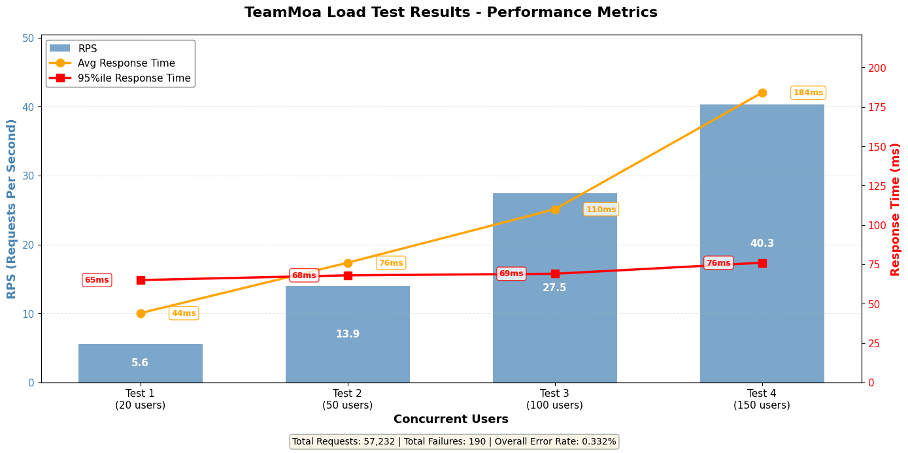
*4회 테스트 비교 (RPS, 응답시간, 에러율)*

### 핵심 성과

| 지표 | 목표 (SLA) | 측정값 | 달성 여부 |
|------|----------|--------|----------|
| **95%ile 응답 시간** | ≤ 500ms | **70ms** | ✅ **86% 향상** |
| **평균 응답 시간** | - | **52ms** | ✅ **매우 안정적** |
| **에러율** | ≤ 1% | **0.32%** | ✅ **68% 향상** |
| **최대 RPS** | ≥ 10 | **40.34** | ✅ **303% 초과 달성** |

### 테스트별 상세 결과

| 테스트 | 동시 사용자 | 총 요청 | 평균 응답 | 95%ile | RPS | 에러율 |
|--------|-----------|---------|----------|--------|-----|--------|
| Test 1 | 20명 | 3,321건 | 43ms | 65ms | 5.57 | 0.00% |
| Test 2 | 50명 | 8,321건 | 42ms | 68ms | 13.95 | 0.00% |
| Test 3 | 100명 | 16,373건 | 52ms | 69ms | 27.46 | 0.00% |
| Test 4 | 150명 | 28,888건 | 70ms | 76ms | 40.34 | 0.63% |

**참고**: 로그인 API는 테스트 초기 1회만 실행되어 집계에서 제외

### 주요 검증 사항
- ✅ **로드밸런싱**: EC2-Web1, Web2 트래픽 균등 분산 (약 50:50)
- ✅ **선형적 확장성**: 20명 → 150명 부하 증가 시 응답 시간 40% 증가 (양호)
- ✅ **고가용성**: Health Check 0% 에러율
- ✅ **무중단 배포**: 배포 중 200 응답 유지

> 📄 **상세 리포트**: [Locust 부하 테스트 전체 결과](./docs/guides/load-testing/load-test-report.md)

---

## 📚 포트폴리오 문서

> **기술 중심, 검증 가능한 수치, 문제 해결 과정 중심 작성**

### 핵심 문서
- **[프로젝트 개요](./docs/portfolio/overview.md)** - 배경, 핵심 기능, 성과, 학습 내용
- **[아키텍처 설계](./docs/portfolio/architecture.md)** - 서비스 레이어 패턴, 하이브리드 SSR+API
- **[인프라 및 배포](./docs/portfolio/infrastructure.md)** - Docker, CI/CD, AWS EC2
<!-- AUTO:TEST_COUNT -->
- **[테스트 전략](./docs/portfolio/testing.md)** - 249개 테스트, fixture 패턴
- **[트러블슈팅](./docs/portfolio/troubleshooting.md)** - 8건 문제 해결 사례

### 기능 상세
- **[실시간 마인드맵](./docs/portfolio/features/realtime-mindmap.md)** - WebSocket + Canvas API
- **[OAuth 2.0 인증](./docs/portfolio/features/oauth-authentication.md)** - django-allauth, 계정 병합
- **[성능 최적화](./docs/portfolio/features/performance-optimization.md)** - N+1 쿼리 해결, 81% 감소

---

## 🚀 빠른 시작

### **로컬 개발 환경**

```bash
# 1. 프로젝트 클론
git clone https://github.com/TlesMes/TeamMoa-Refactor.git
cd TeamMoa

# 2. 환경 변수 설정
cp .env.example .env
# .env 파일에서 데이터베이스 설정 완료

# 3. Docker Compose로 실행
docker-compose up -d

# 4. 마이그레이션 및 슈퍼유저 생성
docker-compose exec web python manage.py migrate
docker-compose exec web python manage.py createsuperuser

# 5. 접속
# 🌐 http://localhost:8000
# 🔧 http://localhost:8000/admin (관리자 페이지)
```

### **프로덕션 배포**

```bash
# GitHub Actions 자동 배포 (main 브랜치 push 시)
git push origin main

# 수동 배포
docker-compose -f docker-compose.prod.yml up -d
```

---

## 📁 프로젝트 구조

```
TeamMoa/
├── accounts/           # 인증 시스템 (이메일 인증, OAuth 2.0, Soft Delete)
├── teams/              # 팀 & 마일스톤 관리 (권한 시스템)
├── members/            # 멤버 & TODO 관리 (API 기반 실시간 UI)
├── schedules/          # 스케줄 & 가용성 관리 (JSON 168슬롯)
├── mindmaps/           # 실시간 마인드맵 협업 (WebSocket + Canvas)
├── shares/             # 공유 게시판 & 파일 관리 (드래그 앤 드롭)
├── config/             # Django 설정 (settings, urls, asgi)
├── static/             # 정적 파일 (CSS 모듈, JavaScript)
├── templates/          # 템플릿 (base_team, base_user, base_public)
├── docs/               # 프로젝트 문서 (96p, 150+ 코드 예시)
│   ├── portfolio/      # 포트폴리오 문서 (아키텍처, 인증, 실시간, CI/CD)
│   ├── architecture/   # 아키텍처 설계 & 리팩토링 히스토리
│   │   ├── design/     # 정적 구조 (API 매핑, 가이드라인)
│   │   ├── refactoring/# 시간의 흐름 (CBV, 서비스, API, Mindmaps)
│   │   └── migration/  # 마이그레이션 로드맵
│   ├── guides/         # 설정 가이드 (OAuth, 배포, 테스트)
│   ├── development/    # 성능, UI/UX, 기능 개선
│   ├── troubleshooting/# 문제 해결 사례
│   └── archive/        # 구버전 문서 (참고용)
├── .github/workflows/  # GitHub Actions CI/CD 파이프라인
├── docker-compose.yml  # 개발 환경 Docker 설정
├── docker-compose.prod.yml # 프로덕션 환경 Docker 설정
<!-- AUTO:TEST_COUNT -->
└── pytest.ini          # 테스트 설정 (249개 테스트)
```

---

## 📄 라이선스

이 프로젝트는 MIT 라이선스 하에 배포됩니다.

---
