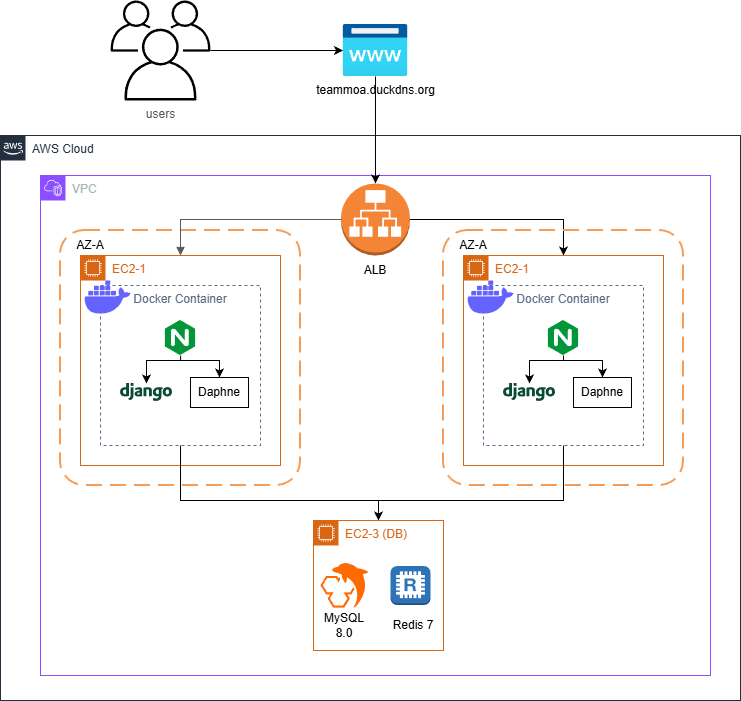
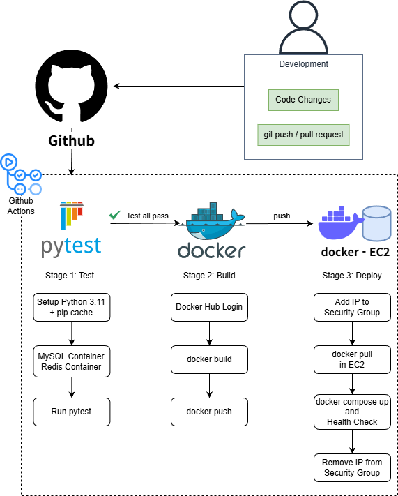

# TeamMoa - 팀 협업 플랫폼

> Django 기반의 **실시간 협업 플랫폼**
> WebSocket, 서비스 레이어 아키텍처, CI/CD 자동화를 적용한 프로젝트


[](https://teammoa.duckdns.org)
[](https://djangoproject.com/) [](https://python.org/) [](https://mysql.com/) [](https://docker.com/)

---

## 💡 프로젝트 소개

**TeamMoa**는 팀 프로젝트 관리를 위한 올인원 협업 플랫폼입니다.
실시간 마인드맵 협업, 스케줄 조율, TODO 관리 등 팀 프로젝트에 필요한 핵심 기능을 제공합니다.

### 🎯 핵심 가치

- **견고한 아키텍처** - 서비스 레이어 패턴으로 비즈니스 로직 완전 분리
- **실시간 협업** - Django Channels + WebSocket 기반 동시 편집
- **높은 품질** - 225개 테스트 구축 및 자동화
- **자동화** - GitHub Actions CI/CD 파이프라인 구축
- **성능 최적화** - N+1 쿼리 해결 및 DB 최적화

---

## 📚 포트폴리오 문서

> **기술 중심, 검증 가능한 수치, 문제 해결 과정 중심 작성**

### 핵심 문서
- **[프로젝트 개요](./docs/portfolio/overview.md)** - 배경, 핵심 기능, 성과, 학습 내용
- **[아키텍처 설계](./docs/portfolio/architecture.md)** - 서비스 레이어 패턴, 하이브리드 SSR+API
- **[인프라 및 배포](./docs/portfolio/infrastructure.md)** - Docker, CI/CD, AWS EC2
- **[테스트 전략](./docs/portfolio/testing.md)** - 225개 테스트, fixture 패턴
- **[트러블슈팅](./docs/portfolio/troubleshooting.md)** - 8건 문제 해결 사례

### 기능 상세
- **[실시간 마인드맵](./docs/portfolio/features/realtime-mindmap.md)** - WebSocket + Canvas API
- **[OAuth 2.0 인증](./docs/portfolio/features/oauth-authentication.md)** - django-allauth, 계정 병합
- **[성능 최적화](./docs/portfolio/features/performance-optimization.md)** - N+1 쿼리 해결, 81% 감소

---

## 🎨 주요 기능

| 기능 | 설명 | 핵심 기술 |
|------|------|----------|
| **실시간 마인드맵** | WebSocket 기반 동시 편집, 드래그 앤 드롭 캔버스 | Django Channels, Canvas API |
| **스마트 스케줄** | 주간 가용 시간 관리, 팀 공통 가능 시간 자동 계산 | JSON 데이터, REST API |
| **팀 관리** | Leader/Member 권한 분리, 마일스톤 추적 | 서비스 레이어 패턴 |
| **TODO & 공유** | API 기반 실시간 TODO, 파일 공유 게시판 | DRF, AJAX |

---

## 🏗️ 기술 스택 & 아키텍처

```
Backend:   Django 5.2.4 | Django Channels | Django REST Framework | MySQL 8.0 | Redis 7.0
Frontend:  HTML, CSS, JavaScript
DevOps:    Docker Compose | GitHub Actions | AWS EC2 | Nginx
Architecture: Service Layer Pattern | Class-Based Views (CBV)
Testing:   pytest (225 tests)
```

### 아키텍처 다이어그램

#### 1. AWS 인프라 아키텍처
> 프로덕션 배포 환경: AWS ALB + Multi-AZ EC2 + Docker + CI/CD 파이프라인



#### 2. CI/CD 파이프라인 흐름
> GitHub Actions 기반 자동화된 테스트, 빌드, 배포 워크플로우



#### 3. 데이터베이스 ERD
> 팀 중심의 협업 데이터 구조


---

## 🚀 빠른 시작

### **로컬 개발 환경**

```bash
# 1. 프로젝트 클론
git clone https://github.com/TlesMes/TeamMoa-Refactor.git
cd TeamMoa

# 2. 환경 변수 설정
cp .env.example .env
# .env 파일에서 데이터베이스 설정 완료

# 3. Docker Compose로 실행
docker-compose up -d

# 4. 마이그레이션 및 슈퍼유저 생성
docker-compose exec web python manage.py migrate
docker-compose exec web python manage.py createsuperuser

# 5. 접속
# 🌐 http://localhost:8000
# 🔧 http://localhost:8000/admin (관리자 페이지)
```

### **프로덕션 배포**

```bash
# GitHub Actions 자동 배포 (main 브랜치 push 시)
git push origin main

# 수동 배포
docker-compose -f docker-compose.prod.yml up -d
```

---

## 📁 프로젝트 구조

```
TeamMoa/
├── accounts/           # 인증 시스템 (이메일 인증, OAuth 2.0, Soft Delete)
├── teams/              # 팀 & 마일스톤 관리 (권한 시스템)
├── members/            # 멤버 & TODO 관리 (API 기반 실시간 UI)
├── schedules/          # 스케줄 & 가용성 관리 (JSON 168슬롯)
├── mindmaps/           # 실시간 마인드맵 협업 (WebSocket + Canvas)
├── shares/             # 공유 게시판 & 파일 관리 (드래그 앤 드롭)
├── config/             # Django 설정 (settings, urls, asgi)
├── static/             # 정적 파일 (CSS 모듈, JavaScript)
├── templates/          # 템플릿 (base_team, base_user, base_public)
├── docs/               # 프로젝트 문서 (96p, 150+ 코드 예시)
│   ├── portfolio/      # 포트폴리오 문서 (아키텍처, 인증, 실시간, CI/CD)
│   ├── architecture/   # 아키텍처 설계 & 리팩토링 히스토리
│   │   ├── design/     # 정적 구조 (API 매핑, 가이드라인)
│   │   ├── refactoring/# 시간의 흐름 (CBV, 서비스, API, Mindmaps)
│   │   └── migration/  # 마이그레이션 로드맵
│   ├── guides/         # 설정 가이드 (OAuth, 배포, 테스트)
│   ├── development/    # 성능, UI/UX, 기능 개선
│   ├── troubleshooting/# 문제 해결 사례
│   └── archive/        # 구버전 문서 (참고용)
├── .github/workflows/  # GitHub Actions CI/CD 파이프라인
├── docker-compose.yml  # 개발 환경 Docker 설정
├── docker-compose.prod.yml # 프로덕션 환경 Docker 설정
└── pytest.ini          # 테스트 설정 (221개 테스트)
```

---

## 📄 라이선스

이 프로젝트는 MIT 라이선스 하에 배포됩니다.

---
