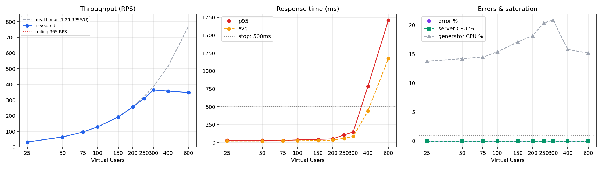

# TeamMoa - 팀 협업 플랫폼

> Django 기반의 **실시간 협업 플랫폼**
> WebSocket, 서비스 레이어 아키텍처, CI/CD 자동화를 적용한 프로젝트

### 🖼️ 서비스 미리보기

*TeamMoa 랜딩 페이지 - 팀 협업을 위한 올인원 플랫폼*

---

[](https://djangoproject.com/) [](https://python.org/) [](https://mysql.com/) [](https://docker.com/)

---

## 📑 목차

- [프로젝트 소개](#-프로젝트-소개)
- [주요 기능](#-주요-기능)
  - [팀 대시보드](#1️⃣-팀-대시보드)
  - [직관적인 TODO 관리](#2️⃣-직관적인-todo-관리)
  - [실시간 마인드맵 협업](#3️⃣-실시간-마인드맵-협업)
  - [마일스톤 타임라인](#4️⃣-마일스톤-타임라인)
  - [팀 스케줄 & 가용성 관리](#5️⃣-팀-스케줄--가용성-관리)
- [기술 스택 & 아키텍처](#️-기술-스택--아키텍처)
- [성능 검증 — 부하 테스트로 한계점 탐색](#-성능-검증--부하-테스트로-한계점-탐색)
- [기술 문서](#-기술-문서)
- [빠른 시작](#-빠른-시작)
- [프로젝트 구조](#-프로젝트-구조)
- [라이선스](#-라이선스)

---

## 💡 프로젝트 소개

**TeamMoa**는 팀 협업에 필요한 모든 도구를 하나로 모은 올인원 플랫폼입니다.

### 🤔 왜 TeamMoa가 필요한가?

팀 프로젝트를 진행하다 보면 **"언제 만날 수 있지?", "아이디어를 어떻게 정리하지?", "누가 뭘 하고 있지?"** 같은 고민에 여러 툴을 오가며 시간을 낭비합니다.
TeamMoa는 이러한 불편함을 해소하기 위해 **스케줄 조율, 마인드맵 협업, TODO 관리를 하나의 플랫폼**에서 제공합니다.

### 🎯 핵심 가치

- **실시간 협업** - WebSocket 기반 마인드맵 동시 편집, 팀원 커서 실시간 표시
- **직관적인 UX** - 드래그앤드롭으로 TODO 할당, 마일스톤 일정 조정
- **스마트 스케줄** - 팀원 가용 시간 자동 분석, 최적의 회의 시간 제안
<!-- AUTO:TEST_COUNT -->
- **검증된 안정성** - 264개 테스트, 부하 테스트 통과 (95%ile 70ms)
- **프로덕션 운영** - AWS ALB + Multi-AZ 고가용성, 무중단 배포

---

## 🎨 주요 기능

### 1️⃣ 팀 대시보드
> 팀 현황을 한눈에, 마일스톤과 멤버 관리


**핵심 기능**:
- ✅ 마일스톤 진행 현황 요약 (전체/진행 중/완료/지연)
- ✅ 팀원 목록 및 가입 시간 표시
- ✅ 팀 정보 카드 (팀 코드, 설명)
- ✅ 팀 관리 및 해체 기능 (팀장 권한)

---

### 2️⃣ 직관적인 TODO 관리
> 드래그앤드롭으로 할 일 관리, 팀원 간 협업


**팀장 관점 - TODO 할당**:


**팀원 관점 - TODO 처리**:


**핵심 기능**:
- ✅ 3단 보드 구조 (할 일 → 팀원 → 완료)
- ✅ 드래그앤드롭으로 TODO 할당
- ✅ 권한 기반 UI (팀장/팀원 구분)
- ✅ 실시간 상태 업데이트

---

### 3️⃣ 실시간 마인드맵 협업
> WebSocket 기반 동시 편집, Canvas API 활용


**실시간 협업 시연**:


**핵심 기능**:
- ✅ Canvas 기반 노드 에디터
- ✅ 드래그앤드롭으로 노드 이동
- ✅ Ctrl + 드래그로 연결선 생성
- ✅ WebSocket 실시간 동기화
- ✅ 다중 사용자 커서 표시

---

### 4️⃣ 마일스톤 타임라인
> 프로젝트 일정을 한눈에, 드래그로 간편하게 조정


**핵심 기능**:
- ✅ 연간 타임라인 캘린더
- ✅ 드래그로 마일스톤 날짜 변경
- ✅ 상태별 색상 구분 (진행 중, 완료, 지연)
- ✅ 진행률(%) 실시간 추적

---

### 5️⃣ 팀 스케줄 & 가용성 관리
> 팀원들의 일정을 자동으로 분석하여 최적의 회의 시간 제안


**핵심 기능**:
- ✅ 주간 가용성 그리드 (7일 × 24시간)
- ✅ 팀원별 가용 시간 시각화
- ✅ 교차 분석: 모든 팀원이 가능한 시간 자동 표시
- ✅ CSV 업로드로 일정 간편 등록

---

## 🏗️ 기술 스택 & 아키텍처

```
Backend:   Django 5.2.4 | Django Channels | Django REST Framework | MySQL 8.0 | Redis 7.0
Frontend:  HTML, CSS, JavaScript (Canvas API, Fetch API)
Infrastructure: AWS ALB | EC2 (Multi-AZ) | Docker Compose | Nginx | ACM SSL
DevOps:    GitHub Actions (Rolling Update) | Docker Hub
Architecture: Service Layer Pattern | Hybrid SSR + API
<!-- AUTO:TEST_COUNT -->
Testing:   pytest (264 tests) | Locust (부하 테스트)
```

### 아키텍처 다이어그램

#### 1. AWS 인프라 아키텍처
> 프로덕션 배포 환경: AWS ALB + Multi-AZ EC2 + Docker + CI/CD 파이프라인


#### 2. CI/CD 파이프라인 흐름
> GitHub Actions 기반 자동화된 테스트, 빌드, 배포 워크플로우


#### 3. 데이터베이스 ERD
> 팀 중심의 협업 데이터 구조


---

## 📊 성능 검증 — 부하 테스트로 한계점 탐색

> **2026.09.11 로컬 재측정.** 처리량 천장을 찾고, 무엇이 먼저 한계에 닿는지 특정하고,
> 배포 구성을 바꿔 천장을 **4.0배** 올렸다.
> 📄 전체 리포트: [REPORT.md](./docs/guides/load-testing/local-knee/REPORT.md)

### 측정 원칙

- **중단 조건을 측정 전에 고정했고 결과를 보고 바꾸지 않았다.**
  `p95 > 500ms` 또는 `에러율 > 1%` — 둘 중 하나라도 위반한 첫 단계를 무릎(knee)으로 판정.
  판정은 스폰 완료 후 60초를 버린 정상 상태 구간만 사용.
- **부하 생성기는 별도 기계(노트북)에서 실행.** 같은 기계에서 돌리면 생성기가 먼저
  병목이 되어 서버 한계를 잴 수 없다. 전 단계에서 생성기 CPU(최대 20.8%)와
  네트워크 사용률(용량의 19%)을 기록해 병목이 아님을 확인했다.
- **서버 CPU / MySQL 커넥션 / 호스트 부하를 3초 간격으로 연속 수집**해 부하 곡선과
  같은 시간축에 놓았다.

### 결과 — Nginx + Daphne 6프로세스

| VU | Locust RPS | 서버 req/s¹ | 평균 | **p95** | 에러율 | 판정 |
|---:|---:|---:|---:|---:|---:|---|
| 25 | 32.2 | 40 | 22ms | **31ms** | 0% | 정상 |
| 50 | 64.5 | 81 | 22ms | **32ms** | 0% | 정상 |
| 100 | 128.9 | 161 | 25ms | **38ms** | 0% | 정상 |
| 150 | 192.6 | 241 | 29ms | **46ms** | 0% | 정상 |
| 200 | 255.7 | 320 | 36ms | **52ms** | 0% | 정상 |
| 250 | 309.9 | 387 | 59ms | 107ms | 0% | 정상 |
| **300** | **364.5** | **456** | 87ms | 150ms | 0% | 정상 |
| 400 | 357.5 | 447 | 439ms | **784ms** | 0% | 위반 |
| 600 | 348.4 | 436 | 1,177ms | 1,712ms | 0% | 위반 |

¹ **서버 req/s = Locust RPS × 1.25.** 홈 태스크(가중치 25%)가 `/` → 302 → `/teams/` 로
서버에 2번 왕복하는데 Locust는 1건으로 집계한다. 서버가 실제 처리한 요청 수는 서버 req/s다.
굵게 표시한 VU 300이 최대 처리량이며, 이후 VU를 2배로 늘려도 처리량은 그대로고 지연만 늘어난다.


*좌: RPS와 선형 기준선 · 중: 응답시간 · 우: 에러율과 서버/생성기 CPU*

### 핵심 결론

| | 값 |
|---|---|
| **선형 확장 구간** | VU 25~200 — VU당 1.286 RPS로 예측한 값 대비 오차 ±0.6% 이내, p95 30~52ms 유지 |
| **처리량 천장** | **456 req/s** (Locust 집계 364.5 RPS) — VU 300/400/600 세 점이 평평 |
| **무릎** | VU 300~400 (p95 150ms → 784ms) |
| **먼저 닿은 한계** | **호스트 물리 코어 6개** (아래 대조 실험) |

### 병목 확정 — 프로세스 1 / 3 / 6개 대조 실험

곡선만으로는 "GIL인가, DB인가, 호스트인가"를 구분할 수 없어 **같은 VU 400을 프로세스
수만 바꿔 재측정**했다.

| 구성 | 프로세스당 CPU | 컨테이너 CPU 합계 | 서버 req/s | 해석 |
|---|---:|---:|---:|---|
| 1프로세스 | 127% | 1.5코어 | 114 | GIL 천장. 호스트 CPU 25~36%로 여유 |
| 3프로세스 | **134%** | 4.7코어 (물리 6코어 이내) | 278 | 프로세스별 GIL까지 도달 |
| 6프로세스 | **109%** | **7.6코어** (물리 6코어 초과) | 432 | **물리 코어 부족으로 억제** |

3프로세스일 때 프로세스당 134%로 단일 프로세스(127%)보다 **높다** → GIL이 천장이 아니다.
6프로세스에서 109%로 **떨어지는** 것은 물리 코어가 없어서다.
`물리 6코어 × SMT 실효 1.27 ≈ 7.6코어` 가 실측 7.59코어와 일치한다.
DB는 `Threads_running` 2~3으로 전 구간 한가했다.

> **단일 프로세스 구성(1차)의 한계는 하드웨어가 아니라 배포 구성이었다.**
> 앱 프로세스 하나가 127%에서 멈추는 동안 호스트 CPU는 25~36%였다.
> 프로세스를 6개로 늘리자 천장이 114 → 456 req/s 로 올라갔고,
> 그제야 한계가 하드웨어(물리 코어)로 옮겨갔다.

### 부수 발견 — DB 커넥션 누수 (프로덕션 버그)

1차 측정에서 VU 634에 **에러율 19.89%** 가 났다. 원인은 지연이 아니라 **커넥션 고갈**:
`CONN_MAX_AGE=600` 이 동작하지 않아 요청 20건에 커넥션이 22개 늘고(재사용 0),
반납되지 않은 채 `wait_timeout` 8시간 동안 남는다. `max_connections` 상한에 닿으면
`OperationalError: Too many connections` → HTTP 500.
2차에서 상한을 올리자 VU 600에서도 에러율 0%로 확인됐다.
prod의 `max_connections` 는 기본값 151이므로 멀티프로세스 배포 전에 반드시 고쳐야 한다.

### 측정 환경

| | 서버 | 부하 생성기 |
|---|---|---|
| 하드웨어 | Ryzen 5 5600 (6C/12T), 32GB | i7-8750H (6C/12T), 17GB |
| 스택 | Docker (WSL2) — Nginx + Daphne ×6 + MySQL 8.0 + Redis 7 | Locust master + 워커 6개 |
| 설정 | prod 상속, `DEBUG=False`, throttle 해제², `max_connections=2000`² | `wait_time = between(0.5, 1)` |

² 의도적 차이. DRF throttle은 익명 로그인에 IP 단위로 걸려 단일 생성기에서는 서버 한계가
아니라 DRF 카운터를 재게 되므로 해제. `max_connections` 는 위 누수 때문에 상향. 둘 다 리포트에 명시.

> 📄 **이전 AWS 측정 (2025.12.16)**: [load-test-report.md](./docs/guides/load-testing/load-test-report.md)
> — ALB + EC2 t3.micro ×2 환경. 하드웨어와 부하 밀도(VU당 0.29 RPS vs 1.29 RPS)가 달라
> **절대값 비교 불가.** 당시 무릎을 찾지 못한 이유는 이번 측정으로 설명된다
> (150 VU ≈ 43 RPS, 단일 프로세스 천장 91 RPS의 절반).

---

## 📚 기술 문서

> **아키텍처, 설계 결정, 문제 해결 과정 상세 기록**

### 핵심 문서
- **[프로젝트 개요](./docs/technical/overview.md)** - 배경, 핵심 기능, 성과, 학습 내용
- **[아키텍처 설계](./docs/technical/architecture.md)** - 서비스 레이어 패턴, 하이브리드 SSR+API
- **[인프라 및 배포](./docs/technical/infrastructure.md)** - Docker, CI/CD, AWS EC2
<!-- AUTO:TEST_COUNT -->
- **[테스트 전략](./docs/technical/testing.md)** - 264개 테스트, fixture 패턴
- **[트러블슈팅](./docs/technical/troubleshooting.md)** - 8건 문제 해결 사례

### 기능 상세
- **[실시간 마인드맵](./docs/technical/features/realtime-mindmap.md)** - WebSocket + Canvas API
- **[OAuth 2.0 인증](./docs/technical/features/oauth-authentication.md)** - django-allauth, 계정 병합
- **[성능 최적화](./docs/technical/features/performance-optimization.md)** - N+1 쿼리 해결, 81% 감소

---

## 🚀 빠른 시작

### **로컬 개발 환경**

```bash
# 1. 프로젝트 클론
git clone https://github.com/TlesMes/TeamMoa-Refactor.git
cd TeamMoa

# 2. 환경 변수 설정
cp .env.example .env
# .env 파일에서 데이터베이스 설정 완료

# 3. Docker Compose로 실행
docker-compose up -d

# 4. 마이그레이션 및 슈퍼유저 생성
docker-compose exec web python manage.py migrate
docker-compose exec web python manage.py createsuperuser

# 5. 접속
# 🌐 http://localhost:8000
# 🔧 http://localhost:8000/admin (관리자 페이지)
```

### **프로덕션 배포**

```bash
# GitHub Actions 자동 배포 (main 브랜치 push 시)
git push origin main

# 수동 배포
docker-compose -f docker-compose.prod.yml up -d
```

---

## 📁 프로젝트 구조

```
TeamMoa/
├── accounts/           # 인증 시스템 (이메일 인증, OAuth 2.0, Soft Delete)
├── teams/              # 팀 & 마일스톤 관리 (권한 시스템)
├── members/            # 멤버 & TODO 관리 (API 기반 실시간 UI)
├── schedules/          # 스케줄 & 가용성 관리 (JSON 168슬롯)
├── mindmaps/           # 실시간 마인드맵 협업 (WebSocket + Canvas)
├── shares/             # 공유 게시판 & 파일 관리 (드래그 앤 드롭)
├── config/             # Django 설정 (settings, urls, asgi)
├── static/             # 정적 파일 (CSS 모듈, JavaScript)
├── templates/          # 템플릿 (base_team, base_user, base_public)
├── docs/               # 프로젝트 문서 (96p, 150+ 코드 예시)
│   ├── technical/      # 기술 문서 (아키텍처, 인증, 실시간, CI/CD)
│   ├── architecture/   # 아키텍처 설계 & 리팩토링 히스토리
│   │   ├── design/     # 정적 구조 (API 매핑, 가이드라인)
│   │   ├── refactoring/# 시간의 흐름 (CBV, 서비스, API, Mindmaps)
│   │   └── migration/  # 마이그레이션 로드맵
│   ├── guides/         # 설정 가이드 (OAuth, 배포, 테스트)
│   ├── development/    # 성능, UI/UX, 기능 개선
│   ├── troubleshooting/# 문제 해결 사례
│   └── archive/        # 구버전 문서 (참고용)
├── .github/workflows/  # GitHub Actions CI/CD 파이프라인
├── docker-compose.yml  # 개발 환경 Docker 설정
├── docker-compose.prod.yml # 프로덕션 환경 Docker 설정
<!-- AUTO:TEST_COUNT -->
└── pytest.ini          # 테스트 설정 (264개 테스트)
```

---

## 📄 라이선스

이 프로젝트는 MIT 라이선스 하에 배포됩니다.

---
