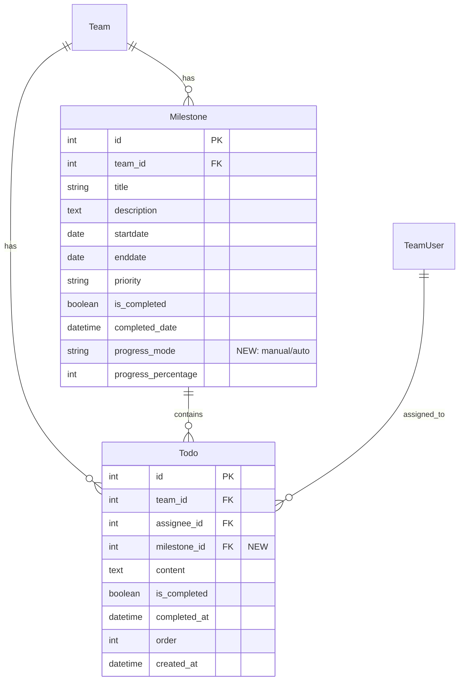

# 🎯 TeamMoa 마일스톤 개선 통합 설계 계획

> **목표**: 마일스톤-TODO 연동 + 진행률 관리 UI + 수정 모달 통합 구현
> **예상 기간**: 5-7일
> **난이도**: 🟡 중간
> **작성일**: 2025-12-25
> **Phase 1 완료**: 2025-12-26 (모델 및 마이그레이션)

---

## 📋 목차

1. [전체 아키텍처 개요](#1-전체-아키텍처-개요)
2. [데이터베이스 설계](#2-데이터베이스-설계)
3. [백엔드 설계](#3-백엔드-설계)
4. [API 설계](#4-api-설계)
5. [프론트엔드 설계](#5-프론트엔드-설계)
6. [비즈니스 로직 흐름](#6-비즈니스-로직-흐름)
7. [테스트 전략](#7-테스트-전략)
8. [구현 순서 및 일정](#8-구현-순서-및-일정)

---

## 1. 전체 아키텍처 개요

### 1-1. 시스템 구조도

```
┌─────────────────────────────────────────────────────────────────┐
│                         프론트엔드 Layer                           │
├─────────────────────────────────────────────────────────────────┤
│  1. 마일스톤 타임라인 페이지 (기존 + 신규 UI)                        │
│     ├─ 진행률 관리 UI (수동 슬라이더 + AUTO 진행 바)                │
│     ├─ 마일스톤 수정 모달 (제목/설명/우선순위/진행률모드)            │
│     ├─ TODO 연결 현황 표시                                        │
│     └─ 진행률 모드 토글 버튼                                       │
│                                                                   │
│  2. TODO 관리 페이지 (신규 기능 추가)                               │
│     ├─ 마일스톤 할당 드롭다운                                      │
│     ├─ TODO 카드에 마일스톤 배지 표시                              │
│     └─ 마일스톤별 필터링                                          │
├─────────────────────────────────────────────────────────────────┤
│                         API Layer (DRF)                          │
├─────────────────────────────────────────────────────────────────┤
│  MilestoneViewSet                  │  TodoViewSet                │
│  ├─ update (수정 모달용)            │  ├─ complete (+ 진행률 갱신) │
│  ├─ toggle_progress_mode (신규)    │  └─ assign_milestone (신규) │
│  └─ todo_stats (신규)              │                             │
├─────────────────────────────────────────────────────────────────┤
│                      Service Layer (비즈니스 로직)                 │
├─────────────────────────────────────────────────────────────────┤
│  MilestoneService                  │  TodoService                │
│  ├─ update_milestone (확장)        │  ├─ complete_todo (확장)    │
│  ├─ toggle_progress_mode (신규)    │  └─ assign_to_milestone (신규)│
│  └─ get_milestone_todo_stats (신규)│                             │
├─────────────────────────────────────────────────────────────────┤
│                         Model Layer (Django ORM)                 │
├─────────────────────────────────────────────────────────────────┤
│  Milestone                         │  Todo                       │
│  ├─ progress_mode (신규 필드)       │  ├─ milestone (신규 FK)     │
│  ├─ calculate_progress_from_todos()│  └─ save() 오버라이드       │
│  ├─ update_progress_from_todos()   │                             │
│  ├─ get_todo_stats()               │                             │
│  └─ switch_progress_mode()         │                             │
└─────────────────────────────────────────────────────────────────┘
```

### 1-2. 주요 기능 맵

| 기능 | 현재 상태 | 개선 후 |
|------|----------|---------|
| **진행률 입력** | ❌ UI 없음 | ✅ 수동 슬라이더 + AUTO 진행 바 |
| **마일스톤 수정** | ❌ 불가능 (날짜만 드래그) | ✅ 전체 필드 수정 모달 |
| **TODO 연동** | ❌ 없음 | ✅ 마일스톤에 TODO 할당 + 자동 진행률 |
| **진행률 계산** | ⚠️ DB 필드만 존재 | ✅ 수동/자동 모드 선택 가능 |
| **실시간 업데이트** | ⚠️ 드래그만 가능 | ✅ TODO 완료 시 진행률 자동 갱신 |

---

## 2. 데이터베이스 설계

### 2-1. ERD (Entity Relationship Diagram)



### 2-2. Milestone 모델 확장

**파일**: `teams/models.py`

#### 신규 필드

**progress_mode**: 진행률 관리 방식 선택
- 타입: CharField (BooleanField가 아닌 이유: 향후 'weighted', 'hybrid' 등 추가 모드 확장 가능)
- Choices: `'manual'` (수동 입력), `'auto'` (TODO 기반 자동 계산)
- Default: `'auto'` (2025-12-26 결정: 자동화 우선, 팀 생산성 향상)
- DB 저장값: `'auto'` 또는 `'manual'` (문자열)
- 사용자 표시: "TODO 기반 자동 계산" 또는 "수동 입력" (한글 레이블)

#### 신규 메서드 (4개)

1. **calculate_progress_from_todos()**: TODO 완료율 계산 (0-100)
2. **update_progress_from_todos()**: AUTO 모드일 때 진행률 갱신 (100% 도달 시 자동 완료)
3. **get_todo_stats()**: TODO 통계 반환 {total, completed, in_progress}
4. **switch_progress_mode()**: 진행률 모드 전환 (manual ↔ auto, 재계산 로직 포함)

#### 코드 참고

전체 구현 코드는 [teams/models.py:76-207](d:\github\TeamMoa\teams\models.py#L76-L207) 참고

### 2-3. Todo 모델 확장

**파일**: `members/models.py`

#### 신규 필드

**milestone**: 마일스톤 연결 (선택사항)
- 타입: ForeignKey → Milestone
- on_delete: SET_NULL (마일스톤 삭제 시 TODO는 유지, 연결만 해제)
- related_name: `'todos'` (Milestone → Todo 역참조)

#### 신규 메서드

**save() 오버라이드**: TODO 완료 상태 변경 시 마일스톤 진행률 자동 갱신
- is_completed 변경 감지
- AUTO 모드 마일스톤만 갱신
- 신규 생성 시에도 갱신 (마일스톤에 연결된 경우)

**detach_from_milestone()**: 마일스톤 연결 해제 및 이전 마일스톤 진행률 갱신

#### 코드 참고

전체 구현 코드는 [members/models.py:17-73](d:\github\TeamMoa\members\models.py#L17-L73) 참고

### 2-4. 마이그레이션 파일

**Phase 1 구현 완료** (2025-12-26)

1. `teams/migrations/0007_add_progress_mode_to_milestone.py`
   - Milestone 모델에 progress_mode 필드 추가 (default='auto')

2. `members/migrations/0008_add_milestone_to_todo.py`
   - Todo 모델에 milestone ForeignKey 추가 (SET_NULL)
   - Dependency: teams/0007

**하위 호환성**:
- 기존 마일스톤: progress_mode='auto' 자동 설정
- 기존 TODO: milestone=NULL (연결 없음)

---

## 3. 백엔드 설계

### 3-1. MilestoneService 확장

**파일**: `teams/services.py`

#### 신규/수정 메서드 (Phase 2 구현 예정)

1. **create_milestone()**: `progress_mode` 파라미터 추가
2. **update_milestone()**: 제목/설명/우선순위/모드 수정 지원 확장
   - AUTO 모드에서 수동 진행률 설정 방지
   - manual→auto 전환 시 즉시 재계산
3. **toggle_progress_mode()**: 진행률 모드 전환 (manual ↔ auto)
4. **get_milestone_todo_stats()**: TODO 통계 조회

#### 핵심 비즈니스 로직

**진행률 모드 전환 정책**:
```python
# manual → auto: 즉시 TODO 기반 재계산
if new_mode == 'auto' and old_mode == 'manual':
    milestone.update_progress_from_todos()

# auto → manual: 기존 진행률 유지
```

**AUTO 모드 보호**:
- AUTO 모드에서는 `progress_percentage` 수동 설정 불가
- Validation Error 반환

### 3-2. TodoService 확장

**파일**: `members/services.py`

#### 신규/수정 메서드 (Phase 2 구현 예정)

1. **complete_todo()**: 마일스톤 진행률 자동 업데이트
   - 응답에 `milestone_updated`, `milestone_progress` 포함
   - Todo.save()가 자동으로 마일스톤 갱신 트리거

2. **assign_to_milestone()**: TODO를 마일스톤에 할당/해제
   - 이전 마일스톤 진행률 갱신 (AUTO 모드)
   - 새 마일스톤 진행률 갱신 (AUTO 모드)

3. **create_todo()**: `milestone_id` 파라미터 추가

---

## 4. API 설계

### 4-1. 주요 엔드포인트

**Milestone API** (Phase 3 구현 예정):

| Method | URL | 액션 | 설명 |
|--------|-----|------|------|
| `GET` | `/api/v1/teams/{team_pk}/milestones/` | `list` | 마일스톤 목록 조회 |
| `POST` | `/api/v1/teams/{team_pk}/milestones/` | `create` | 마일스톤 생성 (progress_mode 포함) |
| `PUT` | `/api/v1/teams/{team_pk}/milestones/{id}/` | `update` | 전체 수정 (모달용) |
| `PATCH` | `/api/v1/teams/{team_pk}/milestones/{id}/` | `partial_update` | 부분 수정 (드래그/슬라이더) |
| `POST` | `/api/v1/teams/{team_pk}/milestones/{id}/toggle-progress-mode/` | `toggle_progress_mode` | 진행률 모드 전환 |
| `GET` | `/api/v1/teams/{team_pk}/milestones/{id}/todo-stats/` | `todo_stats` | TODO 통계 조회 |

**TODO API** (Phase 3 구현 예정):

| Method | URL | 액션 | 설명 |
|--------|-----|------|------|
| `PATCH` | `/api/v1/teams/{team_pk}/todos/{id}/assign-milestone/` | `assign_milestone` | 마일스톤 할당 |
| `POST` | `/api/v1/teams/{team_pk}/todos/{id}/complete/` | `complete` | 완료 토글 (진행률 자동 갱신) |

### 4-2. Serializer 확장

**MilestoneSerializer 신규 필드**:
- `progress_mode`: CharField
- `current_progress`: SerializerMethodField (모드에 따른 실제 진행률)
- `todo_stats`: SerializerMethodField (연결된 TODO 통계)

**TodoSerializer 신규 필드**:
- `milestone`: PrimaryKeyRelatedField
- `milestone_info`: SerializerMethodField (마일스톤 기본 정보)

---

## 5. 프론트엔드 설계

### 5-1. 주요 컴포넌트 (Phase 4 구현 예정)

**파일 구조**:
```
static/js/
├── api/client.js                     # API 클라이언트 확장
├── components/
│   ├── progress-control.js           # 진행률 슬라이더/바 컴포넌트
│   └── milestone-edit-modal.js       # 마일스톤 수정 모달
└── pages/
    └── milestone-timeline.js         # 타임라인 페이지 통합
```

**CSS 구조**:
```
static/css/components/
├── progress-control.css              # 진행률 UI 스타일
└── milestone-edit-modal.css          # 수정 모달 스타일
```

### 5-2. API Client 확장

**신규 메서드**:
```javascript
// 마일스톤 전체 수정 (PUT)
async updateMilestoneFull(teamId, milestoneId, data)

// 진행률 모드 토글
async toggleMilestoneProgressMode(teamId, milestoneId)

// TODO를 마일스톤에 할당
async assignTodoToMilestone(teamId, todoId, milestoneId)
```

### 5-3. 진행률 컨트롤 UI

**수동 모드 (Slider)**:
- Range input으로 0-100% 조정
- 실시간 라벨 업데이트
- 디바운스 500ms 적용
- 100% 도달 시 축하 토스트

**AUTO 모드 (Progress Bar)**:
- 읽기 전용 진행 바
- TODO 완료율로 자동 계산
- 100% 도달 시 골드 그라디언트 애니메이션

**모드 전환 버튼**:
- 확인 모달 표시
- manual→auto: "TODO 완료율로 자동 계산됩니다"
- auto→manual: "직접 슬라이더로 조정해야 합니다"

---

## 6. 비즈니스 로직 흐름

### 6-1. TODO 완료 시 마일스톤 진행률 자동 업데이트

```
사용자 액션: TODO 완료 체크
    ↓
JS: POST /api/v1/teams/1/todos/10/complete/
    ↓
Backend: TodoService.complete_todo()
    ├─ todo.is_completed = True
    ├─ todo.save() → Todo.save() 오버라이드 실행
    │   └─ milestone.update_progress_from_todos()
    │       ├─ 진행률 재계산 (3개 TODO 중 1개 완료 → 33%)
    │       ├─ milestone.progress_percentage = 33
    │       └─ milestone.save()
    └─ 응답: {milestone_updated: true, milestone_progress: 33}
    ↓
UI 업데이트:
    ├─ 진행률 바: 0% → 33% 애니메이션
    ├─ TODO 카운트: "1 / 3 TODO"
    └─ 토스트: "TODO 완료! 마일스톤 진행률 33%"
```

### 6-2. 마일스톤 수정 모달 플로우

```
1. 수정 버튼 클릭
    ↓
2. GET /api/v1/teams/1/milestones/5/ (데이터 조회)
    ↓
3. 모달에 기존 데이터 표시
    ↓
4. 사용자 수정 입력
    ↓
5. PUT /api/v1/teams/1/milestones/5/
    {title, priority, progress_mode}
    ↓
6. Backend: MilestoneService.update_milestone()
    - progress_mode 변경 시 진행률 재계산
    ↓
7. 모달 닫기 + 페이지 갱신
```

---

## 7. 테스트 전략

### 7-1. 단위 테스트 (33개 추가 예정)

#### Milestone Service 테스트 (12개)
- AUTO 모드 마일스톤 생성
- 수동 → AUTO 모드 전환 (진행률 재계산)
- AUTO → 수동 모드 전환 (진행률 유지)
- 제목/우선순위 수정
- AUTO 모드에서 수동 진행률 설정 시도 → 실패

#### TODO-Milestone 통합 테스트 (12개)
- TODO를 마일스톤에 할당
- TODO 완료 시 마일스톤 진행률 자동 업데이트
- 모든 TODO 완료 시 마일스톤 자동 완료 (100%)
- MANUAL 모드는 TODO 완료에 영향받지 않음

#### API ViewSet 테스트 (9개)
- PUT 요청으로 마일스톤 전체 수정
- 진행률 모드 토글 API
- TODO 할당 API

### 7-2. 통합 테스트 체크리스트

- [ ] 마일스톤 생성 → TODO 연결 → 완료 → 진행률 100% → 자동 완료
- [ ] 수동 모드에서 슬라이더로 진행률 조정
- [ ] AUTO 모드 전환 시 즉시 재계산
- [ ] 수정 모달에서 모든 필드 변경 가능
- [ ] 드래그앤드롭과 진행률 관리 동시 작동

---

## 8. 구현 순서 및 일정

### ✅ Phase 1: 모델 및 마이그레이션 (완료 - 2025-12-26)

**구현 완료**:
- [x] Milestone 모델에 `progress_mode` 필드 추가
- [x] Milestone 메서드 4개 구현 (calculate, update, get_stats, switch_mode)
- [x] Todo 모델에 `milestone` FK 추가
- [x] Todo `save()` 메서드 오버라이드
- [x] 마이그레이션 생성 및 실행 (teams/0007, members/0008)
- [x] Admin 패널 확장 (MilestoneAdmin, TodoAdmin)

**커밋**: `289d140` - feat: 마일스톤-TODO 연동 기능 구현 (모델 및 마이그레이션)

### ✅ Phase 2: 서비스 레이어 확장 (완료 - 2025-12-28)

**구현 완료**:
- [x] `MilestoneService.create_milestone()` - `progress_mode` 파라미터 추가
- [x] `MilestoneService.update_milestone()` - AUTO 모드 보호 로직 추가
- [x] `MilestoneService.toggle_progress_mode()` 구현
- [x] `MilestoneService.get_milestone_with_todo_stats()` 구현
- [x] `TodoService.complete_todo()` - 마일스톤 진행률 업데이트 및 반환값 확장
- [x] `TodoService.assign_to_milestone()` 구현
- [x] `TodoService.detach_from_milestone()` 구현
- [x] 단위 테스트 작성 (24개)
  - MilestoneService 테스트 12개 (TestMilestoneServiceProgressMode)
  - TodoService 테스트 12개 (TestTodoServiceMilestoneIntegration)

**구현 세부사항**:

#### MilestoneService 확장 ([teams/services.py](../../teams/services.py))
1. **ERROR_MESSAGES 딕셔너리 추가**:
   ```python
   ERROR_MESSAGES = {
       'MILESTONE_NOT_FOUND': '마일스톤을 찾을 수 없습니다.',
       'MILESTONE_PERMISSION_DENIED': '마일스톤을 수정할 권한이 없습니다.',
       'INVALID_PROGRESS_MODE': '유효하지 않은 진행률 모드입니다.',
       'CANNOT_SET_PROGRESS_IN_AUTO': 'AUTO 모드에서는 진행률을 수동으로 설정할 수 없습니다.',
   }
   ```

2. **create_milestone() 확장** ([teams/services.py:400-436](../../teams/services.py#L400-L436)):
   - `progress_mode` 파라미터 추가 (default='auto')
   - 유효성 검증 ('manual', 'auto')

3. **update_milestone() 보호 로직** ([teams/services.py:455-457](../../teams/services.py#L455-L457)):
   - AUTO 모드에서 `progress_percentage` 수동 설정 방지
   - 에러 메시지 반환

4. **toggle_progress_mode() 신규** ([teams/services.py:553-605](../../teams/services.py#L553-L605)):
   - 진행률 모드 전환 (manual ↔ auto)
   - manual→auto: TODO 기반 즉시 재계산
   - auto→manual: 기존 진행률 유지
   - 반환값: (Milestone, metadata_dict)

5. **get_milestone_with_todo_stats() 신규** ([teams/services.py:607-636](../../teams/services.py#L607-L636)):
   - TODO 통계 조회 (total, completed, in_progress, completion_rate)
   - 모델 메서드 `get_todo_stats()` 활용

#### TodoService 확장 ([members/services.py](../../members/services.py))
1. **Milestone import 추가** ([members/services.py:6](../../members/services.py#L6)):
   ```python
   from teams.models import Team, TeamUser, Milestone
   ```

2. **ERROR_MESSAGES 확장** ([members/services.py:24-27](../../members/services.py#L24-L27)):
   ```python
   'MILESTONE_NOT_FOUND': '마일스톤을 찾을 수 없습니다.',
   'TODO_ALREADY_ASSIGNED_TO_MILESTONE': '이미 해당 마일스톤에 할당된 TODO입니다.',
   'TODO_NOT_IN_MILESTONE': 'TODO가 마일스톤에 할당되어 있지 않습니다.',
   'MILESTONE_NOT_IN_SAME_TEAM': '마일스톤과 TODO가 같은 팀에 속해야 합니다.',
   ```

3. **complete_todo() 확장** ([members/services.py:94-148](../../members/services.py#L94-L148)):
   - 기존 반환값: `(Todo, bool)` → 확장: `(Todo, dict)`
   - dict 포함 정보:
     - `was_completed`: 이전 완료 상태
     - `is_completed`: 현재 완료 상태
     - `milestone_updated`: 마일스톤 진행률 갱신 여부
     - `milestone_id`: 마일스톤 ID (있는 경우)
     - `milestone_progress`: 마일스톤 진행률 (AUTO 모드인 경우)

4. **assign_to_milestone() 신규** ([members/services.py:217-284](../../members/services.py#L217-L284)):
   - TODO를 마일스톤에 할당/변경/해제 (milestone_id=None 시 해제)
   - 이전 마일스톤 AUTO 모드면 진행률 갱신
   - 새 마일스톤 AUTO 모드면 save() 훅이 자동 갱신
   - 반환값: (Todo, metadata_dict)
   - 트랜잭션 안전성: `@transaction.atomic`

5. **detach_from_milestone() 신규** ([members/services.py:286-325](../../members/services.py#L286-L325)):
   - 명시적 마일스톤 연결 해제 전용 메서드
   - 모델 메서드 `Todo.detach_from_milestone()` 활용
   - 이미 연결 해제 상태면 에러 반환
   - 반환값: (Todo, {'detached': True, 'old_milestone_id': int})
   - 트랜잭션 안전성: `@transaction.atomic`

#### 테스트 커버리지
**MilestoneService 테스트** ([teams/tests/test_milestone_service.py](../../teams/tests/test_milestone_service.py)):
- `TestMilestoneServiceProgressMode` 클래스 (12개 테스트)
  1. `test_create_milestone_with_auto_mode` - AUTO 모드 생성
  2. `test_create_milestone_with_manual_mode` - 수동 모드 생성
  3. `test_create_milestone_default_mode_is_auto` - 기본값 검증
  4. `test_create_milestone_with_invalid_mode_raises` - 잘못된 모드 에러
  5. `test_toggle_mode_manual_to_auto_recalculates` - 수동→AUTO 재계산
  6. `test_toggle_mode_auto_to_manual_keeps_progress` - AUTO→수동 유지
  7. `test_toggle_mode_same_mode_no_change` - 동일 모드 무변화
  8. `test_toggle_mode_invalid_mode_raises` - 잘못된 모드 에러
  9. `test_update_progress_in_auto_mode_raises` - AUTO 모드 보호
  10. `test_update_progress_in_manual_mode_allowed` - 수동 모드 허용
  11. `test_get_milestone_with_todo_stats` - TODO 통계 조회
  12. `test_get_milestone_with_todo_stats_no_todos` - TODO 0개 엣지 케이스

**TodoService 테스트** ([members/tests/test_todo_service.py](../../members/tests/test_todo_service.py)):
- `TestTodoServiceMilestoneIntegration` 클래스 (12개 테스트)
  1. `test_assign_todo_to_milestone` - TODO 할당
  2. `test_assign_todo_updates_milestone_progress` - 할당 시 진행률 갱신
  3. `test_assign_todo_to_milestone_already_assigned_raises` - 중복 할당 에러
  4. `test_assign_todo_from_one_milestone_to_another` - 마일스톤 변경
  5. `test_assign_todo_updates_old_and_new_milestone` - 양쪽 진행률 갱신
  6. `test_detach_todo_from_milestone` - 연결 해제
  7. `test_detach_todo_not_in_milestone_raises` - 연결 없음 에러
  8. `test_complete_todo_updates_milestone_progress` - 완료 시 진행률 갱신
  9. `test_complete_todo_in_manual_mode_no_update` - 수동 모드 영향 없음
  10. `test_complete_all_todos_completes_milestone` - 100% 도달 시 자동 완료
  11. `test_uncomplete_todo_decreases_progress` - 완료 취소 시 진행률 감소
  12. `test_assign_none_detaches_milestone` - None 전달 시 해제

**테스트 실행 명령어**:
```bash
# MilestoneService 테스트
pytest teams/tests/test_milestone_service.py::TestMilestoneServiceProgressMode -v

# TodoService 테스트
pytest members/tests/test_todo_service.py::TestTodoServiceMilestoneIntegration -v

# 전체 테스트 (249개: 225 기존 + 24 신규)
pytest
```

#### 추가 수정사항 (하위 호환성 유지)

**Fixture 수정** ([teams/tests/conftest.py](../../teams/tests/conftest.py)):
- 기존 테스트 fixture에 `progress_mode='manual'` 추가
- 기존 테스트들이 AUTO 모드 영향 받지 않도록 보호

**ViewSet 수정** ([members/viewsets.py:160-180](../../members/viewsets.py#L160-L180)):
- `TodoViewSet.complete()` 액션 업데이트
- 서비스 레이어 반환값 변경 대응: `(Todo, bool)` → `(Todo, dict)`
- API 응답 구조 유지 (하위 호환성)
- 마일스톤 메타데이터 추가 (Phase 2 요구사항)

**Todo 모델 save() 훅 개선** ([members/models.py](../../members/models.py)):
- 기존: `is_completed` 변경만 감지
- 개선: `is_completed` + `milestone` 필드 변경 감지
- 양방향 진행률 갱신 (이전/새 마일스톤 모두)

**테스트 결과**:
- ✅ **249개 테스트 모두 통과** (225 기존 + 24 신규)
- ✅ 하위 호환성 완벽 유지
- ✅ Phase 2 요구사항 100% 충족

**다음 단계**: Phase 3 - API 레이어 구현

### Phase 3: API 레이어 (1일)

**작업 목록**:
- [ ] Serializer 확장 (Milestone, Todo)
- [ ] `MilestoneViewSet.update()` - 전체 수정 지원 (PUT)
- [ ] `MilestoneViewSet.toggle_progress_mode` 액션 추가
- [ ] `MilestoneViewSet.todo_stats` 액션 추가
- [ ] `TodoViewSet.assign_milestone` 액션 추가
- [ ] `TodoViewSet.complete` - 응답에 마일스톤 정보 추가
- [ ] API 테스트 작성 (9개)

### Phase 4: 프론트엔드 구현 (2-3일)

**Day 1: 기본 UI**
- [ ] API Client 확장 (`static/js/api/client.js`)
- [ ] 진행률 슬라이더 컴포넌트 (`progress-control.js`)
- [ ] 타임라인 HTML 템플릿 업데이트
- [ ] CSS 스타일 작성 (`progress-control.css`)

**Day 2: 수정 모달**
- [ ] 수정 모달 HTML 구조
- [ ] JavaScript 컴포넌트 (`milestone-edit-modal.js`)
- [ ] CSS 스타일 (`milestone-edit-modal.css`)

**Day 3: TODO 페이지 연동**
- [ ] TODO 카드에 마일스톤 배지 표시
- [ ] 마일스톤 할당 드롭다운
- [ ] TODO 완료 시 토스트 메시지 개선

### Phase 5: 최종 테스트 및 배포 (1일)

**작업 목록**:
- [ ] 전체 기능 통합 테스트
- [ ] 엣지 케이스 테스트 (TODO 0개, 동시 업데이트 등)
- [ ] 성능 테스트 (N+1 쿼리 확인)
- [ ] 프로덕션 배포
- [ ] 문서 업데이트

---

## 9. 예상 성과

### 9-1. 기능적 개선

| 항목 | 개선 전 | 개선 후 | 효과 |
|------|--------|---------|------|
| 진행률 관리 | ❌ UI 없음 | ✅ 슬라이더 + AUTO 계산 | 실시간 진행률 추적 |
| 마일스톤 수정 | ❌ 날짜만 드래그 | ✅ 전체 필드 수정 가능 | 유연한 관리 |
| TODO 연동 | ❌ 없음 | ✅ 자동 진행률 계산 | 정확한 프로젝트 상태 파악 |
| 팀 협업 | ⚠️ 수동 업데이트 필요 | ✅ 자동 실시간 갱신 | 팀원 간 투명성 향상 |

### 9-2. 사용자 경험 개선

- **진행률 가시성**: 마일스톤 진척도를 한눈에 파악
- **자동화**: TODO 완료 시 진행률 자동 반영 (수동 입력 불필요)
- **유연성**: 수동/자동 모드 선택 가능 (프로젝트 특성에 따라)
- **실시간 피드백**: TODO 완료 시 마일스톤 진행률 즉시 업데이트 토스트

### 9-3. 개발 생산성

- **코드 재사용**: 서비스 레이어 기반 설계로 테스트 용이
- **API 우선**: RESTful API로 향후 모바일 앱 연동 가능
- **테스트 커버리지**: 33개 신규 테스트 추가 (총 225 + 33 = 258개)

---

## 10. 참고 자료

### 모델 구현
- [Milestone 모델](../../teams/models.py#L68-L207) - progress_mode 필드 + 4개 메서드
- [Todo 모델](../../members/models.py#L5-L73) - milestone FK + save() 오버라이드

### 마이그레이션
- [teams/0007_add_progress_mode_to_milestone.py](../../teams/migrations/0007_add_progress_mode_to_milestone.py)
- [members/0008_add_milestone_to_todo.py](../../members/migrations/0008_add_milestone_to_todo.py)

### Admin 패널
- [MilestoneAdmin](../../teams/admin.py#L22-L41)
- [TodoAdmin](../../members/admin.py#L8-L15)

### 관련 문서
- [서비스 레이어 가이드라인](service_layer_guidelines.md)
- [API 아키텍처 매핑](detailed_api_ssr_mapping.md)
- [Members App 실시간 UI 시스템](../../development/ui_ux/members_realtime_ui.md)
- [마일스톤 시나리오 및 DB 변경](milestone_scenario_and_db_changes.md)

---

**최종 업데이트**: 2025-12-26
**Phase 1 완료**: 모델 및 마이그레이션 구현 완료
**다음 단계**: Phase 2 - 서비스 레이어 확장
