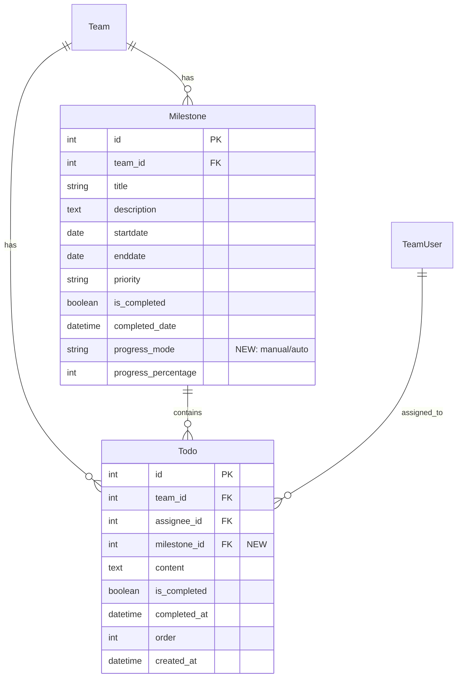

# 🎯 TeamMoa 마일스톤 개선 통합 설계 계획

> **목표**: 마일스톤-TODO 연동 + 진행률 관리 UI + 수정 모달 통합 구현
> **예상 기간**: 5-7일
> **난이도**: 🟡 중간
> **작성일**: 2025-12-25

---

## 📋 목차

1. [전체 아키텍처 개요](#1-전체-아키텍처-개요)
2. [데이터베이스 설계](#2-데이터베이스-설계)
3. [백엔드 설계](#3-백엔드-설계)
4. [API 설계](#4-api-설계)
5. [프론트엔드 설계](#5-프론트엔드-설계)
6. [UI/UX 상세 설계](#6-uiux-상세-설계)
7. [비즈니스 로직 흐름](#7-비즈니스-로직-흐름)
8. [테스트 전략](#8-테스트-전략)
9. [구현 순서 및 일정](#9-구현-순서-및-일정)
10. [마이그레이션 가이드](#10-마이그레이션-가이드)

---

## 1. 전체 아키텍처 개요

### 1-1. 시스템 구조도

```
┌─────────────────────────────────────────────────────────────────┐
│                         프론트엔드 Layer                           │
├─────────────────────────────────────────────────────────────────┤
│  1. 마일스톤 타임라인 페이지 (기존 + 신규 UI)                        │
│     ├─ 진행률 관리 UI (수동 슬라이더 + AUTO 진행 바)                │
│     ├─ 마일스톤 수정 모달 (제목/설명/우선순위/진행률모드)            │
│     ├─ TODO 연결 현황 표시                                        │
│     └─ 진행률 모드 토글 버튼                                       │
│                                                                   │
│  2. TODO 관리 페이지 (신규 기능 추가)                               │
│     ├─ 마일스톤 할당 드롭다운                                      │
│     ├─ TODO 카드에 마일스톤 배지 표시                              │
│     └─ 마일스톤별 필터링                                          │
│                                                                   │
│  3. 팀 메인 페이지 (통계 강화)                                      │
│     ├─ 마일스톤별 TODO 완료율 표시                                 │
│     └─ 진행률 모드별 구분 표시                                     │
├─────────────────────────────────────────────────────────────────┤
│                         API Layer (DRF)                          │
├─────────────────────────────────────────────────────────────────┤
│  MilestoneViewSet                  │  TodoViewSet                │
│  ├─ list                           │  ├─ list                    │
│  ├─ create (+ progress_mode)       │  ├─ create                  │
│  ├─ retrieve                       │  ├─ update                  │
│  ├─ update (수정 모달용)            │  ├─ complete (+ 진행률 갱신) │
│  ├─ partial_update (드래그/진행률)  │  └─ assign_milestone (신규) │
│  ├─ destroy                        │                             │
│  ├─ toggle_progress_mode (신규)    │                             │
│  └─ todo_stats (신규)              │                             │
├─────────────────────────────────────────────────────────────────┤
│                      Service Layer (비즈니스 로직)                 │
├─────────────────────────────────────────────────────────────────┤
│  MilestoneService                  │  TodoService                │
│  ├─ create_milestone               │  ├─ create_todo             │
│  ├─ update_milestone (확장)        │  ├─ complete_todo (확장)    │
│  ├─ toggle_progress_mode (신규)    │  ├─ assign_to_milestone (신규)│
│  ├─ get_milestone_todo_stats (신규)│  └─ get_team_todos_with_stats│
│  └─ calculate_auto_progress (신규) │                             │
├─────────────────────────────────────────────────────────────────┤
│                         Model Layer (Django ORM)                 │
├─────────────────────────────────────────────────────────────────┤
│  Milestone                         │  Todo                       │
│  ├─ progress_mode (신규 필드)       │  ├─ milestone (신규 FK)     │
│  ├─ calculate_progress_from_todos()│  └─ (기존 필드들)           │
│  ├─ update_progress_from_todos()   │                             │
│  └─ get_current_progress()         │                             │
└─────────────────────────────────────────────────────────────────┘
```

### 1-2. 주요 기능 맵

| 기능 | 현재 상태 | 개선 후 |
|------|----------|---------|
| **진행률 입력** | ❌ UI 없음 | ✅ 수동 슬라이더 + AUTO 진행 바 |
| **마일스톤 수정** | ❌ 불가능 (날짜만 드래그) | ✅ 전체 필드 수정 모달 |
| **TODO 연동** | ❌ 없음 | ✅ 마일스톤에 TODO 할당 + 자동 진행률 |
| **진행률 계산** | ⚠️ DB 필드만 존재 | ✅ 수동/자동 모드 선택 가능 |
| **실시간 업데이트** | ⚠️ 드래그만 가능 | ✅ TODO 완료 시 진행률 자동 갱신 |

---

## 2. 데이터베이스 설계

### 2-1. ERD (Entity Relationship Diagram)



### 2-2. Milestone 모델 확장

**파일**: `teams/models.py`

```python
from django.db import models
from django.utils import timezone

class Milestone(models.Model):
    """
    마일스톤 모델

    변경사항 (신규):
    - progress_mode: 진행률 계산 방식 선택 (manual/auto)
    - calculate_progress_from_todos(): TODO 기반 진행률 계산
    - update_progress_from_todos(): 진행률 자동 업데이트
    - get_current_progress(): 모드에 따른 진행률 반환
    """

    team = models.ForeignKey('Team', on_delete=models.CASCADE)
    title = models.CharField(max_length=100)
    description = models.TextField(blank=True)
    startdate = models.DateField()
    enddate = models.DateField()
    is_completed = models.BooleanField(default=False)
    completed_date = models.DateTimeField(null=True, blank=True)

    # ⭐ 신규 필드: 진행률 계산 방식
    progress_mode = models.CharField(
        max_length=20,
        choices=[
            ('manual', '수동 입력'),
            ('auto', 'TODO 기반 자동 계산')
        ],
        default='manual',
        help_text='진행률 계산 방식 선택'
    )

    progress_percentage = models.IntegerField(
        default=0,
        help_text='manual 모드: 직접 입력, auto 모드: TODO 완료율로 자동 계산'
    )

    priority = models.CharField(max_length=20, choices=[
        ('critical', '최우선'),
        ('high', '중요'),
        ('medium', '보통'),
        ('low', '낮음'),
        ('minimal', '미미')
    ], default='medium')

    class Meta:
        ordering = ['-priority', 'enddate']

    def __str__(self):
        return self.title

    # ⭐ 신규 메서드: TODO 기반 진행률 계산
    def calculate_progress_from_todos(self):
        """
        연결된 TODO들의 완료율로 진행률 계산

        Returns:
            int: 계산된 진행률 (0-100)
        """
        total_todos = self.todos.count()
        if total_todos == 0:
            return 0

        completed_todos = self.todos.filter(is_completed=True).count()
        return int((completed_todos / total_todos) * 100)

    # ⭐ 신규 메서드: 진행률 자동 업데이트
    def update_progress_from_todos(self):
        """
        AUTO 모드일 때 TODO 완료율로 진행률 업데이트
        100% 도달 시 자동 완료 처리

        Returns:
            tuple: (이전 진행률, 새 진행률)
        """
        if self.progress_mode != 'auto':
            return None, None

        old_progress = self.progress_percentage
        new_progress = self.calculate_progress_from_todos()

        # 진행률 업데이트
        self.progress_percentage = new_progress

        # 100% 도달 시 자동 완료
        if new_progress == 100 and not self.is_completed:
            self.is_completed = True
            self.completed_date = timezone.now()
        # 100% 미만으로 떨어지면 완료 해제
        elif new_progress < 100 and self.is_completed:
            self.is_completed = False
            self.completed_date = None

        self.save()

        return old_progress, new_progress

    # ⭐ 신규 메서드: 현재 진행률 반환
    def get_current_progress(self):
        """
        진행률 모드에 따라 실제 진행률 반환

        Returns:
            int: 현재 진행률 (0-100)
        """
        if self.progress_mode == 'auto':
            return self.calculate_progress_from_todos()
        else:
            return self.progress_percentage

    # ⭐ 신규 메서드: TODO 통계
    def get_todo_stats(self):
        """
        연결된 TODO 통계 반환

        Returns:
            dict: {total, completed, in_progress}
        """
        total = self.todos.count()
        completed = self.todos.filter(is_completed=True).count()

        return {
            'total': total,
            'completed': completed,
            'in_progress': total - completed
        }

    # 기존 메서드 (수정)
    def get_status(self, today_date=None):
        """마일스톤의 현재 상태를 반환 (날짜 + 진행률 기준)"""
        if today_date is None:
            from datetime import date
            today_date = date.today()

        # 100% 완료된 경우
        if self.get_current_progress() >= 100:
            return 'completed'

        # 아직 시작 전
        if today_date < self.startdate:
            return 'not_started'

        # 종료일이 지났지만 100% 미완료
        if today_date > self.enddate:
            return 'overdue'

        # 진행 기간 내에 있고 진행 중
        return 'in_progress'
```

### 2-3. Todo 모델 확장

**파일**: `members/models.py`

```python
from django.db import models

class Todo(models.Model):
    """
    TODO 모델

    변경사항 (신규):
    - milestone: 마일스톤 연결 (FK)
    - save() 오버라이드: 완료 상태 변경 시 마일스톤 진행률 자동 업데이트
    """

    content = models.TextField(default="", null=True, blank=True)
    is_completed = models.BooleanField(default=False)

    assignee = models.ForeignKey(
        'teams.TeamUser',
        on_delete=models.SET_NULL,
        null=True,
        blank=True,
        related_name='todo_set',
        help_text='TODO 담당자 (탈퇴 시 NULL, 미할당 상태로 변경)'
    )

    team = models.ForeignKey('teams.Team', on_delete=models.CASCADE, default=1)

    # ⭐ 신규 필드: 마일스톤 연결
    milestone = models.ForeignKey(
        'teams.Milestone',
        on_delete=models.SET_NULL,  # 마일스톤 삭제 시 TODO는 유지 (연결만 해제)
        null=True,
        blank=True,
        related_name='todos',
        help_text='이 TODO가 속한 마일스톤 (선택사항)'
    )

    order = models.PositiveIntegerField(default=0)
    created_at = models.DateTimeField(auto_now_add=True, null=True)
    completed_at = models.DateTimeField(null=True, blank=True)

    class Meta:
        ordering = ['order', 'created_at']

    def __str__(self):
        return self.content

    # ⭐ 신규 메서드: 완료 시 마일스톤 진행률 업데이트 트리거
    def save(self, *args, **kwargs):
        """
        저장 시 마일스톤 진행률 자동 업데이트
        (is_completed 변경 시에만)
        """
        # 기존 객체인 경우 이전 완료 상태 확인
        old_is_completed = None
        if self.pk:
            try:
                old_obj = Todo.objects.get(pk=self.pk)
                old_is_completed = old_obj.is_completed
            except Todo.DoesNotExist:
                pass

        # 저장 실행
        super().save(*args, **kwargs)

        # 완료 상태가 변경되었고, 마일스톤이 AUTO 모드인 경우 진행률 업데이트
        if (old_is_completed is not None and
            old_is_completed != self.is_completed and
            self.milestone and
            self.milestone.progress_mode == 'auto'):
            self.milestone.update_progress_from_todos()
```

### 2-4. 마이그레이션 파일

**파일**: `teams/migrations/0007_add_progress_mode_to_milestone.py`

```python
from django.db import migrations, models

class Migration(migrations.Migration):

    dependencies = [
        ('teams', '0006_alter_team_host'),
    ]

    operations = [
        migrations.AddField(
            model_name='milestone',
            name='progress_mode',
            field=models.CharField(
                choices=[('manual', '수동 입력'), ('auto', 'TODO 기반 자동 계산')],
                default='manual',
                help_text='진행률 계산 방식 선택',
                max_length=20
            ),
        ),
    ]
```

**파일**: `members/migrations/0006_add_milestone_to_todo.py`

```python
from django.db import migrations, models
import django.db.models.deletion

class Migration(migrations.Migration):

    dependencies = [
        ('members', '0005_alter_todo_assignee'),
        ('teams', '0007_add_progress_mode_to_milestone'),
    ]

    operations = [
        migrations.AddField(
            model_name='todo',
            name='milestone',
            field=models.ForeignKey(
                blank=True,
                help_text='이 TODO가 속한 마일스톤 (선택사항)',
                null=True,
                on_delete=django.db.models.deletion.SET_NULL,
                related_name='todos',
                to='teams.milestone'
            ),
        ),
    ]
```

---

## 3. 백엔드 설계

### 3-1. MilestoneService 확장

**파일**: `teams/services.py`

주요 추가/수정 메서드:

1. **`create_milestone()`** - `progress_mode` 파라미터 추가
2. **`update_milestone()`** - 제목, 설명, 우선순위, 진행률 모드 수정 지원 확장
3. **`toggle_progress_mode()`** - 진행률 모드 전환 (manual ↔ auto)
4. **`get_milestone_todo_stats()`** - TODO 통계 조회

```python
class MilestoneService:
    """마일스톤 관련 비즈니스 로직"""

    def create_milestone(self, team, title, description, startdate, enddate,
                        priority, progress_mode='manual'):
        """
        새 마일스톤 생성

        Args:
            progress_mode: 'manual' 또는 'auto'
        """
        self._validate_milestone_dates(startdate, enddate)

        if not title or not title.strip():
            raise ValueError('마일스톤 제목을 입력해주세요.')

        milestone = Milestone.objects.create(
            team=team,
            title=title.strip(),
            description=description,
            startdate=startdate,
            enddate=enddate,
            priority=priority,
            progress_mode=progress_mode  # ⭐ 신규
        )

        return milestone

    @transaction.atomic
    def update_milestone(self, milestone_id, team, **update_data):
        """
        마일스톤 업데이트

        지원 필드:
        - title, description, priority (⭐ 신규)
        - startdate, enddate
        - progress_mode (⭐ 신규)
        - progress_percentage (manual 모드일 때만)
        """
        milestone = get_object_or_404(Milestone, pk=milestone_id, team=team)
        updated_fields = []

        # ⭐ 제목 업데이트
        if 'title' in update_data:
            title = update_data['title'].strip()
            if not title:
                raise ValueError('마일스톤 제목을 입력해주세요.')
            milestone.title = title
            updated_fields.append('제목')

        # ⭐ 설명 업데이트
        if 'description' in update_data:
            milestone.description = update_data['description']
            updated_fields.append('설명')

        # ⭐ 우선순위 업데이트
        if 'priority' in update_data:
            priority = update_data['priority']
            valid_priorities = ['critical', 'high', 'medium', 'low', 'minimal']
            if priority not in valid_priorities:
                raise ValueError(f'유효하지 않은 우선순위: {priority}')
            milestone.priority = priority
            updated_fields.append('우선순위')

        # 날짜 업데이트 (기존)
        if 'startdate' in update_data:
            milestone.startdate = self._parse_date(update_data['startdate'])
            updated_fields.append('시작일')

        if 'enddate' in update_data:
            milestone.enddate = self._parse_date(update_data['enddate'])
            updated_fields.append('종료일')

        # 날짜 검증
        if hasattr(milestone, 'startdate') and hasattr(milestone, 'enddate'):
            if milestone.startdate > milestone.enddate:
                raise ValueError('시작일은 종료일보다 이전이어야 합니다.')

        # ⭐ 진행률 모드 업데이트
        if 'progress_mode' in update_data:
            new_mode = update_data['progress_mode']
            if new_mode not in ['manual', 'auto']:
                raise ValueError('유효하지 않은 진행률 모드입니다.')

            old_mode = milestone.progress_mode
            milestone.progress_mode = new_mode

            # AUTO로 전환 시 즉시 진행률 재계산
            if new_mode == 'auto' and old_mode == 'manual':
                milestone.update_progress_from_todos()

            updated_fields.append('진행률 모드')

        # 진행률 업데이트 (manual 모드일 때만)
        if 'progress_percentage' in update_data:
            if milestone.progress_mode == 'auto':
                raise ValueError('AUTO 모드에서는 진행률을 수동으로 설정할 수 없습니다.')

            progress = int(update_data['progress_percentage'])
            if not (0 <= progress <= 100):
                raise ValueError('진행률은 0-100 사이 값이어야 합니다.')

            milestone.progress_percentage = progress
            updated_fields.append('진행률')

            # 완료 상태 자동 업데이트
            if progress == 100 and not milestone.is_completed:
                milestone.is_completed = True
                milestone.completed_date = datetime.now()
                updated_fields.append('완료 상태')
            elif progress < 100 and milestone.is_completed:
                milestone.is_completed = False
                milestone.completed_date = None
                updated_fields.append('완료 상태')

        milestone.save()
        return milestone, updated_fields

    @transaction.atomic
    def toggle_progress_mode(self, milestone_id, team):
        """
        진행률 모드 전환 (manual ↔ auto)

        Returns:
            tuple: (Milestone, 새 모드, 새 진행률)
        """
        milestone = get_object_or_404(Milestone, pk=milestone_id, team=team)

        if milestone.progress_mode == 'manual':
            milestone.progress_mode = 'auto'
            milestone.update_progress_from_todos()
        else:
            milestone.progress_mode = 'manual'

        milestone.save()

        return milestone, milestone.progress_mode, milestone.get_current_progress()

    def get_milestone_todo_stats(self, milestone):
        """TODO 통계 반환"""
        return milestone.get_todo_stats()
```

### 3-2. TodoService 확장

**파일**: `members/services.py`

주요 추가/수정 메서드:

1. **`complete_todo()`** - 마일스톤 진행률 자동 업데이트 로직 추가
2. **`assign_to_milestone()`** - TODO를 마일스톤에 할당
3. **`create_todo()`** - `milestone_id` 파라미터 추가

```python
class TodoService:
    """TODO 관련 비즈니스 로직"""

    @transaction.atomic
    def complete_todo(self, todo_id, team, requester):
        """
        TODO 완료 상태 토글 + 마일스톤 진행률 자동 업데이트

        Returns:
            dict: {
                'todo': Todo 객체,
                'is_completed': 완료 여부,
                'milestone_updated': 마일스톤 업데이트 여부,
                'milestone_progress': 새 진행률,
                'milestone_completed': 마일스톤 완료 여부
            }
        """
        todo = get_object_or_404(Todo, pk=todo_id, team=team)
        current_teamuser = self._get_current_teamuser(team, requester)

        # 권한 검증
        if not (self._is_team_host(team, requester) or
                todo.assignee == current_teamuser):
            raise ValueError(self.ERROR_MESSAGES['NO_PERMISSION'])

        # 완료 상태 토글
        todo.is_completed = not todo.is_completed
        todo.completed_at = timezone.now() if todo.is_completed else None

        # ⭐ save() 메서드가 자동으로 마일스톤 진행률 업데이트
        todo.save()

        # 마일스톤 정보 수집
        milestone_updated = False
        milestone_progress = None
        milestone_completed = False

        if todo.milestone and todo.milestone.progress_mode == 'auto':
            milestone_updated = True
            milestone_progress = todo.milestone.get_current_progress()
            milestone_completed = todo.milestone.is_completed

        return {
            'todo': todo,
            'is_completed': todo.is_completed,
            'milestone_updated': milestone_updated,
            'milestone_progress': milestone_progress,
            'milestone_completed': milestone_completed
        }

    @transaction.atomic
    def assign_to_milestone(self, todo_id, milestone_id, team):
        """
        TODO를 마일스톤에 할당

        Args:
            milestone_id: Milestone ID (None이면 연결 해제)

        Returns:
            dict: {
                'todo': Todo 객체,
                'old_milestone': 이전 마일스톤,
                'new_milestone': 새 마일스톤,
                'old_milestone_progress': 이전 마일스톤 진행률,
                'new_milestone_progress': 새 마일스톤 진행률
            }
        """
        from teams.models import Milestone

        todo = get_object_or_404(Todo, pk=todo_id, team=team)

        old_milestone = todo.milestone
        old_milestone_progress = None
        new_milestone_progress = None

        # 새 마일스톤 할당
        if milestone_id:
            new_milestone = get_object_or_404(Milestone, pk=milestone_id, team=team)
            todo.milestone = new_milestone
        else:
            todo.milestone = None

        todo.save()

        # 이전 마일스톤 진행률 업데이트 (AUTO 모드)
        if old_milestone and old_milestone.progress_mode == 'auto':
            old_milestone.update_progress_from_todos()
            old_milestone_progress = old_milestone.get_current_progress()

        # 새 마일스톤 진행률 업데이트 (AUTO 모드)
        if todo.milestone and todo.milestone.progress_mode == 'auto':
            todo.milestone.update_progress_from_todos()
            new_milestone_progress = todo.milestone.get_current_progress()

        return {
            'todo': todo,
            'old_milestone': old_milestone,
            'new_milestone': todo.milestone,
            'old_milestone_progress': old_milestone_progress,
            'new_milestone_progress': new_milestone_progress
        }
```

---

## 4. API 설계

### 4-1. Serializers

**파일**: `teams/serializers.py`

```python
from rest_framework import serializers
from .models import Milestone

class MilestoneSerializer(serializers.ModelSerializer):
    """마일스톤 조회용"""

    status = serializers.SerializerMethodField()
    status_display = serializers.SerializerMethodField()
    priority_display = serializers.CharField(source='get_priority_display', read_only=True)
    current_progress = serializers.SerializerMethodField()  # ⭐ 신규
    todo_stats = serializers.SerializerMethodField()  # ⭐ 신규

    class Meta:
        model = Milestone
        fields = [
            'id', 'team', 'title', 'description',
            'startdate', 'enddate', 'priority', 'priority_display',
            'progress_mode',  # ⭐ 신규
            'progress_percentage',
            'current_progress',  # ⭐ 신규
            'is_completed', 'completed_date',
            'status', 'status_display',
            'todo_stats'  # ⭐ 신규
        ]
        read_only_fields = ['id', 'team', 'is_completed', 'completed_date']

    def get_status(self, obj):
        return obj.get_status()

    def get_status_display(self, obj):
        return obj.status_display

    def get_current_progress(self, obj):
        return obj.get_current_progress()

    def get_todo_stats(self, obj):
        return obj.get_todo_stats()


class MilestoneCreateSerializer(serializers.ModelSerializer):
    """마일스톤 생성용"""

    class Meta:
        model = Milestone
        fields = [
            'title', 'description',
            'startdate', 'enddate',
            'priority',
            'progress_mode'  # ⭐ 신규
        ]

    def validate_title(self, value):
        if not value or not value.strip():
            raise serializers.ValidationError('마일스톤 제목을 입력해주세요.')
        return value.strip()

    def validate(self, data):
        if data.get('startdate') and data.get('enddate'):
            if data['startdate'] > data['enddate']:
                raise serializers.ValidationError({
                    'enddate': '종료일은 시작일보다 이후여야 합니다.'
                })
        return data


class MilestoneUpdateSerializer(serializers.ModelSerializer):
    """마일스톤 업데이트용"""

    class Meta:
        model = Milestone
        fields = [
            'title',  # ⭐ 신규
            'description',  # ⭐ 신규
            'priority',  # ⭐ 신규
            'startdate',
            'enddate',
            'progress_mode',  # ⭐ 신규
            'progress_percentage'
        ]

    def validate_progress_percentage(self, value):
        if value is not None and not (0 <= value <= 100):
            raise serializers.ValidationError('진행률은 0-100 사이 값이어야 합니다.')
        return value

    def validate(self, data):
        instance = self.instance

        # 날짜 검증
        startdate = data.get('startdate', instance.startdate if instance else None)
        enddate = data.get('enddate', instance.enddate if instance else None)

        if startdate and enddate and startdate > enddate:
            raise serializers.ValidationError({
                'enddate': '종료일은 시작일보다 이후여야 합니다.'
            })

        # AUTO 모드에서 수동 진행률 입력 방지
        progress_mode = data.get('progress_mode', instance.progress_mode if instance else 'manual')
        if progress_mode == 'auto' and 'progress_percentage' in data:
            raise serializers.ValidationError({
                'progress_percentage': 'AUTO 모드에서는 진행률을 수동으로 설정할 수 없습니다.'
            })

        return data
```

**파일**: `members/serializers.py`

```python
from rest_framework import serializers
from .models import Todo
from teams.models import Milestone

class TodoSerializer(serializers.ModelSerializer):
    """TODO 조회용"""

    milestone_info = serializers.SerializerMethodField()  # ⭐ 신규

    class Meta:
        model = Todo
        fields = [
            'id', 'content', 'is_completed',
            'assignee', 'team', 'order',
            'created_at', 'completed_at',
            'milestone',  # ⭐ 신규
            'milestone_info'  # ⭐ 신규
        ]
        read_only_fields = ['id', 'created_at', 'completed_at']

    def get_milestone_info(self, obj):
        if obj.milestone:
            return {
                'id': obj.milestone.id,
                'title': obj.milestone.title,
                'priority': obj.milestone.priority
            }
        return None


class TodoCreateSerializer(serializers.ModelSerializer):
    """TODO 생성용"""

    milestone = serializers.PrimaryKeyRelatedField(
        queryset=Milestone.objects.all(),
        required=False,
        allow_null=True
    )  # ⭐ 신규

    class Meta:
        model = Todo
        fields = ['content', 'milestone']

    def validate_content(self, value):
        if not value or not value.strip():
            raise serializers.ValidationError('할 일 내용을 입력해주세요.')
        return value.strip()
```

### 4-2. API 엔드포인트 목록

**Milestone API**:

| Method | URL | 액션 | 설명 |
|--------|-----|------|------|
| `GET` | `/api/v1/teams/{team_pk}/milestones/` | `list` | 마일스톤 목록 조회 |
| `POST` | `/api/v1/teams/{team_pk}/milestones/` | `create` | 마일스톤 생성 (progress_mode 포함) |
| `GET` | `/api/v1/teams/{team_pk}/milestones/{id}/` | `retrieve` | 마일스톤 상세 조회 |
| `PUT` | `/api/v1/teams/{team_pk}/milestones/{id}/` | `update` | ⭐ 전체 수정 (모달용) |
| `PATCH` | `/api/v1/teams/{team_pk}/milestones/{id}/` | `partial_update` | 부분 수정 (드래그/슬라이더) |
| `DELETE` | `/api/v1/teams/{team_pk}/milestones/{id}/` | `destroy` | 마일스톤 삭제 |
| `POST` | `/api/v1/teams/{team_pk}/milestones/{id}/toggle-progress-mode/` | ⭐ `toggle_progress_mode` | 진행률 모드 전환 |
| `GET` | `/api/v1/teams/{team_pk}/milestones/{id}/todo-stats/` | ⭐ `todo_stats` | TODO 통계 조회 |

**TODO API**:

| Method | URL | 액션 | 설명 |
|--------|-----|------|------|
| `PATCH` | `/api/v1/teams/{team_pk}/todos/{id}/assign-milestone/` | ⭐ `assign_milestone` | 마일스톤 할당 |
| `POST` | `/api/v1/teams/{team_pk}/todos/{id}/complete/` | `complete` | 완료 토글 (진행률 자동 갱신) |

---

## 5. 프론트엔드 설계

### 5-1. JavaScript API Client

**파일**: `static/js/api/client.js`

```javascript
class TeamApiClient {
    constructor() {
        this.baseUrl = '/api/v1';
    }

    // ========================================
    // Milestone API
    // ========================================

    /**
     * ⭐ 마일스톤 전체 수정 (PUT) - 수정 모달용
     */
    async updateMilestoneFull(teamId, milestoneId, data) {
        const response = await fetch(`${this.baseUrl}/teams/${teamId}/milestones/${milestoneId}/`, {
            method: 'PUT',
            headers: this._getHeaders(),
            body: JSON.stringify(data)
        });
        return await this._handleResponse(response);
    }

    /**
     * 마일스톤 부분 수정 (PATCH) - 드래그/진행률용
     */
    async updateMilestone(teamId, milestoneId, data) {
        const response = await fetch(`${this.baseUrl}/teams/${teamId}/milestones/${milestoneId}/`, {
            method: 'PATCH',
            headers: this._getHeaders(),
            body: JSON.stringify(data)
        });
        return await this._handleResponse(response);
    }

    /**
     * ⭐ 진행률 모드 토글
     */
    async toggleMilestoneProgressMode(teamId, milestoneId) {
        const response = await fetch(`${this.baseUrl}/teams/${teamId}/milestones/${milestoneId}/toggle-progress-mode/`, {
            method: 'POST',
            headers: this._getHeaders()
        });
        return await this._handleResponse(response);
    }

    /**
     * ⭐ TODO를 마일스톤에 할당
     */
    async assignTodoToMilestone(teamId, todoId, milestoneId) {
        const response = await fetch(`${this.baseUrl}/teams/${teamId}/todos/${todoId}/assign-milestone/`, {
            method: 'PATCH',
            headers: this._getHeaders(),
            body: JSON.stringify({ milestone_id: milestoneId })
        });
        return await this._handleResponse(response);
    }

    // 헬퍼 메서드
    _getHeaders() {
        return {
            'Content-Type': 'application/json',
            'X-CSRFToken': this._getCsrfToken()
        };
    }

    _getCsrfToken() {
        return document.querySelector('[name=csrfmiddlewaretoken]').value;
    }

    async _handleResponse(response) {
        const data = await response.json();
        if (!response.ok) {
            throw new Error(data.error || 'API 요청 실패');
        }
        return data;
    }
}

window.teamApi = new TeamApiClient();
```

### 5-2. 진행률 슬라이더 컴포넌트

**파일**: `static/js/components/progress-control.js`

```javascript
/**
 * 진행률 슬라이더 컴포넌트
 * - 수동 모드: 슬라이더로 진행률 조정
 * - AUTO 모드: 읽기 전용 진행 바
 */

document.addEventListener('DOMContentLoaded', () => {
    // 진행률 슬라이더 이벤트 (수동 모드)
    document.querySelectorAll('.progress-slider').forEach(slider => {
        let debounceTimer;

        slider.addEventListener('input', (e) => {
            // 실시간 라벨 업데이트
            const milestoneId = e.target.dataset.milestoneId;
            const value = e.target.value;
            const label = e.target.nextElementSibling;

            if (label) {
                label.textContent = `${value}%`;
            }
        });

        slider.addEventListener('change', async (e) => {
            const milestoneId = e.target.dataset.milestoneId;
            const progress = parseInt(e.target.value);

            // 디바운스 (연속 변경 방지)
            clearTimeout(debounceTimer);
            debounceTimer = setTimeout(async () => {
                try {
                    const response = await window.teamApi.updateMilestone(
                        window.teamData.id,
                        milestoneId,
                        { progress_percentage: progress }
                    );

                    if (response.success) {
                        showDjangoToast(response.message, 'success');

                        // 100% 도달 시 축하 효과
                        if (progress === 100) {
                            showDjangoToast('🎉 마일스톤이 완료되었습니다!', 'success');
                        }
                    }
                } catch (error) {
                    showDjangoToast(`진행률 업데이트 실패: ${error.message}`, 'error');
                    // 에러 시 이전 값으로 복원
                    e.target.value = e.target.dataset.oldValue || 0;
                }
            }, 500);

            // 현재 값 저장
            e.target.dataset.oldValue = progress;
        });
    });

    // 진행률 모드 전환 버튼
    document.querySelectorAll('.toggle-mode-btn').forEach(btn => {
        btn.addEventListener('click', async (e) => {
            const milestoneId = e.target.dataset.milestoneId;
            const currentMode = e.target.dataset.currentMode;

            const confirmMessage = currentMode === 'manual'
                ? 'AUTO 모드로 전환하면 연결된 TODO 완료율로 진행률이 자동 계산됩니다. 계속하시겠습니까?'
                : '수동 모드로 전환하면 직접 슬라이더로 진행률을 조정해야 합니다. 계속하시겠습니까?';

            showConfirmModal(confirmMessage, async () => {
                try {
                    const response = await window.teamApi.toggleMilestoneProgressMode(
                        window.teamData.id,
                        milestoneId
                    );

                    if (response.success) {
                        showDjangoToast(response.message, 'success');
                        location.reload(); // UI 갱신
                    }
                } catch (error) {
                    showDjangoToast(`모드 전환 실패: ${error.message}`, 'error');
                }
            });
        });
    });
});
```

### 5-3. 마일스톤 수정 모달 컴포넌트

**파일**: `static/js/components/milestone-edit-modal.js`

```javascript
/**
 * 마일스톤 수정 모달
 */

document.addEventListener('DOMContentLoaded', () => {
    const modal = document.getElementById('editMilestoneModal');
    const closeBtn = document.getElementById('editModalClose');
    const cancelBtn = document.getElementById('editCancelBtn');
    const form = document.getElementById('editMilestoneForm');

    // 수정 버튼 클릭 이벤트
    document.querySelectorAll('.edit-milestone-btn').forEach(btn => {
        btn.addEventListener('click', async (e) => {
            const milestoneId = e.target.closest('.edit-milestone-btn').dataset.milestoneId;
            await openEditModal(milestoneId);
        });
    });

    // 모달 닫기
    const closeModal = () => {
        modal.classList.remove('active');
        form.reset();
    };

    closeBtn.addEventListener('click', closeModal);
    cancelBtn.addEventListener('click', closeModal);

    modal.addEventListener('click', (e) => {
        if (e.target === modal) closeModal();
    });

    // 폼 제출
    form.addEventListener('submit', async (e) => {
        e.preventDefault();
        await submitEditForm();
    });
});

/**
 * 수정 모달 열기 및 데이터 로드
 */
async function openEditModal(milestoneId) {
    try {
        // 마일스톤 데이터 조회
        const response = await window.teamApi.getMilestone(
            window.teamData.id,
            milestoneId
        );

        const milestone = response;

        // 폼에 데이터 채우기
        document.getElementById('edit-milestone-id').value = milestoneId;
        document.getElementById('edit-title').value = milestone.title;
        document.getElementById('edit-description').value = milestone.description || '';
        document.getElementById('edit-startdate').value = milestone.startdate;
        document.getElementById('edit-enddate').value = milestone.enddate;
        document.getElementById('edit-priority').value = milestone.priority;

        // 진행률 모드 라디오 버튼 선택
        if (milestone.progress_mode === 'auto') {
            document.getElementById('edit-mode-auto').checked = true;
            // AUTO 진행률 표시
            document.getElementById('edit-auto-progress').textContent =
                milestone.current_progress;
        } else {
            document.getElementById('edit-mode-manual').checked = true;
        }

        // 모달 열기
        document.getElementById('editMilestoneModal').classList.add('active');

    } catch (error) {
        showDjangoToast(`마일스톤 조회 실패: ${error.message}`, 'error');
    }
}

/**
 * 수정 폼 제출
 */
async function submitEditForm() {
    const milestoneId = document.getElementById('edit-milestone-id').value;

    const formData = {
        title: document.getElementById('edit-title').value.trim(),
        description: document.getElementById('edit-description').value,
        startdate: document.getElementById('edit-startdate').value,
        enddate: document.getElementById('edit-enddate').value,
        priority: document.getElementById('edit-priority').value,
        progress_mode: document.querySelector('input[name="progress_mode"]:checked').value
    };

    // 유효성 검사
    if (!formData.title) {
        showDjangoToast('마일스톤 제목을 입력해주세요.', 'error');
        return;
    }

    if (new Date(formData.startdate) > new Date(formData.enddate)) {
        showDjangoToast('종료일은 시작일보다 이후여야 합니다.', 'error');
        return;
    }

    try {
        const response = await window.teamApi.updateMilestoneFull(
            window.teamData.id,
            milestoneId,
            formData
        );

        if (response.success) {
            showDjangoToast(response.message, 'success');

            // 모달 닫기
            document.getElementById('editMilestoneModal').classList.remove('active');

            // 페이지 새로고침 (UI 갱신)
            setTimeout(() => location.reload(), 500);
        }

    } catch (error) {
        showDjangoToast(`수정 실패: ${error.message}`, 'error');
    }
}
```

---

## 6. UI/UX 상세 설계

### 6-1. CSS 스타일

**파일**: `static/css/components/progress-control.css`

```css
/* 진행률 슬라이더 (수동 모드) */
.progress-slider-wrapper {
  display: flex;
  flex-direction: column;
  gap: 8px;
  padding: 12px;
  background: #f9fafb;
  border-radius: 8px;
  margin-top: 8px;
}

.progress-slider {
  -webkit-appearance: none;
  width: 100%;
  height: 6px;
  border-radius: 3px;
  background: #e5e7eb;
  outline: none;
  transition: background 0.2s;
}

.progress-slider:hover {
  background: #d1d5db;
}

.progress-slider::-webkit-slider-thumb {
  -webkit-appearance: none;
  width: 18px;
  height: 18px;
  border-radius: 50%;
  background: #3b82f6;
  cursor: pointer;
  box-shadow: 0 2px 4px rgba(0, 0, 0, 0.1);
  transition: all 0.2s;
}

.progress-slider::-webkit-slider-thumb:hover {
  background: #2563eb;
  transform: scale(1.1);
}

.progress-value {
  align-self: flex-end;
  font-size: 13px;
  font-weight: 600;
  color: #3b82f6;
}

/* 진행률 바 (AUTO 모드) */
.progress-bar-readonly {
  display: flex;
  align-items: center;
  gap: 12px;
  padding: 12px;
  background: #f9fafb;
  border-radius: 8px;
  margin-top: 8px;
}

.progress-bar-track {
  flex: 1;
  height: 8px;
  background: #e5e7eb;
  border-radius: 4px;
  overflow: hidden;
}

.progress-bar-fill {
  height: 100%;
  background: linear-gradient(90deg, #10b981, #34d399);
  border-radius: 4px;
  transition: width 0.3s ease;
}

/* 100% 완료 효과 */
.progress-bar-fill[style*="100%"] {
  background: linear-gradient(90deg, #f59e0b, #fbbf24);
  animation: pulse-gold 2s infinite;
}

@keyframes pulse-gold {
  0%, 100% { opacity: 1; }
  50% { opacity: 0.8; }
}

.progress-value-readonly {
  font-size: 13px;
  font-weight: 600;
  color: #10b981;
  min-width: 40px;
  text-align: right;
}

/* 모드 전환 버튼 */
.toggle-mode-btn {
  margin-top: 8px;
  padding: 8px 12px;
  background: white;
  border: 1px solid #e5e7eb;
  border-radius: 6px;
  font-size: 12px;
  color: #6b7280;
  cursor: pointer;
  transition: all 0.2s;
  display: flex;
  align-items: center;
  gap: 6px;
  width: 100%;
  justify-content: center;
}

.toggle-mode-btn:hover {
  background: #f9fafb;
  border-color: #3b82f6;
  color: #3b82f6;
}

/* 진행률 모드 배지 */
.progress-mode-badge {
  display: inline-flex;
  align-items: center;
  gap: 4px;
  padding: 4px 8px;
  border-radius: 4px;
  font-size: 11px;
  font-weight: 600;
  text-transform: uppercase;
}

.progress-mode-badge.mode-manual {
  background: #dbeafe;
  color: #1e40af;
}

.progress-mode-badge.mode-auto {
  background: #d1fae5;
  color: #065f46;
}

/* TODO 연결 정보 */
.todo-connection-info {
  display: flex;
  align-items: center;
  gap: 6px;
  padding: 8px 12px;
  background: #f0fdf4;
  border-radius: 6px;
  margin-top: 8px;
}

.todo-connection-info i {
  font-size: 16px;
  color: #10b981;
}

.todo-count {
  font-size: 13px;
  font-weight: 500;
  color: #065f46;
}
```

---

## 7. 비즈니스 로직 흐름

### 7-1. TODO 완료 시 마일스톤 진행률 자동 업데이트

```
사용자 액션: TODO 완료 체크
    ↓
JS: POST /api/v1/teams/1/todos/10/complete/
    ↓
Backend: TodoService.complete_todo()
    ├─ todo.is_completed = True
    ├─ todo.save() → Todo 모델의 save() 메서드 오버라이드 실행
    │   └─ milestone.update_progress_from_todos()
    │       ├─ 진행률 재계산 (3개 TODO 중 1개 완료 → 33%)
    │       ├─ milestone.progress_percentage = 33
    │       └─ milestone.save()
    └─ 응답 반환: {
        "milestone_updated": true,
        "milestone_progress": 33
    }
    ↓
UI 업데이트:
    ├─ 진행률 바: 0% → 33% 애니메이션
    ├─ TODO 카운트: "1 / 3 TODO"
    └─ 토스트: "TODO 완료! 마일스톤 진행률 33%"
```

### 7-2. 마일스톤 수정 모달 플로우

```
1. 수정 버튼 클릭
    ↓
2. GET /api/v1/teams/1/milestones/5/ (데이터 조회)
    ↓
3. 모달에 기존 데이터 표시
    - 제목, 설명, 날짜, 우선순위, 진행률 모드
    ↓
4. 사용자 수정 입력
    ↓
5. "수정 완료" 클릭
    ↓
6. PUT /api/v1/teams/1/milestones/5/
    {
      "title": "수정된 제목",
      "priority": "critical",
      "progress_mode": "auto"
    }
    ↓
7. Backend: MilestoneService.update_milestone()
    - 필드 업데이트
    - progress_mode 변경 시 진행률 재계산
    ↓
8. 모달 닫기 + 페이지 갱신
```

---

## 8. 테스트 전략

### 8-1. 단위 테스트 (33개 추가)

#### Milestone Service 테스트 (12개)

**파일**: `teams/tests/test_milestone_service_extended.py`

- ✅ AUTO 모드 마일스톤 생성
- ✅ 수동 → AUTO 모드 전환 (진행률 재계산)
- ✅ AUTO → 수동 모드 전환 (진행률 유지)
- ✅ 제목/우선순위 수정
- ✅ 진행률 모드 변경 시 자동 재계산
- ✅ AUTO 모드에서 수동 진행률 설정 시도 → 실패

#### TODO-Milestone 통합 테스트 (12개)

**파일**: `members/tests/test_todo_milestone_integration.py`

- ✅ TODO를 마일스톤에 할당
- ✅ TODO 마일스톤 연결 해제
- ✅ TODO 완료 시 마일스톤 진행률 자동 업데이트 (33%)
- ✅ 모든 TODO 완료 시 마일스톤 자동 완료 (100%)
- ✅ TODO 완료 취소 시 마일스톤 미완료 처리
- ✅ MANUAL 모드는 TODO 완료에 영향받지 않음

#### API ViewSet 테스트 (9개)

**파일**: `teams/tests/test_milestone_viewset_extended.py`

- ✅ PUT 요청으로 마일스톤 전체 수정
- ✅ 진행률 모드 토글 API
- ✅ TODO 통계 조회 API
- ✅ TODO 할당 API
- ✅ TODO 완료 API (마일스톤 진행률 응답 포함)

### 8-2. 통합 테스트 체크리스트

- [ ] 마일스톤 생성 → TODO 연결 → 완료 → 진행률 100% → 자동 완료
- [ ] 수동 모드에서 슬라이더로 진행률 조정
- [ ] AUTO 모드 전환 시 즉시 재계산
- [ ] 수정 모달에서 모든 필드 변경 가능
- [ ] 드래그앤드롭과 진행률 관리 동시 작동

---

## 9. 구현 순서 및 일정

### Phase 1: 핵심 기능 (3-4일) ⭐ 최우선

#### Day 1: 모델 및 마이그레이션
- [ ] Milestone 모델에 `progress_mode` 필드 추가
- [ ] Milestone 메서드 구현:
  - `calculate_progress_from_todos()`
  - `update_progress_from_todos()`
  - `get_current_progress()`
  - `get_todo_stats()`
- [ ] Todo 모델에 `milestone` FK 추가
- [ ] Todo `save()` 메서드 오버라이드
- [ ] 마이그레이션 생성 및 실행
- [ ] 기존 데이터 호환성 검증

#### Day 2: 서비스 레이어 확장
- [ ] `MilestoneService.create_milestone()` - `progress_mode` 파라미터 추가
- [ ] `MilestoneService.update_milestone()` - 제목/설명/우선순위/모드 수정 지원
- [ ] `MilestoneService.toggle_progress_mode()` 구현
- [ ] `MilestoneService.get_milestone_todo_stats()` 구현
- [ ] `TodoService.complete_todo()` - 마일스톤 진행률 업데이트 로직 추가
- [ ] `TodoService.assign_to_milestone()` 구현
- [ ] `TodoService.create_todo()` - `milestone_id` 파라미터 추가
- [ ] 단위 테스트 작성 (24개)

#### Day 3: API 엔드포인트
- [ ] Serializer 확장:
  - `MilestoneSerializer` - `progress_mode`, `current_progress`, `todo_stats` 추가
  - `MilestoneCreateSerializer` - `progress_mode` 추가
  - `MilestoneUpdateSerializer` - 제목/설명/우선순위 추가
  - `TodoSerializer` - `milestone`, `milestone_info` 추가
- [ ] `MilestoneViewSet.update()` - 전체 수정 지원 (PUT)
- [ ] `MilestoneViewSet.toggle_progress_mode` 액션 추가
- [ ] `MilestoneViewSet.todo_stats` 액션 추가
- [ ] `TodoViewSet.assign_milestone` 액션 추가
- [ ] `TodoViewSet.complete` - 응답에 마일스톤 정보 추가
- [ ] API 테스트 작성 (9개)

#### Day 4: 프론트엔드 기본 UI
- [ ] API Client 확장 (`static/js/api/client.js`)
  - `updateMilestoneFull()` (PUT)
  - `toggleMilestoneProgressMode()`
  - `assignTodoToMilestone()`
- [ ] 진행률 슬라이더 컴포넌트 (`progress-control.js`)
  - 수동 모드: 슬라이더 이벤트 핸들러
  - AUTO 모드: 읽기 전용 진행 바
  - 모드 전환 버튼
- [ ] 타임라인 HTML 템플릿 업데이트
  - 진행률 컨트롤 영역 추가
  - 진행률 모드 배지
  - TODO 연결 정보 표시
- [ ] CSS 스타일 작성 (`progress-control.css`)

### Phase 2: 마일스톤 수정 모달 (1-2일)

#### Day 5: 수정 모달 구현
- [ ] HTML 템플릿 작성
  - 수정 모달 구조
  - 폼 필드 (제목, 설명, 날짜, 우선순위, 진행률 모드)
  - 라디오 버튼 그룹
- [ ] JavaScript 컴포넌트 (`milestone-edit-modal.js`)
  - `openEditModal()` - 데이터 로드 및 폼 채우기
  - `submitEditForm()` - PUT 요청
  - 모달 열기/닫기 이벤트
- [ ] CSS 스타일 (`milestone-edit-modal.css`)
  - 모달 레이아웃
  - 라디오 버튼 스타일
  - 날짜 범위 그룹
- [ ] 좌측 패널에 수정 버튼 추가

### Phase 3: TODO 페이지 연동 (1일)

#### Day 6: TODO 마일스톤 할당 UI
- [ ] TODO 카드에 마일스톤 배지 표시
- [ ] 마일스톤 할당 드롭다운 모달
  - 진행 중인 마일스톤 목록 조회
  - 마일스톤 선택 UI
- [ ] TODO 완료 시 토스트 메시지 개선
  - "마일스톤 진행률 X% 업데이트됨" 표시
  - 마일스톤 완료 시 축하 메시지
- [ ] JavaScript 이벤트 핸들러
  - `assignTodoToMilestone()`
  - `openMilestoneSelector()`

### Phase 4: 최종 테스트 및 배포 (1일)

#### Day 7: 통합 테스트 및 배포
- [ ] 전체 기능 통합 테스트
  - 마일스톤 생성 (수동/AUTO 모드)
  - TODO 할당 및 완료
  - 진행률 자동 업데이트 검증
  - 수정 모달 전체 필드 변경
  - 모드 전환 테스트
- [ ] 엣지 케이스 테스트
  - TODO 0개인 마일스톤
  - 마일스톤 없는 TODO
  - 동시 업데이트 경합 조건
- [ ] 성능 테스트
  - N+1 쿼리 확인 (select_related, prefetch_related)
  - 대량 TODO (100개+) 성능
- [ ] 배포 준비
  - 마이그레이션 스크립트 검증
  - 프로덕션 환경 테스트
  - 롤백 계획 수립
- [ ] 문서 업데이트
  - API 문서 (Swagger)
  - 사용자 가이드
  - 아키텍처 문서

---

## 10. 마이그레이션 가이드

### 10-1. 개발 환경 마이그레이션

```bash
# 1. 최신 코드 Pull
git pull origin main

# 2. 가상환경 활성화
source venv/bin/activate  # Linux/Mac
# 또는
venv\Scripts\activate  # Windows

# 3. 마이그레이션 생성
python manage.py makemigrations teams
python manage.py makemigrations members

# 4. 마이그레이션 확인
python manage.py showmigrations

# 5. 마이그레이션 실행
python manage.py migrate

# 6. 기존 마일스톤 데이터 확인
python manage.py shell
>>> from teams.models import Milestone
>>> Milestone.objects.filter(progress_mode='manual').count()
# 모든 기존 마일스톤이 'manual' 모드여야 함
```

### 10-2. 프로덕션 환경 마이그레이션

```bash
# 1. 데이터베이스 백업
python manage.py dumpdata teams.Milestone > milestone_backup.json
python manage.py dumpdata members.Todo > todo_backup.json

# 2. 마이그레이션 실행 (다운타임 없음)
python manage.py migrate teams 0007_add_progress_mode_to_milestone
python manage.py migrate members 0006_add_milestone_to_todo

# 3. 데이터 검증
python manage.py shell
>>> from teams.models import Milestone
>>> from members.models import Todo
>>> Milestone.objects.filter(progress_mode__isnull=True).count()
# 0이어야 함
>>> Todo.objects.filter(milestone__isnull=False).count()
# 0이어야 함 (초기에는 연결된 TODO 없음)

# 4. 롤백 계획 (문제 발생 시)
python manage.py migrate teams 0006_alter_team_host
python manage.py migrate members 0005_alter_todo_assignee
python manage.py loaddata milestone_backup.json
python manage.py loaddata todo_backup.json
```

### 10-3. 데이터 마이그레이션 스크립트

기존 마일스톤의 `progress_mode`를 'manual'로 설정하는 것은 마이그레이션 파일에서 `default='manual'`로 자동 처리되므로 별도 스크립트 불필요.

단, 특정 마일스톤을 AUTO 모드로 전환하려면:

```python
# management/commands/convert_milestone_to_auto.py

from django.core.management.base import BaseCommand
from teams.models import Milestone

class Command(BaseCommand):
    help = '특정 마일스톤을 AUTO 모드로 전환'

    def add_arguments(self, parser):
        parser.add_argument('milestone_id', type=int, help='마일스톤 ID')

    def handle(self, *args, **options):
        milestone_id = options['milestone_id']

        try:
            milestone = Milestone.objects.get(pk=milestone_id)

            self.stdout.write(f'마일스톤: {milestone.title}')
            self.stdout.write(f'현재 모드: {milestone.progress_mode}')
            self.stdout.write(f'현재 진행률: {milestone.progress_percentage}%')

            # AUTO 모드로 전환
            milestone.progress_mode = 'auto'
            milestone.update_progress_from_todos()

            self.stdout.write(self.style.SUCCESS(
                f'AUTO 모드로 전환 완료! 새 진행률: {milestone.progress_percentage}%'
            ))

        except Milestone.DoesNotExist:
            self.stdout.write(self.style.ERROR(f'마일스톤 ID {milestone_id}를 찾을 수 없습니다.'))
```

사용법:
```bash
python manage.py convert_milestone_to_auto 5
```

---

## 11. 예상 성과

### 11-1. 기능적 개선

| 항목 | 개선 전 | 개선 후 | 효과 |
|------|--------|---------|------|
| 진행률 관리 | ❌ UI 없음 | ✅ 슬라이더 + AUTO 계산 | 실시간 진행률 추적 |
| 마일스톤 수정 | ❌ 날짜만 드래그 | ✅ 전체 필드 수정 가능 | 유연한 관리 |
| TODO 연동 | ❌ 없음 | ✅ 자동 진행률 계산 | 정확한 프로젝트 상태 파악 |
| 팀 협업 | ⚠️ 수동 업데이트 필요 | ✅ 자동 실시간 갱신 | 팀원 간 투명성 향상 |

### 11-2. 사용자 경험 개선

- **진행률 가시성**: 마일스톤 진척도를 한눈에 파악
- **자동화**: TODO 완료 시 진행률 자동 반영 (수동 입력 불필요)
- **유연성**: 수동/자동 모드 선택 가능 (프로젝트 특성에 따라)
- **실시간 피드백**: TODO 완료 시 마일스톤 진행률 즉시 업데이트 토스트

### 11-3. 개발 생산성

- **코드 재사용**: 서비스 레이어 기반 설계로 테스트 용이
- **API 우선**: RESTful API로 향후 모바일 앱 연동 가능
- **테스트 커버리지**: 33개 신규 테스트 추가 (총 225 + 33 = 258개)
- **문서화**: Swagger 자동 생성으로 API 문서 최신 유지

---

## 12. 참고 자료

- [현재 마일스톤 구현](../../teams/models.py)
- [현재 TODO 구현](../../members/models.py)
- [서비스 레이어 가이드라인](service_layer_guidelines.md)
- [API 아키텍처 매핑](detailed_api_ssr_mapping.md)
- [Members App 실시간 UI 시스템](../../development/ui_ux/members_realtime_ui.md)

---

**최종 업데이트**: 2025-12-25
**다음 단계**: Phase 1 Day 1 시작 - 모델 및 마이그레이션 구현
