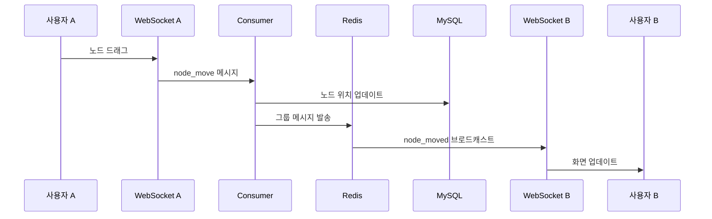

# Mindmaps WebSocket 아키텍처 기술 가이드

## 🏗️ 전체 시스템 아키텍처

### 1. 계층별 구조

```
┌─────────────────┐    ┌─────────────────┐
│   사용자 A      │    │   사용자 B      │
│  (브라우저)     │    │  (브라우저)     │
└─────────────────┘    └─────────────────┘
         │                       │
         │ WebSocket              │ WebSocket
         ▼                       ▼
┌─────────────────────────────────────────────┐
│            ASGI Layer                       │
│  ┌─────────────┐  ┌─────────────────────┐  │
│  │   HTTP      │  │    WebSocket        │  │
│  │  (Django)   │  │   (Channels)        │  │
│  └─────────────┘  └─────────────────────┘  │
└─────────────────────────────────────────────┘
         │                       │
         ▼                       ▼
┌─────────────────────────────────────────────┐
│            Business Layer                   │
│  ┌─────────────┐  ┌─────────────────────┐  │
│  │  Views      │  │   MindmapConsumer   │  │
│  │ (Django)    │  │   (Channels)        │  │
│  └─────────────┘  └─────────────────────┘  │
│         │                    │             │
│         ▼                    ▼             │
│  ┌─────────────────────────────────────┐   │
│  │      MindmapService                 │   │
│  │    (비즈니스 로직)                    │   │
│  └─────────────────────────────────────┘   │
└─────────────────────────────────────────────┘
         │
         ▼
┌─────────────────────────────────────────────┐
│            Data Layer                       │
│  ┌─────────────┐  ┌─────────────────────┐  │
│  │   MySQL     │  │      Redis          │  │
│  │ (영구저장)   │  │   (Channel Layer)   │  │
│  └─────────────┘  └─────────────────────┘  │
└─────────────────────────────────────────────┘
```

### 2. WebSocket 통신 흐름



## 🔧 핵심 컴포넌트 상세 분석

### 1. MindmapConsumer (WebSocket Handler)

#### 연결 관리
```python
class MindmapConsumer(AsyncWebsocketConsumer):
    async def connect(self):
        # URL에서 파라미터 추출
        self.mindmap_id = self.scope['url_route']['kwargs']['mindmap_id']
        self.team_id = self.scope['url_route']['kwargs']['team_id']
        self.room_group_name = f'mindmap_{self.mindmap_id}'
        
        # 사용자 인증 및 권한 확인
        if not await self.check_permissions():
            await self.close(code=4001)  # Unauthorized
            return
        
        # Redis 그룹에 참가
        await self.channel_layer.group_add(
            self.room_group_name,
            self.channel_name
        )
        
        await self.accept()
        
        # 다른 사용자들에게 참가 알림
        await self.channel_layer.group_send(
            self.room_group_name,
            {
                'type': 'user_joined',
                'user_id': self.user.id,
                'username': self.user.username
            }
        )
```

#### 메시지 처리 라우팅
```python
async def receive(self, text_data):
    try:
        data = json.loads(text_data)
        message_type = data.get('type')
        
        # 메시지 타입별 핸들러 호출
        handler_map = {
            'node_move': self.handle_node_move,
            'node_create': self.handle_node_create,
            'node_delete': self.handle_node_delete,
            'cursor_move': self.handle_cursor_move,
        }
        
        handler = handler_map.get(message_type)
        if handler:
            await handler(data)
        else:
            logger.warning(f"Unknown message type: {message_type}")
            
    except json.JSONDecodeError:
        await self.send_error("Invalid JSON format")
    except Exception as e:
        logger.error(f"Message handling error: {e}")
        await self.send_error("Internal server error")
```

#### 비동기 데이터베이스 작업
```python
@database_sync_to_async
def update_node_position(self, node_id, x, y):
    """
    동기 Django ORM을 비동기 컨텍스트에서 안전하게 사용
    """
    try:
        with transaction.atomic():
            node = Node.objects.select_for_update().get(
                id=node_id, 
                mindmap_id=self.mindmap_id
            )
            
            # 데이터 검증
            if not self.validate_coordinates(x, y):
                return False
            
            node.posX = float(x)
            node.posY = float(y)
            node.save()
            
            return True
    except (Node.DoesNotExist, ValueError, TypeError):
        return False

def validate_coordinates(self, x, y):
    """좌표 유효성 검사"""
    try:
        x, y = float(x), float(y)
        return -10000 <= x <= 10000 and -10000 <= y <= 10000
    except (ValueError, TypeError):
        return False
```

### 2. 클라이언트 JavaScript 아키텍처

#### MindmapEditor 클래스 구조
```javascript
class MindmapEditor {
  constructor(teamId, mindmapId) {
    // 상태 관리
    this.state = {
      nodes: new Map(),           // 노드 데이터
      connections: new Map(),     // 연결선 데이터
      activeUsers: new Map(),     // 활성 사용자
      viewport: {                 // 뷰포트 상태
        scale: 1.0,
        translateX: 0,
        translateY: 0
      },
      interaction: {              // 상호작용 상태
        isDragging: false,
        dragNode: null,
        isPanning: false,
        selectedNodes: new Set()
      }
    };
    
    this.initializeComponents();
  }
  
  initializeComponents() {
    this.canvas = new CanvasManager(this);
    this.websocket = new WebSocketManager(this);
    this.eventHandler = new EventHandler(this);
    this.renderer = new Renderer(this);
  }
}
```

#### WebSocket 관리자
```javascript
class WebSocketManager {
  constructor(editor) {
    this.editor = editor;
    this.socket = null;
    this.reconnectAttempts = 0;
    this.maxReconnectAttempts = 5;
    this.reconnectDelay = 1000;
    
    this.messageQueue = [];  // 연결 끊어짐 시 메시지 큐
    this.throttles = new Map();  // 메시지 스로틀링
  }
  
  connect() {
    const protocol = location.protocol === 'https:' ? 'wss:' : 'ws:';
    const url = `${protocol}//${location.host}/ws/mindmap/${this.editor.teamId}/${this.editor.mindmapId}/`;
    
    this.socket = new WebSocket(url);
    this.setupEventHandlers();
  }
  
  setupEventHandlers() {
    this.socket.onopen = () => {
      console.log('WebSocket 연결 성공');
      this.reconnectAttempts = 0;
      this.editor.updateConnectionStatus(true);
      
      // 큐에 있는 메시지들 전송
      while (this.messageQueue.length > 0) {
        const message = this.messageQueue.shift();
        this.send(message);
      }
    };
    
    this.socket.onmessage = (event) => {
      try {
        const data = JSON.parse(event.data);
        this.handleMessage(data);
      } catch (e) {
        console.error('메시지 파싱 오류:', e);
      }
    };
    
    this.socket.onclose = (event) => {
      console.log('WebSocket 연결 종료:', event.code);
      this.editor.updateConnectionStatus(false);
      this.attemptReconnect();
    };
    
    this.socket.onerror = (error) => {
      console.error('WebSocket 오류:', error);
    };
  }
  
  // 스로틀링과 함께 메시지 전송
  sendThrottled(type, data, delay = 50) {
    const key = `${type}_throttle`;
    
    if (this.throttles.has(key)) {
      clearTimeout(this.throttles.get(key));
    }
    
    const timeoutId = setTimeout(() => {
      this.send({ type, ...data });
      this.throttles.delete(key);
    }, delay);
    
    this.throttles.set(key, timeoutId);
  }
  
  send(message) {
    if (this.socket && this.socket.readyState === WebSocket.OPEN) {
      this.socket.send(JSON.stringify(message));
    } else {
      // 연결이 끊어진 경우 큐에 저장
      this.messageQueue.push(message);
    }
  }
  
  attemptReconnect() {
    if (this.reconnectAttempts < this.maxReconnectAttempts) {
      this.reconnectAttempts++;
      const delay = this.reconnectDelay * Math.pow(2, this.reconnectAttempts - 1);
      
      setTimeout(() => {
        console.log(`재연결 시도 ${this.reconnectAttempts}/${this.maxReconnectAttempts}`);
        this.connect();
      }, delay);
    }
  }
}
```

#### 렌더링 엔진
```javascript
class Renderer {
  constructor(editor) {
    this.editor = editor;
    this.ctx = editor.canvas.getContext('2d');
    this.animationFrame = null;
    this.dirtyRegions = new Set();  // 변경된 영역만 다시 그리기
  }
  
  render() {
    // 애니메이션 프레임 최적화
    if (this.animationFrame) {
      cancelAnimationFrame(this.animationFrame);
    }
    
    this.animationFrame = requestAnimationFrame(() => {
      this.performRender();
      this.animationFrame = null;
    });
  }
  
  performRender() {
    const { canvas, ctx } = this.editor;
    const { viewport } = this.editor.state;
    
    // 변환 매트릭스 설정
    ctx.save();
    ctx.clearRect(0, 0, canvas.width, canvas.height);
    
    // 뷰포트 변환 적용
    ctx.translate(viewport.translateX, viewport.translateY);
    ctx.scale(viewport.scale, viewport.scale);
    
    // 렌더링 순서: 배경 → 연결선 → 노드 → UI
    this.renderGrid();
    this.renderConnections();
    this.renderNodes();
    this.renderSelectionBox();
    
    ctx.restore();
    
    // 오버레이 (변환 영향 없음)
    this.renderUserCursors();
    this.renderUI();
  }
  
  renderNodes() {
    this.editor.state.nodes.forEach(node => {
      this.renderNode(node);
    });
  }
  
  renderNode(node) {
    const { ctx } = this;
    const { x, y, width, height, title, isSelected, isDragging } = node;
    
    // 노드 스타일 계산
    const style = this.getNodeStyle(node);
    
    // 그림자 효과 (드래그 중일 때)
    if (isDragging) {
      ctx.save();
      ctx.shadowColor = 'rgba(0,0,0,0.2)';
      ctx.shadowBlur = 8;
      ctx.shadowOffsetX = 2;
      ctx.shadowOffsetY = 2;
    }
    
    // 노드 배경
    ctx.fillStyle = style.backgroundColor;
    this.roundRect(ctx, x - width/2, y - height/2, width, height, 8);
    ctx.fill();
    
    // 노드 테두리
    if (isSelected) {
      ctx.strokeStyle = style.selectedBorderColor;
      ctx.lineWidth = 3;
    } else {
      ctx.strokeStyle = style.borderColor;
      ctx.lineWidth = 2;
    }
    ctx.stroke();
    
    // 노드 텍스트
    ctx.fillStyle = style.textColor;
    ctx.font = style.font;
    ctx.textAlign = 'center';
    ctx.textBaseline = 'middle';
    
    // 텍스트 길이에 따른 줄바꿈
    this.renderWrappedText(ctx, title, x, y, width - 16);
    
    if (isDragging) {
      ctx.restore();
    }
  }
  
  // 둥근 사각형 그리기 헬퍼
  roundRect(ctx, x, y, width, height, radius) {
    ctx.beginPath();
    ctx.moveTo(x + radius, y);
    ctx.lineTo(x + width - radius, y);
    ctx.quadraticCurveTo(x + width, y, x + width, y + radius);
    ctx.lineTo(x + width, y + height - radius);
    ctx.quadraticCurveTo(x + width, y + height, x + width - radius, y + height);
    ctx.lineTo(x + radius, y + height);
    ctx.quadraticCurveTo(x, y + height, x, y + height - radius);
    ctx.lineTo(x, y + radius);
    ctx.quadraticCurveTo(x, y, x + radius, y);
    ctx.closePath();
  }
  
  // 텍스트 줄바꿈 렌더링
  renderWrappedText(ctx, text, x, y, maxWidth) {
    const words = text.split(' ');
    const lines = [];
    let currentLine = '';
    
    for (let word of words) {
      const testLine = currentLine + (currentLine ? ' ' : '') + word;
      const metrics = ctx.measureText(testLine);
      
      if (metrics.width > maxWidth && currentLine) {
        lines.push(currentLine);
        currentLine = word;
      } else {
        currentLine = testLine;
      }
    }
    lines.push(currentLine);
    
    const lineHeight = 16;
    const totalHeight = lines.length * lineHeight;
    const startY = y - totalHeight / 2 + lineHeight / 2;
    
    lines.forEach((line, index) => {
      ctx.fillText(line, x, startY + index * lineHeight);
    });
  }
}
```

## 🔄 상태 관리 및 동기화

### 1. 충돌 해결 메커니즘

#### 낙관적 락킹 (Optimistic Locking)
```python
# 노드 업데이트 시 버전 체크
@database_sync_to_async
def update_node_position(self, node_id, x, y, version=None):
    try:
        with transaction.atomic():
            node = Node.objects.select_for_update().get(
                id=node_id, 
                mindmap_id=self.mindmap_id
            )
            
            # 버전 충돌 체크
            if version and node.version != version:
                return False, "Version conflict"
            
            node.posX = float(x)
            node.posY = float(y)
            node.version = F('version') + 1  # 버전 증가
            node.save()
            
            return True, node.version
    except Node.DoesNotExist:
        return False, "Node not found"
```

#### 클라이언트 상태 동기화
```javascript
class StateManager {
  constructor(editor) {
    this.editor = editor;
    this.pendingUpdates = new Map();  // 서버 응답 대기 중인 업데이트
    this.conflictResolution = 'server-wins';  // 충돌 해결 정책
  }
  
  updateNodePosition(nodeId, x, y) {
    const node = this.editor.state.nodes.get(nodeId);
    if (!node) return;
    
    // 낙관적 업데이트
    const originalPosition = { x: node.x, y: node.y };
    node.x = x;
    node.y = y;
    
    // 업데이트 ID 생성
    const updateId = this.generateUpdateId();
    this.pendingUpdates.set(updateId, {
      nodeId,
      originalPosition,
      newPosition: { x, y },
      timestamp: Date.now()
    });
    
    // 서버에 전송
    this.editor.websocket.send({
      type: 'node_move',
      node_id: nodeId,
      x: x,
      y: y,
      update_id: updateId,
      version: node.version
    });
    
    // 타임아웃 설정
    setTimeout(() => {
      this.handleUpdateTimeout(updateId);
    }, 5000);
  }
  
  handleServerUpdate(data) {
    const { type, node_id, x, y, update_id, version } = data;
    
    if (update_id && this.pendingUpdates.has(update_id)) {
      // 자신의 업데이트에 대한 서버 응답
      this.pendingUpdates.delete(update_id);
      
      const node = this.editor.state.nodes.get(node_id);
      if (node) {
        node.version = version;  // 버전 업데이트
      }
    } else {
      // 다른 사용자의 업데이트
      this.applyRemoteUpdate(node_id, x, y, version);
    }
  }
  
  handleUpdateTimeout(updateId) {
    if (this.pendingUpdates.has(updateId)) {
      const update = this.pendingUpdates.get(updateId);
      console.warn('업데이트 타임아웃:', update);
      
      // 원래 위치로 복구 (선택적)
      if (this.conflictResolution === 'revert-on-timeout') {
        const node = this.editor.state.nodes.get(update.nodeId);
        if (node) {
          node.x = update.originalPosition.x;
          node.y = update.originalPosition.y;
          this.editor.renderer.render();
        }
      }
      
      this.pendingUpdates.delete(updateId);
    }
  }
}
```

### 2. 성능 최적화 전략

#### 렌더링 최적화
```javascript
class PerformanceOptimizer {
  constructor(renderer) {
    this.renderer = renderer;
    this.dirtyRegions = new Set();
    this.cullingEnabled = true;
    this.levelOfDetail = true;
  }
  
  // 뷰포트 기반 컬링
  shouldRenderNode(node, viewport) {
    if (!this.cullingEnabled) return true;
    
    const { scale, translateX, translateY } = viewport;
    const canvasWidth = this.renderer.editor.canvas.width;
    const canvasHeight = this.renderer.editor.canvas.height;
    
    // 화면 영역 계산
    const viewLeft = (-translateX) / scale;
    const viewRight = (canvasWidth - translateX) / scale;
    const viewTop = (-translateY) / scale;
    const viewBottom = (canvasHeight - translateY) / scale;
    
    // 노드 영역
    const nodeLeft = node.x - node.width / 2;
    const nodeRight = node.x + node.width / 2;
    const nodeTop = node.y - node.height / 2;
    const nodeBottom = node.y + node.height / 2;
    
    // 교집합 검사
    return !(nodeRight < viewLeft || 
             nodeLeft > viewRight || 
             nodeBottom < viewTop || 
             nodeTop > viewBottom);
  }
  
  // 세부 수준 조절
  getNodeDetailLevel(node, viewport) {
    if (!this.levelOfDetail) return 'high';
    
    const { scale } = viewport;
    
    if (scale < 0.3) return 'low';      // 텍스트 숨김
    if (scale < 0.7) return 'medium';   // 단순화된 렌더링
    return 'high';                      // 풀 디테일
  }
}
```

#### 메모리 관리
```javascript
class MemoryManager {
  constructor(editor) {
    this.editor = editor;
    this.nodeCache = new Map();
    this.renderCache = new Map();
    this.maxCacheSize = 1000;
  }
  
  // 노드 캐시 관리
  cacheNode(nodeId, renderData) {
    if (this.nodeCache.size >= this.maxCacheSize) {
      // LRU 방식으로 오래된 캐시 제거
      const oldestKey = this.nodeCache.keys().next().value;
      this.nodeCache.delete(oldestKey);
    }
    
    this.nodeCache.set(nodeId, {
      data: renderData,
      timestamp: Date.now(),
      accessCount: 0
    });
  }
  
  // 주기적 메모리 정리
  cleanup() {
    const now = Date.now();
    const maxAge = 5 * 60 * 1000; // 5분
    
    for (const [key, value] of this.nodeCache) {
      if (now - value.timestamp > maxAge) {
        this.nodeCache.delete(key);
      }
    }
    
    // 사용하지 않는 DOM 요소 정리
    this.cleanupUserCursors();
  }
  
  cleanupUserCursors() {
    const cursors = document.querySelectorAll('.user-cursor');
    const activeUserIds = new Set(this.editor.state.activeUsers.keys());
    
    cursors.forEach(cursor => {
      const userId = cursor.getAttribute('data-user-id');
      if (!activeUserIds.has(parseInt(userId))) {
        cursor.remove();
      }
    });
  }
}
```

## 📊 모니터링 및 디버깅

### 1. 성능 메트릭
```javascript
class PerformanceMonitor {
  constructor(editor) {
    this.editor = editor;
    this.metrics = {
      renderTime: [],
      wsLatency: [],
      memoryUsage: [],
      nodeCount: 0,
      userCount: 0
    };
    
    this.startMonitoring();
  }
  
  recordRenderTime(startTime) {
    const renderTime = performance.now() - startTime;
    this.metrics.renderTime.push(renderTime);
    
    // 최근 100개 기록만 유지
    if (this.metrics.renderTime.length > 100) {
      this.metrics.renderTime.shift();
    }
    
    // 성능 임계값 체크
    if (renderTime > 16.67) { // 60fps 기준
      console.warn(`느린 렌더링 감지: ${renderTime.toFixed(2)}ms`);
    }
  }
  
  recordWebSocketLatency(sentTime) {
    const latency = Date.now() - sentTime;
    this.metrics.wsLatency.push(latency);
    
    if (this.metrics.wsLatency.length > 50) {
      this.metrics.wsLatency.shift();
    }
  }
  
  getAverageRenderTime() {
    if (this.metrics.renderTime.length === 0) return 0;
    const sum = this.metrics.renderTime.reduce((a, b) => a + b, 0);
    return sum / this.metrics.renderTime.length;
  }
  
  getMemoryUsage() {
    if ('memory' in performance) {
      return {
        used: performance.memory.usedJSHeapSize,
        total: performance.memory.totalJSHeapSize,
        limit: performance.memory.jsHeapSizeLimit
      };
    }
    return null;
  }
}
```

### 2. 오류 처리 및 로깅
```python
# Django Consumer 로깅
import logging
import traceback

logger = logging.getLogger('mindmaps.websocket')

class MindmapConsumer(AsyncWebsocketConsumer):
    async def receive(self, text_data):
        try:
            data = json.loads(text_data)
            await self.process_message(data)
            
        except json.JSONDecodeError as e:
            logger.warning(f"Invalid JSON from user {self.user.id}: {text_data}")
            await self.send_error("Invalid JSON format")
            
        except PermissionError as e:
            logger.warning(f"Permission denied for user {self.user.id}: {e}")
            await self.send_error("Permission denied")
            
        except Exception as e:
            logger.error(f"Unexpected error in mindmap {self.mindmap_id}: {e}")
            logger.error(traceback.format_exc())
            await self.send_error("Internal server error")
    
    async def send_error(self, message):
        await self.send(text_data=json.dumps({
            'type': 'error',
            'message': message,
            'timestamp': time.time()
        }))
```

---

**작성일**: 2025.09.07  
**버전**: 1.0  
**다음 업데이트**: Phase 2 완료 후

> 이 기술 가이드는 WebSocket 기반 실시간 마인드맵 시스템의 핵심 아키텍처와 구현 세부사항을 다룹니다. 향후 시스템 확장 및 유지보수 시 참고 문서로 활용하세요.