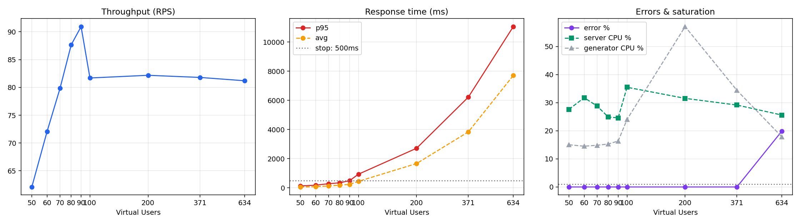

# 로컬 한계점 탐색 부하 테스트 리포트

> **측정일**: 2026-09-11
> **목적**: 2025-12-16 AWS 측정에서 찾지 못한 **무릎(knee)** 을 찾고,
> 그 지점에서 **무엇이 먼저 한계에 닿았는지** 규명한다.
> **⚠️ 이 리포트의 절대값을 [AWS 측정치](../load-test-report.md)와 섞어 쓰지 말 것.**
> 환경이 완전히 다른 별개 실험이다.

---

## 0. 측정 전에 고정한 중단 조건

**측정을 시작하기 전에 확정했고, 결과를 보고 바꾸지 않았다.**

| 조건 | 임계값 |
|---|---|
| 95%ile 응답 시간 | **> 500 ms** |
| 에러율 | **> 1 %** |

둘 중 하나라도 위반한 첫 단계를 "무릎을 넘은 단계"로 판정한다.
판정 구간은 **스폰 완료 후 60초를 버린 정상 상태**만 사용한다.
(`config.py` 의 `STOP_P95_MS`, `STOP_ERROR_RATE` 에 같은 값이 박혀 있다.)

---

## 1. 측정 환경

### 서버 (부하 대상)

| 항목 | 값 |
|---|---|
| CPU / RAM | AMD Ryzen 5 5600 (6C / 12T) / 32 GB |
| OS | Windows 11 Pro 26200 + Docker Desktop (WSL2) |
| 앱 | Django 5.2.4, asgiref 3.9.1, **Daphne 단일 프로세스** |
| 스레드 | **실측 17개** = 메인 1 + asgiref 워커 16 (`min(32, cpu+4)`, cpu=12) |
| DB | MySQL 8.0 — `max_connections=300`, `wait_timeout=28800` |
| 캐시 | Redis 7 |
| 설정 | `TeamMoa.settings.loadtest` (prod 상속, `DEBUG=False`) |
| 리버스 프록시 | **없음** (Daphne 직접) |

### 부하 생성기

| 항목 | 값 |
|---|---|
| 모델 | MSI P65 Creator 8RD (i7-8750H) |
| CPU / RAM | 6 physical / 12 logical, 17.0 GB |
| OS | Windows 10.0.26200 |
| Locust | master + **워커 6개** (코어 수만큼 독립 프로세스) |

### prod 대비 의도적 차이

| 항목 | prod | 여기 | 이유 |
|---|---|---|---|
| Nginx | 있음 | **없음** | 변수 축소 |
| HTTPS | ALB 종단 | **평문 HTTP** | 로컬에 종단점 없음 |
| `SECURE_SSL_REDIRECT` / secure 쿠키 | True | **False** | 평문 HTTP에서 로그인 불가해짐 |
| DRF throttle | anon 100/h, user 1000/h | **해제** | 아래 참고 |

> **throttle 해제가 이 실험의 전제였다.** 로그인 API는 `AllowAny`(익명)라
> `AnonRateThrottle` 이 **IP 단위**로 걸린다. 부하는 노트북 1대(단일 IP)에서
> 나오므로 시간당 101번째 로그인부터 전부 429가 된다. 해제하지 않으면
> "서버가 언제 무너지는가"가 아니라 **"DRF 카운터가 언제 차는가"** 를 재게 된다.
>
> 뒤집어 말하면 **prod에서는 인프라 한계보다 이 정책이 먼저 걸린다.**
> 그것 자체가 결과다.

---

## 2. 결과

### 단계별 수치 (정상 상태, 워밍업 60초 제외)

| VU | RPS | 평균(ms) | **p95(ms)** | p95 최대 | **에러율** | 호스트 CPU | **web CPU** | DB CPU | MySQL conn | 생성기 CPU | 판정 |
|---:|---:|---:|---:|---:|---:|---:|---:|---:|---:|---:|---|
| 50 | 62.1 | 53 | 122 | 220 | 0.00 % | 28 % | **88 %** | 17 % | 35 | 15 % | 정상 |
| 60 | 72.1 | 73 | 177 | 270 | 0.00 % | 32 % | **106 %** | 19 % | 57 | 15 % | 정상 |
| 70 | 79.8 | 123 | 278 | 330 | 0.00 % | 29 % | **117 %** | 21 % | 60 | 15 % | 정상 |
| 80 | 87.7 | 179 | 339 | 420 | 0.00 % | 25 % | **125 %** | 23 % | 105 | 15 % | 정상 |
| 90 | **90.9** | 232 | **490** | 620 | 0.00 % | 25 % | **127 %** | 23 % | 106 | 16 % | 정상 (문턱 근접) |
| 100 | 81.7 | 440 | **932** | 1300 | 0.00 % | 36 % | **127 %** | 24 % | 142 | 24 % | **위반 (p95)** |
| 200 | 82.2 | 1,662 | 2,712 | 3,000 | 0.00 % | 32 % | **126 %** | 24 % | 227 | 57 % | 위반 |
| 371¹ | 81.8 | 3,839 | 6,227 | 6,500 | 0.00 %² | 29 % | **127 %** | 26 % | 279 | 34 % | 위반 |
| 634¹ | 81.2 | 7,711 | 11,066 | 12,000 | **19.89 %** | 26 % | **126 %** | 19 % | **301** | 18 % | 위반 |

¹ 목표는 VU 400 / 800이었으나 **VU가 목표치를 유지하지 못했다**(371 / 634).
서버가 500을 던지면서 `on_start` 의 로그인이 실패해 VU가 죽었다.
표에는 실제 유지된 수를 적는다.

² VU 371 단계는 전체로는 실패 56건(0.4%)이지만, 정상 상태 구간만 보면 0%다.
에러가 스폰 직후에 몰렸다.

### 무릎

**VU 90 과 VU 100 사이.**

- VU 90: p95 **490 ms** — 중단 조건(500 ms) 바로 아래
- VU 100: p95 **932 ms** — 위반. 한 단계 만에 1.9배

**처리량으로도 같은 지점이 나온다.** RPS가 VU 90에서 **90.9로 정점**을 찍고
VU 100에서 81.7로 꺾인다. 그 뒤로는 VU를 6배 늘려도 **RPS가 81~82에서 완전히 평평**하다.
VU를 더 넣어도 처리량은 그대로고 대기열만 길어진다 — 전형적인 포화 곡선이다.

> **처리량 천장 ≈ 91 RPS** (Locust 집계 기준).
> 홈 태스크(`/` → 302 → `/teams/`, 가중치 25%)가 2왕복이므로
> **서버 실측으로는 약 114 req/s** 다.

---

## 3. 무엇이 먼저 한계에 닿았는가

### ① 무릎의 원인 — Daphne 단일 프로세스 CPU 천장

**web 컨테이너 CPU가 126~127%에서 완전히 평평하다.** VU 80부터 VU 634까지,
부하를 8배 늘리는 동안 단 1%도 움직이지 않았다.

Daphne는 **단일 Python 프로세스**다. GIL 때문에 100%가 사실상 천장이고,
127%는 mysqlclient 같은 C 확장이 GIL을 놓는 구간의 몫이다. 즉 **포화**다.
동시 처리 가능한 동기 뷰도 asgiref 워커 **16개**로 묶여 있다.

**결정적인 것은 호스트 CPU가 25~36%에 불과하다는 점이다.**
12스레드 머신에서 **8코어 이상이 놀고 있는데** 앱 프로세스 하나가 꽉 찼다.

> **한계는 하드웨어가 아니라 배포 구성이다.**
> VU 50에서 88%, VU 90에서 127%(천장)에 닿았고, 무릎이 정확히 거기 있다.

### ② DB는 무릎의 원인이 아니다

`Threads_running` 이 **전 구간 2~4** 에 머물렀다. 커넥션은 300까지 쌓였지만
실제로 쿼리를 실행 중인 것은 거의 없었다. DB CPU도 17~26%다.

> **DB는 한가했다. 쿼리 성능은 무릎의 원인이 아니다.**

### ③ VU 371 이후의 500 에러 — MySQL 커넥션 누수 (**프로덕션 버그**)

무릎과 500 에러는 **원인이 다르다.** 뭉뚱그리면 안 된다.

| 측정 | 값 | 출처 |
|---|---|---|
| 요청 20건 → 신규 커넥션 증가 | **22** | `Connections` 전후 비교 |
| 테스트 중 총 커넥션 생성 | **122,324** | `Connections` |
| `Max_used_connections` | **301** | = 상한 300 + SUPER 예약 1 |
| `Connection_errors_max_connections` | **2,914** | 상한 초과로 **거부된** 접속 |
| 부하 종료 6분 후 잔존 커넥션 | **73개, 전부 Sleep, 최고령 384초** | `PROCESSLIST` |
| `wait_timeout` | **28,800초 (8시간)** | `SHOW VARIABLES` |

django.log: `Too many connections` **779건**, `OperationalError` **604건**,
`Internal Server Error` **312건**.

**`CONN_MAX_AGE = 600` 이 전혀 동작하지 않는다.**
요청 20건에 커넥션이 22개 늘었다 — 재사용이 0이다. 게다가 만들어진 커넥션이
반납되지 않는다. 부하가 끝나고 6분이 지나도 73개가 Sleep으로 살아 있고,
`wait_timeout` 이 8시간이라 스스로 정리되지도 않는다.

즉 **요청마다 커넥션을 새로 열고 놓지 않는다.** 부하가 지속되면 상한 300에
부딪히고, 그 뒤 모든 신규 접속이 거부되어
`OperationalError: Too many connections` → **HTTP 500** 이 된다.

수집 타임라인에서 `mysql_threads_connected` 가 **301에 고정된 구간**이
정확히 500이 쏟아진 단계와 일치한다.

> ⚠️ **이건 테스트 아티팩트가 아니다.** EC2도 같은 `prod` 설정, 같은 Daphne
> 단일 프로세스 구성이다. 트래픽이 낮아 8시간 안에 300에 닿지 못했을 뿐이다.
> `CONN_MAX_AGE` 로 커넥션이 재사용된다고 믿고 있었다면 **그 전제가 틀렸다.**
> throttle 해제 때문에 도달한 것도 아니다. throttle은 요청 수를 제한할 뿐,
> 커넥션이 반납되지 않는다는 사실과는 무관하다.

---

## 4. 생성기와 네트워크가 병목이 아니었다는 증거

이게 없으면 "서버 한계를 쟀다"고 말할 수 없다.

### 생성기 (노트북)

| VU | 50 | 60 | 70 | 80 | 90 | 100 | 200 | 371 | 634 |
|---|---|---|---|---|---|---|---|---|---|
| 생성기 CPU | 15 % | 15 % | 15 % | 15 % | **16 %** | **24 %** | 57 % | 34 % | 18 % |

**무릎이 나온 VU 90~100 구간에서 생성기 CPU는 16~24%다.** 포화와 거리가 멀다.
VU 371 / 634에서 오히려 낮아진 것은 서버가 느려져 생성기가 대기했기 때문이다.

> 단, VU 200 단계는 평균 57% / 순간 최대 100%를 기록했다.
> 그 구간 수치는 생성기 영향 가능성을 배제하지 못한다.
> **다만 무릎은 그보다 훨씬 앞(VU 90~100)에서 이미 나왔으므로 결론에 영향이 없다.**

### 네트워크

| 항목 | 측정값 |
|---|---|
| RTT (ping ×50) | 최소 1 ms / 평균 1 ms / 최대 2 ms, **손실 0%** |
| iperf3 업로드 (노트북→서버) | 84.0 Mbps |
| iperf3 다운로드 (서버→노트북) | **59.3 Mbps** |
| 실사용 대역폭 (천장 91 RPS 시점) | **≈ 2.2 Mbps (용량의 3.7%)** |

응답 트래픽 방향(`-R`) 용량의 4%도 쓰지 않았다. **네트워크는 병목이 아니다.**

**실사용 대역폭 산출 근거** — 시나리오 가중치 × 실측 응답 크기:

| 태스크 | 가중치 | 응답 크기 |
|---|---:|---:|
| 02 홈 (`/teams/`) | 25 % | 4,415 B |
| 03 팀 목록 | 20 % | 204 B |
| 04 팀 상세 | 15 % | 236 B |
| 05 공유게시판 | 10 % | 8,738 B |
| 06 TODO 목록 | 15 % | 4,862 B |
| 07 스케줄 | 10 % | 2,279 B |
| 08 Health | 5 % | 43 B |
| **가중평균** | | **3,013 B** |

3,013 B × 91 RPS = 2.2 Mbps (바디 기준, 헤더·TCP 오버헤드 제외).

> ⚠️ **`generator_*.csv` 의 `net_recv_mb` 로는 이 값을 낼 수 없다.**
> `psutil.net_io_counters()` 는 **노트북 전체 트래픽**을 재므로 locust 외의
> 통신이 섞인다. 실제로 요청 수가 거의 같은데(14,529 → 13,522, −7%)
> 수신량은 191.7 MB → 132.0 MB 로 45% 차이가 났다. 가중치가 고정이라
> 바이트는 요청 수를 따라가야 하는데 따라가지 않는다.
> 따라서 그 컬럼은 **상한(upper bound)** 으로만 읽고, 실사용량은 위처럼
> 응답 크기에서 산출한다.

> 한계: 서버·노트북 **양쪽 다 무선**으로 같은 AP를 공유했다(같은 채널 airtime 공유).
> TCP 재전송(Retr) 수치는 이 Windows iperf3 빌드가 출력하지 않아 확보하지 못했다.
> RTT가 1 ms에 손실 0%였으므로 영향은 작다고 판단하지만,
> **재전송을 확인하지 못한 것은 이 측정의 약점이다.**

---

## 5. 기존 AWS 측정과의 관계

| | AWS (2025-12-16) | 로컬 (2026-09-11) |
|---|---|---|
| 환경 | ALB + EC2 t3.micro ×2 (Multi-AZ) | 로컬 PC 단일 컨테이너, 프록시 없음 |
| `wait_time` | `between(2, 5)` → **VU당 0.29 RPS** | `between(0.5, 1)` → **VU당 ~1.3 RPS** |
| 최대 VU | 150 | 800 (유지 634) |
| 최대 p95 | 76 ms | 11,066 ms |
| 무릎 | **찾지 못함** | **VU 90~100** |

**AWS 측정이 무릎을 못 찾은 이유가 이번에 설명된다.**
VU당 부하 밀도가 0.29 RPS였으므로 150 VU라도 약 **43 RPS** 다.
이번 측정의 처리량 천장이 **91 RPS** 이므로, AWS 실험은 천장의 절반에도
닿지 못한 상태에서 끝난 것이다. "여유가 있다"는 결론은 그래서 나왔다.

> **절대값은 비교할 수 없다.** 하드웨어도, 프록시 유무도, 네트워크도 다르다.
> 비교 가능한 것은 **"부하 밀도가 부족했다"** 는 구조적 사실뿐이다.

---

## 6. 결론

1. **무릎은 VU 90~100 에 있다.** p95가 490 ms → 932 ms로 꺾이고,
   RPS가 90.9에서 정점을 찍은 뒤 81~82로 평평해진다.
2. **먼저 닿은 한계는 Daphne 단일 프로세스의 CPU 천장이다.**
   web CPU가 127%에 고정된 반면 호스트 CPU는 25~36%였다.
   **하드웨어가 아니라 배포 구성이 한계였다.**
3. **VU 371 이상의 500 에러는 별개 원인 — MySQL 커넥션 누수다.**
   `CONN_MAX_AGE=600` 이 동작하지 않아 요청마다 커넥션이 새로 열리고
   반납되지 않는다. 상한 300에 닿으면 접속이 거부된다.
   **이건 프로덕션에도 그대로 있는 버그다.**
4. **DB 쿼리 성능은 병목이 아니었다.** `Threads_running` 이 2~4에 머물렀다.
5. **생성기와 네트워크는 병목이 아니었음을 수치로 확인했다.**

---

## 7. 다음에 할 것

아래는 **가설이다.** 같은 중단 조건으로 재측정해야 결과가 된다.

1. **커넥션 누수의 정확한 지점 특정.** ASGI 경로에서 `close_old_connections`
   가 커넥션을 만든 스레드와 다른 컨텍스트에서 도는지 우선 확인한다.
   → 수정 후 VU 634에서 500이 사라지는지 재측정.
2. **무릎을 옮길 수 있는지 검증.** Daphne 인스턴스를 코어 수만큼 띄우고
   앞에 Nginx를 두면 무릎이 어디로 가는가. 호스트 CPU가 25%에 불과하므로
   여지는 크다.
3. **N+1 최적화 전후 비교** (`43eefc5` ↔ `41f941c`).
   **다만 해석에 주의가 필요하다.** 이번 측정에서 DB는 한가했고 앱 프로세스가
   먼저 포화됐다. 그런 구성에서는 쿼리 수를 줄여도 무릎이 거의 움직이지 않을
   수 있다. 그 경우 "최적화가 무의미했다"가 아니라
   **"현재 병목이 DB가 아니라서 드러나지 않는다"** 가 올바른 결론이다.
   앱을 멀티프로세스로 바꿔 CPU 천장을 걷어낸 뒤 비교해야 의미가 있다.

---

## 부록: 재현 방법

- 절차: [RUNBOOK.md](./RUNBOOK.md)
- 생성기 지시서: [LAPTOP_BRIEF.md](./LAPTOP_BRIEF.md)
- 원인 규명 상세: [FINDINGS.md](./FINDINGS.md)
- 원자료: [results/](./results/)
