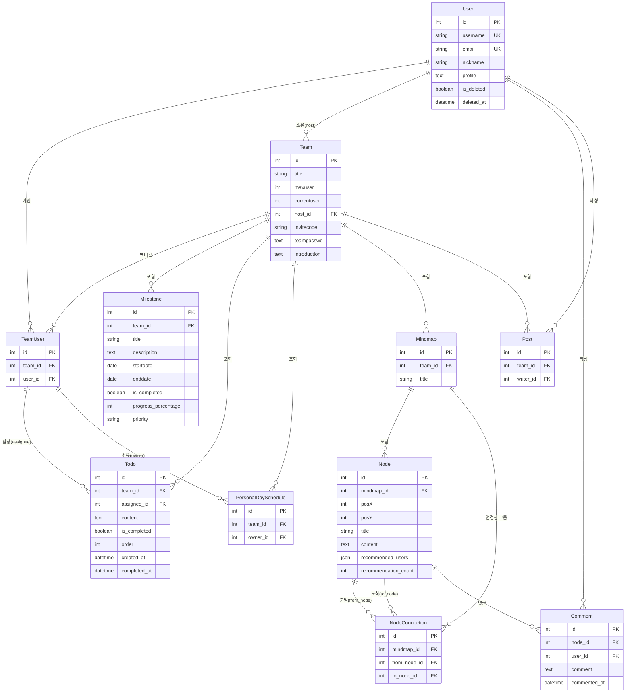

# 아키텍처 설계

> **서비스 레이어 패턴과 SSR + API 병행 구조**
> View에 섞여있던 비즈니스 로직을 분리하여 관리하기 쉬운 구조로 개선

---

## 문서 목적

이 문서는 **왜 이렇게 설계했는지**를 설명합니다.

### 주요 내용
1. **서비스 레이어 도입 배경** - View가 뚱뚱해지는 문제 해결
2. **API vs SSR 선택 기준** - 언제 무엇을 쓸지 명확한 기준
3. **데이터베이스 설계 의도** - Soft Delete, JSONField 선택 이유
4. **코드 구조화** - 6개 앱의 일관된 패턴


---

## 목차
- [아키텍처 개요](#아키텍처-개요)
- [서비스 레이어 패턴](#서비스-레이어-패턴)
- [API vs SSR 전략](#api-vs-ssr-전략)
- [데이터베이스 설계](#데이터베이스-설계)
- [코드 구조](#코드-구조)

---

## 아키텍처 개요

### 레이어 구조
```
┌────────────────────────────────────────┐
│      Presentation Layer                │
│     (View + Template 통합)              │
│  ┌──────────────┐    ┌──────────────┐  │
│  │  Django      │    │  DRF         │  │
│  │  Views       │    │  ViewSets    │  │
│  │  +           │    │  +           │  │
│  │  Templates   │    │  JSON        │  │
│  └──────────────┘    └──────────────┘  │
├────────────────────────────────────────┤
│         Service Layer                  │
│  ┌─────────────────────────────────┐   │
│  │  Business Logic                 │   │
│  │  (services.py)                  │   │
│  └─────────────────────────────────┘   │
├────────────────────────────────────────┤
│          Data Layer                    │
│  ┌──────────────┐    ┌──────────────┐  │
│  │  Django      │    │  MySQL       │  │
│  │  ORM         │    │  Database    │  │
│  └──────────────┘    └──────────────┘  │
└────────────────────────────────────────┘
```

**레이어 설명**:
- **Presentation Layer**: Django에서는 View와 Template을 함께 표현 계층으로 취급
  - SSR: `views.py` (View) + `templates/` (Template)
  - API: `viewsets.py` (ViewSet) + JSON 응답
- **Service Layer**: 비즈니스 로직 집중 (`services.py`)
- **Data Layer**: ORM을 통한 DB 접근 (`models.py`)

---

### 설계 원칙

위 레이어 구조를 설계할 때 다음 3가지 원칙을 따랐다.

#### 1. 관심사의 분리 (Separation of Concerns)
- **View Layer**: HTTP 요청/응답 처리만
- **Service Layer**: 비즈니스 로직 집중
- **Data Layer**: 데이터 저장 및 조회

#### 2. 재사용성 (Reusability)
- 서비스 레이어를 API/SSR 뷰에서 공통 사용
- 예시: `TeamService.create_team()` → API ViewSet, SSR Form 모두 사용

#### 3. 테스트 가능성 (Testability)
- 서비스 로직 단위 테스트 가능
- View와 분리되어 HTTP 요청 없이 테스트

---

## 서비스 레이어 패턴

### 도입 배경

**문제점 (도입 전)**:
```python
# teams/views.py (Before)
class TeamCreateView(LoginRequiredMixin, View):
    def post(self, request):
        form = TeamForm(request.POST)
        if form.is_valid():
            team = form.save(commit=False)
            team.save()

            # 비즈니스 로직이 View에 혼재
            invite_code = generate_invite_code()
            team.invitecode = invite_code
            team.host = request.user
            team.save()

            # 호스트를 멤버로 등록
            TeamUser.objects.create(
                team=team,
                user=request.user
            )

            messages.success(request, '팀이 생성되었습니다.')
            return redirect('teams:team_main', pk=team.pk)
```

**문제**:
1. View에 비즈니스 로직 혼재 (초대 코드 생성, 호스트 등록)
2. API와 SSR에서 로직 중복
3. 테스트 시 HTTP 요청 필요
4. 재사용 불가

---

**해결 (도입 후)**:
```python
# teams/services.py (After)
class TeamService:
    @transaction.atomic
    def create_team(self, host_user, title, maxuser, teampasswd, introduction):
        """
        팀을 생성하고 호스트를 멤버로 자동 등록합니다.

        Args:
            host_user: 팀 호스트가 될 사용자
            title: 팀 제목
            maxuser: 최대 인원수
            teampasswd: 팀 비밀번호
            introduction: 팀 소개

        Returns:
            Team: 생성된 팀 객체
        """
        # 1. 초대 코드 생성
        invite_code = self._generate_invite_code()

        # 2. 팀 생성
        team = Team.objects.create(
            title=title,
            maxuser=maxuser,
            teampasswd=teampasswd,
            introduction=introduction,
            host=host_user,
            currentuser=1,
            invitecode=invite_code
        )

        # 3. 호스트를 멤버로 추가
        TeamUser.objects.create(team=team, user=host_user)

        return team
```

```python
# teams/views.py (SSR)
class TeamCreateView(LoginRequiredMixin, View):
    def post(self, request):
        form = TeamForm(request.POST)
        if form.is_valid():
            team_service = TeamService()
            team = team_service.create_team(
                host_user=request.user,
                title=form.cleaned_data['title'],
                maxuser=form.cleaned_data['maxuser'],
                teampasswd=form.cleaned_data['teampasswd'],
                introduction=form.cleaned_data.get('introduction', '')
            )
            messages.success(request, '팀이 생성되었습니다.')
            return redirect('teams:team_main', pk=team.pk)
```

```python
# teams/viewsets.py (API)
class TeamViewSet(viewsets.ModelViewSet):
    def create(self, request):
        serializer = TeamSerializer(data=request.data)
        serializer.is_valid(raise_exception=True)

        team_service = TeamService()
        team = team_service.create_team(
            host_user=request.user,
            title=serializer.validated_data['title'],
            maxuser=serializer.validated_data['maxuser'],
            teampasswd=serializer.validated_data['teampasswd'],
            introduction=serializer.validated_data.get('introduction', '')
        )

        return Response(
            TeamSerializer(team).data,
            status=status.HTTP_201_CREATED
        )
```

>**효과**:
>- ✅ View는 HTTP 처리만 (얇은 View)
>- ✅ API/SSR 로직 공유 (중복 제거)
>- ✅ 서비스 단위 테스트 가능
>- ✅ 재사용 가능

---

### 서비스 레이어 구현 패턴

#### 1. 트랜잭션 관리
```python
# accounts/services.py
class AuthService:
    @transaction.atomic
    def register_user(self, form, current_site):
        """
        사용자 등록 + 이메일 발송을 원자적으로 처리
        이메일 발송 실패 시 사용자 생성도 취소됨
        """
        with transaction.atomic():
            # 1. 유저를 DB에 임시 저장, pk 부여
            user = form.save()

            # 2. 이메일 전송 (실패 시 롤백)
            self.send_activation_email(user, current_site)

        # 3. 예외 없이 성공하면 최종 확정(commit)
        return user
```

**배경**:
- 회원가입 시 이메일 인증 링크 발송 필요
- 이메일 발송 실패 시 유저 레코드가 더미로 남는 문제
- `@transaction.atomic`으로 원자성 확보

**코드 위치**: [`accounts/services.py:18-36`](../../accounts/services.py#L18-L36)

---

#### 2. 권한 검증
```python
# teams/services.py
class TeamService:
    def remove_member(self, team, user_to_remove):
        """
        팀 멤버 제거 (탈퇴)

        권한 검증:
        - 호스트는 탈퇴할 수 없음
        - 일반 멤버만 탈퇴 가능
        """
        # 호스트 탈퇴 방지
        if team.host == user_to_remove:
            raise PermissionDenied("호스트는 팀을 탈퇴할 수 없습니다.")

        # 멤버십 확인 및 삭제
        try:
            team_user = TeamUser.objects.get(team=team, user=user_to_remove)
            team_user.delete()

            # 현재 인원수 감소
            team.currentuser = team.get_current_member_count()
            team.save()

            return True
        except TeamUser.DoesNotExist:
            raise ValueError("팀 멤버가 아닙니다.")
```

**특징**:
- 비즈니스 규칙을 서비스에서 검증
- View는 검증 로직 없이 서비스 호출만
- 예외 발생 시 View에서 처리

---

#### 3. 복잡한 쿼리 캡슐화
```python
# schedules/services.py
class ScheduleService:
    @staticmethod
    def get_team_availability(team, year, week):
        """
        팀 가용성 계산 (7일 × 24시간)

        Returns:
            {
                'time_9-1': 3,  # 월요일 09:00, 3명 가능
                'time_9-2': 2,  # 화요일 09:00, 2명 가능
                ...
            }
        """
        # 1. 해당 주차의 모든 멤버 스케줄 조회
        schedules = Schedule.objects.filter(
            team=team,
            year=year,
            week=week
        ).select_related('member')  # N+1 방지

        # 2. 168개 슬롯별 가용 인원 집계
        availability = {f'time_{h}-{d}': 0 for h in range(24) for d in range(1, 8)}

        for schedule in schedules:
            for slot, is_available in schedule.schedule_data.items():
                if is_available:
                    availability[slot] += 1

        return availability
```

**효과**:
- N+1 쿼리 해결 (`select_related`)
- 복잡한 집계 로직 캡슐화
- View는 단순히 결과만 받음

---

### 서비스 레이어 가이드라인

#### 언제 서비스 레이어를 사용하는가?
다음 조건 중 **1개 이상** 만족 시 서비스 사용:

1. ✅ **비즈니스 로직 존재** (권한 검증, 상태 전이, 계산)
2. ✅ **여러 모델 조작** (Team + TeamMember 동시 생성)
3. ✅ **트랜잭션 필요** (회원가입 + 이메일 발송)
4. ✅ **API/SSR 로직 공유** (중복 제거)
5. ✅ **복잡한 쿼리** (집계, N+1 해결)

#### 서비스 레이어를 사용하지 않는 경우
- 단순 CRUD (Django Generic Views로 충분)
- 비즈니스 로직 없음 (단순 조회)

---

## API vs SSR 전략

### 개요

본 프로젝트는 **SSR(Server-Side Rendering)과 API 기반 동적 UI를 함께 사용하는 하이브리드 아키텍처**를 채택했다. 각 기능이 요구하는 UX·성능·SEO·실시간성을 기준으로 다음과 같이 구분했다.

| 영역 | 기준 | 적용된 기능 |
|-----|------|-----------|
| **SSR 사용** | - 복잡한 Form 처리<br>- SEO 필요<br>- 초기 로드 시 서버 템플릿 렌더링이 빠름 | 인증(accounts), 게시판(shares) |
| **API 사용** | - 실시간성 필요<br>- 프론트에서 상태 관리가 많은 경우<br>- UI가 빈번히 변경되는 동적 화면 | TODO 드래그앤드롭(members), 마인드맵 에디터(mindmaps) |
| **하이브리드** | - 초기 페이지는 SSR(빠른 로드)<br>- 이후 CRUD는 API로 비동기 처리 | 팀 관리(teams), 스케줄(schedules) |

**결과적으로**:
- 로그인/가입/게시글 등 전통적인 웹 흐름 → **SSR**
- 인터랙티브하고 상태 변화가 많은 기능 → **API**

---

### 왜 이런 구조를 선택했나?

#### 1. UX 최적화 (사용자가 느끼는 속도)

- **SSR**: 초기 페이지 로드가 빠르고 즉시 렌더링됨
- **API**: 이후 인터랙션(TODO 정렬, 노드 연결 등)은 페이지 새로고침 없이 동적 동작

**"초기 렌더링은 빠르게, 이후 인터랙션은 부드럽게"** 한다는 원칙으로 설계함.

#### 2. 백엔드 로직 재사용

API/SSR 방식이 달라도 **하나의 비즈니스 로직만 사용**하도록 서비스 레이어 중심 구조로 설계함.

```
SSR View    → Service Layer → ORM
API ViewSet → Service Layer → ORM
```

**예시**:
- `TeamService.create_team()`
- `ScheduleService.get_week_availability()`
- `MindmapService.create_node()`

→ API/SSR 모두 동일 로직 사용 → **중복 제거 + 유지보수 쉬움**

#### 3. 실시간성과 정적 페이지의 공존

프로젝트는 정적 페이지 + 실시간 인터랙션 기능이 모두 존재하기 때문에 단일 방식(순수 SSR/순수 SPA)으로는 구조적 단점이 컸음.

따라서 기능별로 다음 기준을 도입했다:

- **데이터 변경이 잦고 화면 갱신이 빈번** → API
- **문서성 콘텐츠/SEO 필요** → SSR
- **초기 로드가 중요 + 이후 비동기 작업이 섞임** → 하이브리드

---

### 핵심 요약 (Summary)

- **SSR**은 전통적 화면 렌더링이 필요한 페이지에 최적
- **API**는 실시간 상호작용 또는 동시 편집이 필요한 화면에 최적
- **하이브리드**는 초기 로드 속도 + 인터랙티브한 UX를 동시에 만족
- 구조는 **서비스 레이어로 통합**하여 API/SSR 로직 중복을 제거

---

### 구현 예시

#### 예시 1: TODO 관리 (API)

**선택 이유**:
- 드래그 앤 드롭 즉시 반영 (실시간성)
- 동적 카운터 업데이트 (멤버별 TODO 수)
- Optimistic UI 패턴

**구현**:
```javascript
// static/js/pages/team_members.js
async function assignTodo(todoId, memberId) {
    // 1. Optimistic UI - DOM 먼저 업데이트
    moveTodoElement(todoId, memberId);
    updateTodoCounter(memberId, +1);

    // 2. API 호출
    try {
        await todoApi.assignTodo(teamId, todoId, memberId);
        showDjangoToast('TODO가 할당되었습니다.', 'success');
    } catch (error) {
        // 3. 실패 시 롤백
        revertTodoElement(todoId);
        updateTodoCounter(memberId, -1);
        showDjangoToast('할당 실패: ' + error.message, 'error');
    }
}
```

**API 엔드포인트**:
```python
# members/viewsets.py
class TodoViewSet(viewsets.ModelViewSet):
    @action(detail=True, methods=['post'])
    def assign(self, request, team_pk, pk):
        """TODO 할당"""
        todo = self.get_object()
        member_id = request.data.get('member_id')

        TodoService.assign_todo(todo, member_id)
        return Response({'status': 'success'})
```

**코드 위치**:
- JavaScript: [`static/js/pages/team_members.js`](../../static/js/pages/team_members.js)
- ViewSet: [`members/viewsets.py`](../../members/viewsets.py)

---

#### 예시 2: 게시판 (SSR)

**선택 이유**:
- SEO 필요 (게시물 검색 엔진 노출)
- 정적 콘텐츠 (게시물 상세 페이지)
- 복잡한 Form (파일 업로드, Summernote 에디터)

**구현**:
```python
# shares/views.py
def post_write_view(request, pk):
    """게시물 작성 (SSR)"""
    team = get_object_or_404(Team, pk=pk)

    if request.method == 'POST':
        form = PostForm(request.POST, request.FILES)
        if form.is_valid():
            post = PostService.create_post(
                team=team,
                author=request.user,
                data=form.cleaned_data,
                file=request.FILES.get('file')
            )
            messages.success(request, '게시물이 작성되었습니다.')
            return redirect('shares:post_detail', pk=pk, post_id=post.pk)
    else:
        form = PostForm()

    return render(request, 'shares/post_write_renew.html', {
        'team': team,
        'form': form
    })
```

**템플릿**:
```html
<!-- shares/templates/shares/post_write_renew.html -->
<form method="POST" enctype="multipart/form-data">
    

    {{ form.title }}
    {{ form.content }}  <!-- Summernote 에디터 -->

    <!-- 파일 업로드 (드래그 앤 드롭 UI) -->
    <div class="file-upload-area">
        <input type="file" name="file" id="id_file">
    </div>

    <button type="submit">작성하기</button>
</form>
```

**코드 위치**: [`shares/views.py`](../../shares/views.py)

---

#### 예시 3: 팀 가입 (AJAX - 특수 케이스)

**선택 이유**:
- SSR 페이지 내에서 부분적으로 비동기 처리 필요
- 보안 (URL에 팀 ID 노출 방지)
- UX (페이지 새로고침 방지)

**특징**: REST API가 아닌 템플릿 뷰용 AJAX 엔드포인트 (2-step 인증)

---

### API vs SSR 실제 분포

| 앱 | SSR 뷰 | REST API | AJAX | 전략 |
|---|--------|----------|------|------|
| **Accounts** | 10개 | 0개 | 1개 | SSR 중심 (인증 흐름) |
| **Teams** | 7개 | 4개 | 2개 | 하이브리드 (관리는 SSR, 마일스톤은 API) |
| **Members** | 1개 | 5개 | 0개 | 하이브리드 (초기 로드 SSR, CRUD API) |
| **Schedules** | 2개 | 2개 | 0개 | 하이브리드 (페이지 SSR, 조회/저장 API) |
| **Mindmaps** | 8개 | 10개 | 0개 | 하이브리드 (관리 SSR, 에디터 API+WS) |
| **Shares** | 6개 | 0개 | 0개 | SSR 중심 (게시판 CRUD) |

**상세 매핑**: [`docs/architecture/design/api_ssr_mapping.md`](../architecture/design/api_ssr_mapping.md)

---

## 데이터베이스 설계

### 설계 의도

**"Team을 중심으로 협업 데이터를 관리"**

프로젝트의 핵심 엔터티는 User, Team, Mindmap, Node이며, Team을 중심으로 협업 관련 데이터(Milestone, Todo, PersonalDaySchedule, Mindmap, Post)가 1:N 관계로 연결되는 구조이다. User와 Team은 N:M 관계이며, 중간 테이블(TeamUser)을 통해 연결된다. 팀장은 Team.host(ForeignKey)로 별도 관리한다.

이러한 구조를 선택한 이유는:
1. **권한 관리 단순화** - host 필드로 팀장을 명시적으로 지정, TeamUser는 단순 멤버십만 표현
2. **팀 단위 격리** - 각 팀의 데이터는 독립적으로 관리
3. **확장성** - 새 기능 추가 시 Team에 1:N 관계로 연결만 하면 됨

---

### 테이블 관계 개요

프로젝트의 핵심 엔터티는 User, Team, Mindmap, Node이며, Team을 중심으로 협업 관련 데이터가 1:N 관계로 연결되는 구조이다.



**주요 관계**:
- User와 Team은 N:M 관계 (중간 테이블: TeamUser, 단순 멤버십만 표현)
- 팀장은 Team.host(ForeignKey→User)로 별도 관리
- Todo.assignee는 TeamUser를 참조 (팀 내부 멤버에게만 할당)
- PersonalDaySchedule.owner도 TeamUser 참조 (팀 멤버별 스케줄)
- Mindmap은 Node를 1:N으로 포함, Node 간 연결은 NodeConnection(M2M self) 사용
- Node는 Comment를 1:N으로 가짐 (Comment.user는 User 직접 참조)

> **상세 내용** (필드 정의, Soft Delete 이유, JSONField 구조 등)은 별도 DB 설계 문서 참조

---

### 쿼리 최적화 예시

```python
# N+1 문제 해결 (10개 팀 조회 시)
# Before: 11번 쿼리 (1 + 10)
teams = Team.objects.all()
for team in teams:
    print(team.host.username)  # 각 팀마다 추가 쿼리

# After: 1번 JOIN 쿼리
teams = Team.objects.select_related('host').all()
```

**실제 적용 사례**: [`teams/viewsets.py:32`](../../teams/viewsets.py#L32)

**참고**: `select_related` (ForeignKey), `prefetch_related` (ManyToMany, 역참조)

---

## 코드 구조

### 앱별 파일 구조
```
teams/
├── models.py           # Team, TeamUser, Milestone
├── services.py         # TeamService, MilestoneService
├── views.py            # SSR 뷰 (team_create, team_search, ...)
├── viewsets.py         # MilestoneViewSet (REST API)
├── serializers.py      # MilestoneSerializer
├── forms.py            # TeamForm, MilestoneForm
├── urls.py             # SSR URL 패턴
├── tests/
│   ├── test_team_service.py       # 서비스 테스트 (36개)
│   ├── test_team_viewset.py       # API 테스트 (17개)
│   └── test_team_views.py         # SSR 테스트 (13개)
└── templates/teams/
    ├── main_authenticated.html
    ├── team_create.html
    └── ...
```

### URL 라우팅

#### SSR URLs
```python
# teams/urls.py
app_name = 'teams'

urlpatterns = [
    path('', views.main_page, name='main'),
    path('team_create/', views.team_create, name='team_create'),
    path('team_main_page/<int:pk>/', views.team_main_page, name='team_main'),
    # ...
]
```

#### API URLs
```python
# TeamMoa/urls.py
from rest_framework.routers import DefaultRouter

router = DefaultRouter()
router.register(
    r'teams/(?P<team_pk>\d+)/milestones',
    MilestoneViewSet,
    basename='milestone'
)

urlpatterns = [
    path('api/v1/', include(router.urls)),
]
```

**결과 URL**: `/api/v1/teams/1/milestones/` (팀 1번의 마일스톤 목록)

---

### JavaScript 모듈 구조

```
static/js/
├── api/
│   └── client.js           # API 클라이언트 (공통)
│       ├── teamApi
│       ├── todoApi
│       ├── scheduleApi
│       └── mindmapApi
│
├── common/
│   └── ui-utils.js         # 공통 UI 유틸리티
│       ├── showToast()
│       ├── showDjangoToast()
│       ├── showConfirmModal()
│       └── showDjangoMessages()
│
└── pages/                  # 페이지별 스크립트
    ├── team_members.js     # TODO 드래그 앤 드롭
    ├── milestone_timeline.js # 마일스톤 타임라인
    ├── scheduler_upload.js # 스케줄 업로드
    └── mindmap_detail.js   # 마인드맵 에디터
```

**API 클라이언트 예시**:
```javascript
// static/js/api/client.js
const todoApi = {
    async assignTodo(teamId, todoId, memberId) {
        const response = await fetch(
            `/api/v1/teams/${teamId}/todos/${todoId}/assign/`,
            {
                method: 'POST',
                headers: {
                    'Content-Type': 'application/json',
                    'X-CSRFToken': getCookie('csrftoken')
                },
                body: JSON.stringify({ member_id: memberId })
            }
        );
        return await response.json();
    }
};
```

---

## 학습 내용

### 1. 아키텍처 패턴
- **서비스 레이어 패턴** - Fat Model 문제 해결
- **관심사의 분리** - View/Service/Model 역할 명확화
- **하이브리드 렌더링** - SSR과 API의 장점 결합

### 2. Django 심화
- **Class-Based Views** - Generic Views, Mixin 활용
- **DRF ViewSet** - `@action` 데코레이터, 커스텀 액션
- **ORM 최적화** - `select_related`, `prefetch_related`

### 3. 설계 원칙
- **SOLID** - 단일 책임 원칙 (Service Layer)
- **DRY** - API/SSR 로직 공유
- **YAGNI** - 필요한 API만 구현 (24개 중 19개 사용)

---

**작성일**: 2025년 12월 2일
**버전**: 1.0
**참고 문서**:
- [상세 API/SSR 매핑](../architecture/design/api_ssr_mapping.md)
- [서비스 레이어 가이드라인](../architecture/design/service_layer_guidelines.md)
