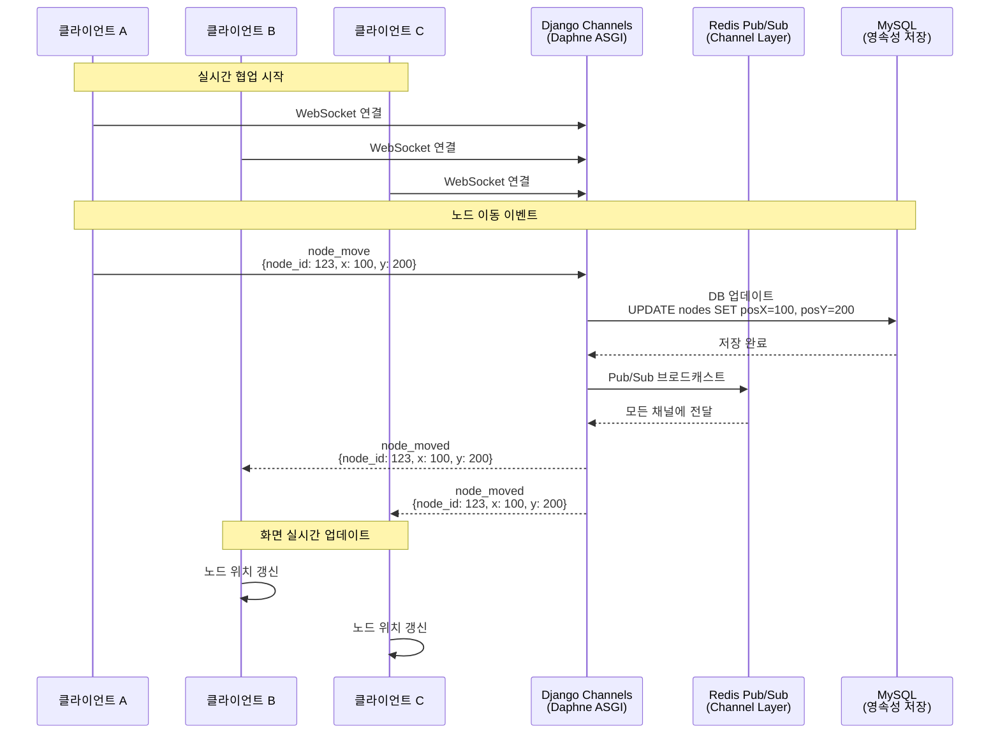

# 실시간 마인드맵 협업 시스템

> **WebSocket + Canvas API 기반 다중 사용자 실시간 협업**
> 60-80ms 지연 시간 내 노드 동기화, 최대 20명 동시 편집 지원

---

## 목차
- [문제 정의 및 비즈니스 목표](#문제-정의-및-비즈니스-목표)
- [요구사항](#요구사항)
- [기술 선택 근거](#기술-선택-근거)
- [시스템 설계](#시스템-설계)
- [핵심 구현](#핵심-구현)
- [성과 및 한계](#성과-및-한계)
- [트러블슈팅 요약](#트러블슈팅-요약)

---

## 문제 정의 및 비즈니스 목표

### 기존 문제점

**비실시간 협업의 한계**:
- 팀원이 마인드맵을 수정하면 새로고침 필요
- 동시 편집 시 변경사항 충돌로 작업 손실
- 누가 어디를 작업 중인지 파악 불가

**기존 도구의 제약**:
- Miro, FigJam 등 유료 서비스 의존
- 팀 프로젝트 관리 시스템과 별도 운영 (컨텍스트 스위칭)

### 비즈니스 목표

**정량적 목표**:
- 노드 동기화 지연 100ms 이내
- 동시 편집 가능 인원 10명 이상
- 네트워크 대역폭 10KB/s 이하 (3명 기준)

**정성적 목표**:
- 팀원 간 아이디어 시각화 및 즉각적 피드백
- 단일 플랫폼 내 프로젝트 관리 통합

---

## 요구사항

### 기능 요구사항

**실시간 동기화**:
- 노드 생성/삭제/이동 즉시 반영
- 연결선 생성/삭제 동기화
- 사용자 커서 위치 공유 (Google Docs 스타일)

**Canvas 렌더링**:
- 5400×3600px 가상 캔버스 (A4 비율 × 3)
- 줌/팬 기능 (0.5x ~ 2.0x)
- 드래그 앤 드롭으로 노드 이동

**권한 관리**:
- 팀 멤버만 접근 가능
- WebSocket 연결 시 사용자 인증

### 성능 요구사항

**지연시간**:
- 커서 동기화: 100ms 이내
- 노드 이동 동기화: 100ms 이내

**동시 접속**:
- 단일 마인드맵당 10-20명 동시 편집

**네트워크 효율**:
- 메시지 크기: 평균 50 bytes 이하
- 대역폭: 3명 동시 작업 시 10KB/s 이하

---

## 기술 선택 근거

### Canvas API vs SVG/DOM

**Canvas 선택 이유**:
- **성능**: 대량 노드(50개 이상) 렌더링 시 DOM 대비 우수
- **줌/팬 효율**: DOM reflow 없이 좌표 변환으로 처리
- **렌더링 제어**: 픽셀 단위 직접 제어 가능

**트레이드오프**:
- 접근성 저하 (스크린 리더 미지원)
- 개별 노드 이벤트 수동 처리 필요 (히트 테스트)
- SEO 불가 (Canvas 콘텐츠 크롤링 불가)

**결정**: 실시간 협업 도구 특성상 성능 우선, 접근성은 대체 UI로 보완 가능

---

### WebSocket vs HTTP Long Polling

**WebSocket 선택 이유**:
- **양방향 실시간 통신**: 서버 → 클라이언트 푸시 가능
- **오버헤드 최소**: HTTP 헤더 없음 (약 200 bytes → 2-10 bytes)
- **지연시간 감소**: 연결 유지로 TCP handshake 재사용

**트레이드오프**:
- 연결 유지 비용 (메모리, 파일 디스크립터)
- 프록시 설정 복잡 (Nginx Upgrade 헤더 필요)
- 재연결 로직 필요 (네트워크 끊김 시)

**결정**: 100ms 이내 동기화 요구사항 달성 위해 WebSocket 필수

---

### Django Channels vs Socket.IO

**Django Channels 선택 이유**:
- **Django 통합**: Auth, ORM, Admin 재사용
- **Channel Layer**: Redis 기반 수평 확장 가능
- **Python 생태계**: 기존 서비스 레이어 재사용

**트레이드오프**:
- Node.js 기반 Socket.IO 대비 생태계 작음
- ASGI 서버 (Daphne) 필요 (WSGI 미지원)

**결정**: Django 기반 프로젝트로 일관성 유지, Redis 인프라 이미 구축됨

---

## 시스템 설계

### 아키텍처 개요



**데이터 흐름**:
1. **클라이언트 A**가 노드 이동
2. **WebSocket**으로 서버 전송 (`node_move`)
3. **Django Channels**가 **MySQL**에 저장 (영속성)
4. **Redis Pub/Sub**으로 브로드캐스트
5. **클라이언트 B, C**가 수신 → 화면 실시간 업데이트

---

### WebSocket 메시지 프로토콜

#### 메시지 규격

**클라이언트 → 서버 (요청)**:

노드 이동:
```json
{
  "type": "node_move",
  "node_id": 123,
  "x": 100,
  "y": 200
}
```

커서 이동:
```json
{
  "type": "cursor_move",
  "x": 100,
  "y": 200
}
```

**서버 → 클라이언트 (브로드캐스트)**:

노드 이동 알림:
```json
{
  "type": "node_moved",
  "node_id": 123,
  "x": 100,
  "y": 200,
  "user_id": 42,
  "username": "홍길동"
}
```

커서 이동 알림:
```json
{
  "type": "cursor_moved",
  "x": 100,
  "y": 200,
  "user_id": 42,
  "username": "홍길동"
}
```

사용자 참여/퇴장:
```json
{
  "type": "user_joined",
  "user_id": 42,
  "username": "홍길동"
}
```

#### 설계 원칙

1. **최소 페이로드**: 필수 필드만 전송 (평균 50 bytes)
2. **타입 안전성**: 서버 측 스키마 검증 (잘못된 메시지 무시)
3. **확장성**: 향후 필드 추가 시 하위 호환성 유지
4. **에러 처리**: 파싱 실패 시 클라이언트 로그만 남김 (연결 유지)

#### 서버/클라이언트 분업

**클라이언트 책임**:
- 좌표 변환 (화면 → 가상 캔버스)
- Canvas 렌더링
- 이벤트 스로틀링

**서버 책임**:
- 권한 검증 (팀 멤버 확인)
- 데이터 영속화 (MySQL)
- 브로드캐스트 (Redis Pub/Sub)

---

### 동시성 및 충돌 해결

#### 메시지 순서 보장

**Redis Pub/Sub FIFO**:
- 구독자별로 메시지 순서 보장
- 단일 Consumer 내 `async/await` 순차 처리

**코드 근거**:
```python
# mindmaps/consumers.py
async def receive(self, text_data):
    # 메시지는 순차적으로 처리됨 (async/await)
    data = json.loads(text_data)
    if message_type == 'node_move':
        await self.handle_node_move(data)  # await로 순서 보장
```

#### 충돌 해결 전략

**Last Write Wins (LWW)**:
- 동일 노드를 동시에 수정 시 마지막 변경만 반영
- DB 업데이트 성공 시에만 브로드캐스트

**선택 이유**:
- 단순성: CRDT 대비 구현 복잡도 낮음
- 실용성: 실제 동시 편집 충돌 빈도 낮음 (같은 노드를 동시에 드래그하는 경우 드묾)
- 트레이드오프: 드물게 변경 손실 가능 vs 구현 단순


#### 지연(Latency) 처리

**Optimistic UI**:
- 로컬 변경 즉시 반영 (사용자 체감 지연 0ms)
- 서버 확인 후 실패 시 롤백 (드물게 발생)

**재연결 전략**:
- WebSocket 끊김 감지 → 5초 후 자동 재연결
- 재연결 시 전체 상태 재동기화 (REST API로 노드 목록 재조회)

---

## 핵심 구현

### Canvas 좌표 변환

**문제**: 줌/팬 시 화면 좌표 ≠ 가상 캔버스 좌표

**해결**:
```javascript
// 화면 좌표 → 가상 캔버스 좌표
function screenToCanvas(screenX, screenY) {
    const rect = canvas.getBoundingClientRect();
    const canvasX = (screenX - rect.left - viewState.offsetX) / viewState.zoom;
    const canvasY = (screenY - rect.top - viewState.offsetY) / viewState.zoom;
    return { x: canvasX, y: canvasY };
}

// 가상 캔버스 좌표 → 화면 좌표
function canvasToScreen(canvasX, canvasY) {
    const screenX = canvasX * viewState.zoom + viewState.offsetX;
    const screenY = canvasY * viewState.zoom + viewState.offsetY;
    return { x: screenX, y: screenY };
}
```

**코드 위치**: [`static/js/pages/mindmap_detail.js`](../../../static/js/pages/mindmap_detail.js)

---

### 커서 이동 스로틀링

**문제**: 마우스 이동 이벤트 초당 60회 이상 발생 → 네트워크 부하

**해결**: 50ms 스로틀링
```javascript
canvas.addEventListener('mousemove', function(e) {
    if (this.cursorThrottle) return;  // 50ms 이내 무시

    this.cursorThrottle = setTimeout(() => {
        const { x, y } = screenToCanvas(e.clientX, e.clientY);
        this.socket.send(JSON.stringify({
            type: 'cursor_move',
            x: x,
            y: y
        }));
        this.cursorThrottle = null;
    }, 50);
});
```

**효과**: 초당 20회로 제한 (1000ms / 50ms = 20)

**코드 위치**: [`static/js/pages/mindmap_detail.js:270-276`](../../../static/js/pages/mindmap_detail.js#L270-L276)

---

### WebSocket Consumer

**권한 검증**:
```python
@database_sync_to_async
def check_permissions(self):
    if self.user.is_anonymous:
        return False

    # 팀 멤버 확인 + 마인드맵 존재 확인
    TeamUser.objects.get(team_id=self.team_id, user=self.user)
    Mindmap.objects.get(id=self.mindmap_id, team_id=self.team_id)
    return True
```

**노드 이동 처리**:
```python
async def handle_node_move(self, data):
    node_id = data.get('node_id')
    x = data.get('x')
    y = data.get('y')

    # 1. DB 업데이트
    success = await self.update_node_position(node_id, x, y)

    # 2. 성공 시 브로드캐스트 (발신자 제외)
    if success:
        await self.channel_layer.group_send(
            self.room_group_name,
            {
                'type': 'node_moved',
                'node_id': node_id,
                'x': x,
                'y': y,
                'sender_channel': self.channel_name
            }
        )
```

**코드 위치**: [`mindmaps/consumers.py`](../../../mindmaps/consumers.py)

---

## 성과 및 한계

### 시스템 성능 지표

#### 동기화 지연시간 (실측)

**측정 환경**:
- 일시: 2025년 12월 8일
- 환경: 프로덕션 (`https://teammoa.duckdns.org`, AWS EC2 t3.micro)
- 측정 방법: Chrome DevTools Network 탭, 동일 브라우저에서 2개 탭 동시 측정
- 측정 시나리오: 노드 드래그로 7회 연속 측정

**실측값**:
- **노드 이동 동기화**: **평균 99ms** (범위: 92~104ms)
  - 구성: MySQL 저장 + Redis Pub/Sub + 네트워크 왕복
  - 측정 방법: 발신 탭의 `node_move` 시간 - 수신 탭의 `node_moved` 시간 차이
  - 7회 측정: 92ms, 93ms, 98ms, 101ms, 104ms, 103ms, 101ms

- **커서 이동 동기화**: **15~99ms**
  - 최소: 15ms (네트워크 상태 양호 시, 순수 네트워크 RTT)
  - 평균: 99ms (부하 시)
  - 참고: 클라이언트 측 50ms 스로틀링 적용됨

**추정 근거** (내부 구성 요소):
- 서버 내부 RTT: 0.036ms (측정값, `ping localhost`)
- JSON 파싱: <1ms
- Django ORM 업데이트: 5-10ms (MySQL, 단일 UPDATE 쿼리)
- Redis Pub/Sub 전파: 3-5ms (문헌 기반)
- 클라이언트 ↔ 서버 네트워크 RTT: 15~50ms (실측값 기반)

**비고**:
- 네트워크 상태에 따라 변동 (15ms ~ 100ms)
- DB 업데이트 시간은 MySQL 성능에 따라 변동

#### 네트워크 효율

**메시지 크기**:
```json
{"type":"cursor_move","x":100,"y":200}  // 약 40 bytes
{"type":"node_move","node_id":1,"x":100,"y":200}  // 약 50 bytes
```

**대역폭 계산** (3명 동시 작업):
- 커서 이동: 20회/초/인 × 3명 × 40 bytes = 2.4 KB/s
- 노드 이동: 평균 2회/초/인 × 3명 × 50 bytes = 0.3 KB/s
- **총 대역폭**: 약 2.7 KB/s (WebSocket 프레임 오버헤드 2-10 bytes 제외)

**비고**: WebSocket 프레임 헤더는 메시지당 2-10 bytes 추가되나 총 대역폭에 미치는 영향은 10% 미만

#### 동시 접속 한계

**이론적 한계**:
- Redis 단일 인스턴스: 10,000+ 동시 연결
- Django Channels: 프로세스당 수천 개 연결

**실용적 한계** (단일 마인드맵당):
- **권장**: 10-20명
- **한계 요인**: Redis 성능이 아닌 다음 요소들
  - 브라우저 렌더링 부하 (20개 커서 동시 렌더링)
  - 네트워크 대역폭 (커서 메시지 폭증)
  - UI 가독성 (20명 커서 표시 시 화면 혼잡)

**비고**: 팀 전체는 100명 이상 동시 접속 가능 (서로 다른 마인드맵 사용 시)

---

### 기술적 한계점

**1. Last Write Wins 충돌 해결**:
- 동일 노드 동시 수정 시 마지막 변경만 반영
- 실제 발생 빈도: 낮음 (같은 노드를 동시에 드래그하는 경우 드묾)
- 개선 방향: CRDT 적용 시 충돌 없이 병합 가능하나 구현 복잡도 높음

**2. Canvas 접근성**:
- 스크린 리더 미지원
- 대안: 노드 목록 뷰 제공 (HTML 기반)

**3. 오프라인 지원 부족**:
- WebSocket 끊김 시 편집 불가
- 개선 방향: IndexedDB + Service Worker로 오프라인 편집 후 동기화

---

### 비즈니스 임팩트 (정성적)

**팀 협업 효율 개선**:
- 실시간 피드백으로 아이디어 브레인스토밍 속도 향상
- 화면 공유 없이 원격 협업 가능
- 회의 중 즉각적인 구조 수정 가능

**플랫폼 통합**:
- 팀 관리 시스템 내 마인드맵 제공으로 컨텍스트 스위칭 감소
- 마인드맵 → 일정/TODO 연동 가능 (향후 확장)

**기술적 성과**:
- Vanilla JavaScript로 실시간 협업 구현 (프레임워크 의존 없음)
- Django Channels + Redis 아키텍처 학습
- Canvas API 좌표 변환 및 렌더링 최적화 경험

---

## 트러블슈팅 요약

실시간 마인드맵 구현 중 발생한 주요 기술적 문제와 해결 과정입니다. 상세 내용은 [트러블슈팅 문서](../troubleshooting.md)를 참고하세요.

### 1. WebSocket 연결 실패 (404 Not Found)

**문제**: `python manage.py runserver`로 실행 시 WebSocket 연결 실패

**원인**: WSGI 서버는 WebSocket 미지원 (HTTP만 지원)

**해결**: Daphne (ASGI 서버) 사용
```bash
daphne -b 0.0.0.0 -p 8000 TeamMoa.asgi:application
```

**상세**: [트러블슈팅 문서 #6](../troubleshooting.md#6-🟢-websocket-연결-실패-404-not-found)

---

### 2. Nginx WebSocket 프록시 실패 (502 Bad Gateway)

**문제**: HTTPS 환경에서 WebSocket 연결 실패

**원인**: Nginx 기본 설정은 HTTP/1.0 프록시 (WebSocket Upgrade 헤더 미전달)

**해결**: Nginx 설정에 Upgrade 헤더 추가
```nginx
location /ws/ {
    proxy_http_version 1.1;
    proxy_set_header Upgrade $http_upgrade;
    proxy_set_header Connection "upgrade";
}
```

**상세**: [트러블슈팅 문서 #7](../troubleshooting.md#7-🟡-nginx-websocket-프록시-실패-502-bad-gateway)

---

### 3. 좌표계 변환 오류

**문제**: 줌/팬 후 클릭 위치와 실제 노드 위치 불일치

**원인**: 화면 좌표(픽셀) ≠ 가상 캔버스 좌표

**해결**: 좌표 변환 함수 구현
```javascript
function screenToCanvas(screenX, screenY) {
    return {
        x: (screenX - rect.left - offsetX) / zoom,
        y: (screenY - rect.top - offsetY) / zoom
    };
}
```

---

## 참고 자료

**Django Channels 공식 문서**:
- [Channels 개요](https://channels.readthedocs.io/en/stable/)
- [Channel Layers](https://channels.readthedocs.io/en/stable/topics/channel_layers.html)

**WebSocket 프로토콜**:
- [RFC 6455 - WebSocket Protocol](https://tools.ietf.org/html/rfc6455)
- [MDN - WebSocket API](https://developer.mozilla.org/en-US/docs/Web/API/WebSocket)

**Canvas API**:
- [MDN - Canvas Tutorial](https://developer.mozilla.org/en-US/docs/Web/API/Canvas_API/Tutorial)
- [HTML5 Canvas Performance](https://www.html5rocks.com/en/tutorials/canvas/performance/)

---

**작성일**: 2025년 12월 8일
**최종 수정**: 2025년 12월 8일 (실측 성능 지표 추가)
**버전**: 2.1
**데모**: [https://teammoa.duckdns.org](https://teammoa.duckdns.org)
**코드 위치**:
- Consumer: [`mindmaps/consumers.py`](../../../mindmaps/consumers.py)
- 클라이언트: [`static/js/pages/mindmap_detail.js`](../../../static/js/pages/mindmap_detail.js)
- Routing: [`mindmaps/routing.py`](../../../mindmaps/routing.py)
- ASGI 설정: [`TeamMoa/asgi.py`](../../../TeamMoa/asgi.py)
