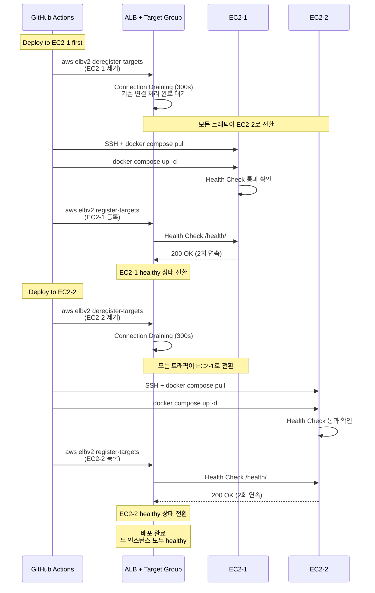

# 인프라 및 배포

> **Docker 기반 컨테이너화와 GitHub Actions CI/CD 파이프라인**
> 수동 배포 30분 → 자동 배포 5분, 테스트 실패 시 자동 중단

---

## 목차
- [인프라 개요](#인프라-개요)
- [Docker 컨테이너화](#docker-컨테이너화)
- [CI/CD 파이프라인](#cicd-파이프라인)
- [프로덕션 배포](#프로덕션-배포)
- [학습 내용](#학습-내용)

---

## 인프라 개요

### 왜 이런 인프라를 구축했는가?

**핵심 목표**:
1. **비용 최소화** - AWS 프리티어 범위 내 운영 (월 0원)
2. **배포 자동화** - 수동 30분 → 자동 5분
3. **안정성** - Health Check, 테스트 실패 시 배포 중단
4. **학습** - 인프라 전 과정을 직접 구축하며 이해

**기술 선택 이유 (Why)**:
- **Docker**: 환경 불일치 해결, 어디서나 동일하게 실행
- **GitHub Actions**: 무료, GitHub 통합, 간단한 YAML 설정
- **AWS EC2**: 프리티어, 학습용으로 직접 관리
- **Nginx + Daphne**: WebSocket 지원 + HTTPS 종료 분리

---

### 아키텍처 구성도 및 흐름


**흐름 설명 (2가지)**:

#### 1. 배포 흐름 (CI/CD 파이프라인)
```
개발자 → git push → GitHub Actions
                          ↓
        [Test] 221개 테스트 (실패 시 중단)
                          ↓
        [Build] Docker 이미지 빌드 → Docker Hub
                          ↓
        [Deploy] EC2 접속 → 이미지 pull → 컨테이너 재시작
```

#### 2. 사용자 요청 처리 흐름 (프로덕션 인프라)
```
사용자 브라우저
    ↓ HTTPS 요청
Nginx (SSL 종료, 리버스 프록시)
    ↓ HTTP 또는 WebSocket Upgrade
Daphne (ASGI 서버)
    ↓
Django 앱 (비즈니스 로직)
    ↓ (WebSocket 사용 시)
Channels → Redis (Channel Layer)
```

---

## Docker 컨테이너화

### 도입 배경

**문제 (Docker 도입 전)**:
1. **환경 불일치** - 로컬에서 동작하는 코드가 프로덕션에서 실패
2. **복잡한 설정** - MySQL, Redis를 각 환경마다 수동 설치 및 설정
3. **배포 복잡도** - EC2에서 Python 버전, 의존성 패키지 수동 관리

**해결 (Docker 도입 후)**:
- 로컬, 테스트, 프로덕션 환경이 동일한 컨테이너 사용
- `docker-compose up` 명령 하나로 전체 스택 실행
- 이미지 기반 배포로 환경 설정 자동화

---

### Dockerfile (멀티 스테이지 빌드)

```dockerfile
# Stage 1: Builder (의존성 설치)
FROM python:3.11-slim as builder

ENV PYTHONUNBUFFERED=1 \
    PYTHONDONTWRITEBYTECODE=1 \
    PIP_NO_CACHE_DIR=1
    PIP_DISABLE_PIP_VERSION_CHECK=1
    
# 시스템 패키지 설치 (MySQL 클라이언트 라이브러리)
RUN apt-get update && apt-get install -y --no-install-recommends \
    gcc \
    default-libmysqlclient-dev \
    pkg-config \
    && rm -rf /var/lib/apt/lists/*

# Virtual Environment 생성
RUN python -m venv /opt/venv
ENV PATH="/opt/venv/bin:$PATH"

# Python 패키지 설치
COPY requirements.txt .
RUN pip install --upgrade pip && \
    pip install -r requirements.txt

# Stage 2: Runtime (최종 이미지)
FROM python:3.11-slim

ENV PYTHONUNBUFFERED=1 \
    PYTHONDONTWRITEBYTECODE=1 \
    PATH="/opt/venv/bin:$PATH" \
    DJANGO_SETTINGS_MODULE=TeamMoa.settings.prod

# 런타임 의존성만 설치
RUN apt-get update && apt-get install -y --no-install-recommends \
    default-libmysqlclient-dev \
    curl \
    cron \
    gosu \
    && rm -rf /var/lib/apt/lists/*

# Stage 1에서 빌드한 Virtual Environment 복사
COPY --from=builder /opt/venv /opt/venv

# 비root 사용자 생성 (보안)
RUN useradd -m -u 1000 appuser && \
    mkdir -p /app/staticfiles /app/media /app/logs && \
    chown -R appuser:appuser /app

WORKDIR /app

# 애플리케이션 코드 복사
COPY --chown=appuser:appuser . .

# Health check
HEALTHCHECK --interval=30s --timeout=10s --start-period=40s --retries=3 \
    CMD curl -f http://localhost:8000/health/ || exit 1

EXPOSE 8000

# Entrypoint script 실행 (마이그레이션, collectstatic 등)
ENTRYPOINT ["/app/deploy/entrypoint.sh"]

# Daphne로 실행 (ASGI 서버)
CMD ["daphne", "-b", "0.0.0.0", "-p", "8000", "TeamMoa.asgi:application"]
```

**멀티 스테이지 빌드 이유**:
1. **이미지 크기 감소** - gcc 등 빌드 도구는 최종 이미지에 포함 안 됨
2. **Virtual Environment 격리** - Stage 1에서 빌드한 venv만 복사
3. **보안** - 비root 사용자(appuser)로 실행, 불필요한 패키지 제거

**실제 효과**:
- 이미지 크기: ~1.2GB (단일 스테이지) → ~600MB (멀티 스테이지)
- 빌드 시간: 레이어 캐싱으로 requirements.txt 변경 없으면 2분 단축

**코드 위치**: [`Dockerfile`](../../Dockerfile)

---

### 왜 Docker Compose를 선택했는가?

**다른 선택지**:
| 옵션 | 장점 | 단점 | 선택 이유 |
|-----|------|------|----------|
| **AWS ECS** | 매니지드, 오토스케일링 | 학습 곡선, 비용 (프리티어 제한) | ❌ 비용, 학습 효과 적음 |
| **Elastic Beanstalk** | 쉬운 배포, 자동화 | 커스터마이징 제한, 비용 | ❌ 비용, 직접 제어 불가 |
| **Docker Compose** | 간단, YAML 설정, 무료 | 수동 관리, 단일 호스트만 | ✅ **선택** - 학습용, 비용 0원, 직접 제어 |
| **Kubernetes** | 강력한 오케스트레이션 | 복잡도 높음, 오버스펙 | ❌ 프로젝트 규모에 과함 |

**선택 이유**:
1. **비용 0원** - AWS 프리티어 EC2 t3.micro 범위 내
2. **학습 효과** - Docker, 네트워크, 볼륨 직접 관리하며 학습
3. **단순함** - 4개 컨테이너로 충분, 복잡한 오케스트레이션 불필요
4. **직접 제어** - Dockerfile, Compose 설정 완전 커스터마이징 가능

---

### 왜 MySQL 8.0과 Redis 7-alpine인가?

**MySQL 8.0**:
- **JSON 지원 개선** - `PersonalDaySchedule.available_hours` (JSONField 사용)
- **성능 향상** - 8.0에서 쿼리 최적화 개선
- **Django 권장** - Django 4.x는 MySQL 8.0 권장

**Redis 7-alpine**:
- **Django Channels** - WebSocket Channel Layer로 사용 (`channels_redis`)
- **Alpine 이미지** - 크기 5MB (redis:7은 116MB)
- **메모리 효율** - EC2 t3.micro (1GB RAM) 환경에 적합

---

### 왜 Nginx + Daphne 조합인가?

**다른 선택지**:
| 옵션 | 장점 | 단점 | 선택 여부 |
|-----|------|------|----------|
| **Gunicorn** | WSGI 표준, 안정적 | WebSocket 미지원 | ❌ WebSocket 필요 |
| **uWSGI** | WSGI + WebSocket | 설정 복잡 | ❌ Daphne가 더 간단 |
| **Daphne 단독** | ASGI 지원, 간단 | SSL 종료, 정적 파일 처리 약함 | ⚠️ Nginx와 함께 사용 |
| **Nginx + Daphne** | SSL 종료, 정적 캐싱, WebSocket | 2개 서비스 관리 | ✅ **선택** |

**선택 이유**:
1. **WebSocket 필수** - 실시간 마인드맵 협업 (Django Channels)
2. **SSL Termination** - Nginx에서 SSL 처리, Django는 HTTP로 통신
3. **정적 파일 캐싱** - Nginx가 30일 캐시, Daphne는 동적 요청만
4. **역할 분리** - Nginx (프록시, SSL), Daphne (ASGI, WebSocket)

**구조**:
```
사용자 → HTTPS → Nginx (SSL 종료) → HTTP → Daphne (ASGI) → Django
                   ↓
              정적 파일 (30일 캐시)
```

---

### Docker Compose (개발 환경)

```yaml
# docker-compose.yml
version: '3.8'

services:
  db:
    image: mysql:8.0
    container_name: teammoa_db
    environment:
      MYSQL_ROOT_PASSWORD: ${DB_PASSWORD}
      MYSQL_DATABASE: ${DB_NAME}
      MYSQL_USER: ${DB_USER}
      MYSQL_PASSWORD: ${DB_PASSWORD}
    ports:
      - "3306:3306"
    volumes:
      - mysql_data:/var/lib/mysql
    healthcheck:
      test: ["CMD", "mysqladmin", "ping", "-h", "localhost"]
      interval: 10s
      timeout: 5s
      retries: 3

  redis:
    image: redis:7-alpine
    container_name: teammoa_redis
    ports:
      - "6379:6379"
    healthcheck:
      test: ["CMD", "redis-cli", "ping"]
      interval: 10s
      timeout: 5s
      retries: 3

  web:
    build: .
    container_name: teammoa_web
    command: daphne -b 0.0.0.0 -p 8000 config.asgi:application
    volumes:
      - .:/app  # 코드 실시간 반영
    ports:
      - "8000:8000"
    env_file:
      - .env
    depends_on:
      db:
        condition: service_healthy
      redis:
        condition: service_healthy
    healthcheck:
      test: ["CMD", "curl", "-f", "http://localhost:8000/health/"]
      interval: 30s
      timeout: 10s
      retries: 3

volumes:
  mysql_data:
```

**핵심 설정**:
- `depends_on` + `condition: service_healthy`: DB/Redis 준비 후 Django 시작
- `volumes: .:/app`: 코드 변경 시 컨테이너 재시작 불필요
- `env_file`: 환경 변수 분리

**코드 위치**: [`docker-compose.yml`](../../docker-compose.yml)

---

### Docker Compose (프로덕션)

```yaml
# docker-compose.prod.yml
version: '3.8'

services:
  db:
    image: mysql:8.0
    container_name: teammoa_db_prod
    environment:
      MYSQL_ROOT_PASSWORD: ${DB_PASSWORD}
      MYSQL_DATABASE: ${DB_NAME}
      MYSQL_USER: ${DB_USER}
      MYSQL_PASSWORD: ${DB_PASSWORD}
    volumes:
      - mysql_data_prod:/var/lib/mysql
    networks:
      - teammoa_network
    restart: always
    # 포트 노출 안 함 (보안)

  redis:
    image: redis:7-alpine
    container_name: teammoa_redis_prod
    networks:
      - teammoa_network
    restart: always

  web:
    image: tlesmes/teammoa-web:latest  # Docker Hub 이미지
    container_name: teammoa_web_prod
    env_file:
      - .env
    depends_on:
      - db
      - redis
    networks:
      - teammoa_network
    restart: always
    # 포트 노출 안 함 (Nginx 프록시)

  nginx:
    image: nginx:1.25-alpine
    container_name: teammoa_nginx_prod
    volumes:
      - ./deploy/nginx-site.conf:/etc/nginx/conf.d/default.conf
      - ./staticfiles:/app/staticfiles:ro
      - ./certbot/conf:/etc/letsencrypt:ro
      - ./certbot/www:/var/www/certbot:ro
    ports:
      - "80:80"
      - "443:443"
    depends_on:
      - web
    networks:
      - teammoa_network
    restart: always

networks:
  teammoa_network:
    driver: bridge

volumes:
  mysql_data_prod:
```

**프로덕션 차이점**:
1. **포트 격리** - DB/Redis/Django는 내부 네트워크만
2. **Docker Hub 이미지** - 빌드 없이 pull만
3. **Nginx 추가** - 리버스 프록시 + SSL 종료
4. `restart: always`: 컨테이너 종료 시 자동 재시작

**코드 위치**: [`docker-compose.prod.yml`](../../docker-compose.prod.yml)

---

### Nginx 설정 (리버스 프록시 + SSL)

```nginx
# deploy/nginx-site.conf

# Upstream 정의
upstream teammoa_app {
    server web:8000;
}

# HTTP server (redirect to HTTPS)
server {
    listen 80;
    server_name teammoa.duckdns.org 3.34.102.12;

    # Nginx health check endpoint
    location /nginx-health {
        access_log off;
        return 200 "Nginx OK\n";
        add_header Content-Type text/plain;
    }

    # Django health check endpoint
    location /health/ {
        access_log off;
        proxy_pass http://teammoa_app;
        proxy_set_header Host $host;
        proxy_set_header X-Real-IP $remote_addr;
    }

    # Redirect all other HTTP traffic to HTTPS
    location / {
        return 301 https://$server_name$request_uri;
    }
}

# HTTPS server
server {
    listen 443 ssl http2;
    server_name teammoa.duckdns.org 3.34.102.12;

    # SSL 인증서
    ssl_certificate /etc/nginx/ssl/cert.pem;
    ssl_certificate_key /etc/nginx/ssl/key.pem;

    # SSL configuration
    ssl_protocols TLSv1.2 TLSv1.3;
    ssl_ciphers HIGH:!aNULL:!MD5;
    ssl_prefer_server_ciphers on;
    ssl_session_cache shared:SSL:10m;
    ssl_session_timeout 10m;

    # Security headers
    add_header Strict-Transport-Security "max-age=31536000; includeSubDomains" always;
    add_header X-Frame-Options "SAMEORIGIN" always;
    add_header X-Content-Type-Options "nosniff" always;
    add_header X-XSS-Protection "1; mode=block" always;

    # WebSocket 전용 location (우선순위 높음)
    location /ws/ {
        proxy_pass http://teammoa_app;
        proxy_http_version 1.1;
        proxy_set_header Upgrade $http_upgrade;
        proxy_set_header Connection "upgrade";
        proxy_set_header Host $host;
        proxy_set_header X-Real-IP $remote_addr;
        proxy_set_header X-Forwarded-For $proxy_add_x_forwarded_for;
        proxy_set_header X-Forwarded-Proto $scheme;

        # WebSocket 타임아웃 설정 (긴 연결 유지)
        proxy_connect_timeout 7d;
        proxy_send_timeout 7d;
        proxy_read_timeout 7d;

        # WebSocket 버퍼링 비활성화
        proxy_buffering off;
    }

    # Django 프록시
    location / {
        proxy_pass http://teammoa_app;
        proxy_set_header Host $host;
        proxy_set_header X-Real-IP $remote_addr;
        proxy_set_header X-Forwarded-For $proxy_add_x_forwarded_for;
        proxy_set_header X-Forwarded-Proto $scheme;

        # 일반 HTTP 타임아웃
        proxy_connect_timeout 60s;
        proxy_send_timeout 60s;
        proxy_read_timeout 60s;
    }

    # 정적 파일
    location /static/ {
        alias /app/staticfiles/;
        expires 30d;
        add_header Cache-Control "public, immutable";
    }

    # 미디어 파일
    location /media/ {
        alias /app/media/;
        expires 7d;
        add_header Cache-Control "public";
    }
}
```

**핵심 설정**:
1. **Upstream** - 백엔드 서버 그룹 정의로 로드 밸런싱 준비
2. **HTTP/2** - `listen 443 ssl http2`로 성능 향상
3. **SSL 보안** - TLSv1.2/1.3만 허용, 강력한 암호화 스위트
4. **Security Headers** - HSTS, XSS 방지, Clickjacking 방지
5. **WebSocket 타임아웃** - 7일 장시간 연결 유지 (실시간 협업)
6. **Health Check** - HTTP 80번 포트에서도 health 엔드포인트 제공

**코드 위치**: [`deploy/nginx-site.conf`](../../deploy/nginx-site.conf)

---

## CI/CD 파이프라인

### 도입 배경

**수동 배포 프로세스 (도입 전)**:
```bash
# 1. 로컬에서 테스트 
pytest -v

# 2. Docker 이미지 빌드 
docker build -t tlesmes/teammoa-web:latest .

# 3. Docker Hub 푸시 
docker push tlesmes/teammoa-web:latest

# 4. EC2 SSH 접속 
ssh teammoa

# 5. 이미지 풀 및 재시작
cd ~/TeamMoa
docker compose -f docker-compose.prod.yml pull web
docker compose -f docker-compose.prod.yml up -d web
docker compose -f docker-compose.prod.yml ps
```

**문제점**:
- 수동 작업으로 실수 가능성
- 단계별 대기시간으로 시간 소요

**자동화 배포 (도입 후)**:
```bash
git push origin main
# → 자동으로 Test → Build → Deploy → 완료!
```

---

### GitHub Actions 워크플로우

전체 워크플로우 정의는 [`.github/workflows/ci-cd.yml`](../../.github/workflows/ci-cd.yml) 참조.

**주요 구성**:
- **3-stage 파이프라인**: Test → Build → Deploy
- **트리거**: `main` 브랜치 push 시 자동 실행 (문서 변경은 제외)
- **테스트**: 221개 pytest 자동 검증 (MySQL 8.0 + Redis 7 서비스 컨테이너)
- **빌드**: Docker 이미지 빌드 및 Docker Hub 푸시 (레이어 캐싱 최적화)
- **배포**: EC2 무중단 배포 (Dynamic Security Group + Health Check 재시도)

**핵심 특징**:
```yaml
# 테스트 실패 시 배포 중단
needs: test  # test Job 성공 시에만 build-and-push 실행

# 배포 시에만 SSH 포트 개방 (Dynamic Security Group)
- Add GitHub Actions IP to security group
- Deploy to EC2 via SSH
- Remove GitHub Actions IP from security group (always)

# Health check 재시도 (3회, 10초 간격)
for i in 1 2 3; do
  if docker compose ps | grep -q "teammoa_web_prod.*healthy"; then
    exit 0
  fi
done
```

---

### 왜 GitHub Actions를 선택했는가?

**다른 선택지**:
| CI/CD 도구 | 장점 | 단점 | 선택 이유 |
|-----------|------|------|----------|
| **Jenkins** | 유연함, 플러그인 많음 | 서버 유지 필요, 설정 복잡 | ❌ 서버 비용, 관리 부담 |
| **GitLab CI** | 강력, Private 지원 | GitHub 떠나야 함 | ❌ GitHub 이미 사용 중 |
| **CircleCI** | 빠름, 무료 플랜 | 설정 복잡, 크레딧 제한 | ❌ 학습 곡선 |
| **GitHub Actions** | GitHub 통합, YAML 간단, 무료 | 일부 고급 기능 제한 | ✅ GitHub 기반 프로젝트에 최적 |

**선택 이유**:
1. **완전 무료** - Public 리포지토리는 무제한 사용
2. **GitHub 통합** - 별도 서비스 불필요, PR/Issue와 연동
3. **간단한 YAML** - Jenkins Groovy보다 직관적
4. **Marketplace** - 검증된 Action 재사용 (docker/build-push-action 등)

---

### CI/CD 파이프라인 설계 및 운영 전략

#### 1. 캐시 전략

**pip 캐시 (Test Job)**:
```yaml
- uses: actions/setup-python@v5
  with:
    python-version: '3.11'
    cache: 'pip'  # requirements.txt 변경 없으면 캐시 재사용
```
**효과**: 의존성 설치 3분 → 30초

**Docker Layer 캐시 (Build Job)**:
```yaml
- name: Build and push
  uses: docker/build-push-action@v5
  with:
    cache-from: type=registry,ref=${{ env.DOCKER_IMAGE }}:buildcache
    cache-to: type=registry,ref=${{ env.DOCKER_IMAGE }}:buildcache,mode=max
```
**효과**: Docker 빌드 10분 → 2분 (레이어 재사용)

---

#### 2. 테스트 실패 시 처리 플로우

```
Test Job 실패 (pytest)
    ↓
GitHub Actions 중단
    ↓
Build/Deploy Job 실행 안 됨
    ↓
개발자에게 이메일 알림
```

**코드**:
```yaml
build-and-push:
  needs: test  # test 실패 시 이 job은 실행 안 됨
```

**실제 사례** (테스트 실패):
```
❌ Test: FAILED - test_create_team_with_invalid_data
→ Build: Skipped
→ Deploy: Skipped
→ Email: "Workflow run failed"
```

---

#### 3. GitHub Secrets 사용 방식

**설정한 Secrets** (Settings → Secrets and variables → Actions):
```
DOCKER_USERNAME          # Docker Hub 로그인
DOCKER_PASSWORD          # Docker Hub 토큰
AWS_ACCESS_KEY_ID        # IAM 사용자 (최소 권한)
AWS_SECRET_ACCESS_KEY    # IAM 시크릿
AWS_SECURITY_GROUP_ID    # EC2 Security Group ID
EC2_HOST                 # EC2 Elastic IP
EC2_USERNAME             # ubuntu
EC2_SSH_KEY              # SSH Private Key (PEM)
```

**보안 원칙**:
1. **IAM 최소 권한** - EC2 Security Group 수정 권한만
2. **SSH Key 분리** - 배포 전용 키 생성 (개인 키와 분리)
3. **토큰 순환** - Docker Hub는 Personal Access Token 사용 (비밀번호 X)

---

#### 4. Job 분리 전략

**3-Stage Pipeline 구조**:
```
test → build-and-push → deploy
```

**분리 이유**:
1. **독립성** - 각 Stage를 독립적으로 실행/재실행 가능
2. **조기 실패 감지** - 테스트 실패 시 빌드 단계 스킵 (시간/비용 절감)
3. **확장성** - 향후 병렬 실행 구조로 전환 가능
4. **로그 격리** - 각 Job의 로그가 명확히 분리되어 디버깅 용이

**단일 Job 대비 장점**:
| 항목 | 단일 Job | 3-Stage Pipeline |
|------|---------|-----------------|
| 테스트 실패 시 | 빌드 계속 진행 (불필요한 시간 소요) | 빌드 단계 스킵 ✅ |
| 로그 가독성 | 모든 로그 혼재 | Stage별 로그 분리 ✅ |
| 재실행 | 전체 재실행 필요 | 특정 Stage만 재실행 가능 ✅ |

---

#### 5. 롤백 방법

**현재 상태**: 수동 롤백

- **이전 Docker 이미지로 재배포 가능**

- **Git 커밋 되돌리기 시 자동 재배포**


**개선 계획**:
- GitHub Actions에서 태그별 배포 (`<git push --tags>` 시 해당 버전 배포)
- Health Check 실패 시 자동 이전 이미지로 롤백

---

#### 6. Dynamic Security Group의 필요성

**문제**:
1. **보안 위협** - SSH 포트(22)를 항상 열면 **무차별 대입 공격(Brute Force)** 노출
2. **고정 IP 불가** - GitHub Actions Runner IP는 **매 실행마다 변경** (고정 IP 없음)
3. **특정 IP 허용 불가** - 사전에 허용할 IP를 알 수 없어 배포 실패

**해결 (Dynamic Security Group)**:
```yaml
# 1. 현재 Runner IP 가져오기
- name: Get Public IP
  id: ip
  uses: haythem/public-ip@v1.3

# 2. Security Group에 IP 추가 (22번 포트만)
- name: Add IP to security group
  run: |
    aws ec2 authorize-security-group-ingress \
        --group-id ${{ secrets.AWS_SECURITY_GROUP_ID }} \
        --protocol tcp \
        --port 22 \
        --cidr ${{ steps.ip.outputs.ipv4 }}/32

# 3. SSH 배포

# 4. Security Group에서 IP 제거 (if: always())
- name: Remove IP from security group
  if: always()  # 실패해도 반드시 실행
```

**보안 효과**:
- SSH 포트는 배포 시에만 일시적으로 열림
- 배포 완료 후 자동으로 닫힘 (실패 시에도 `if: always()`)
- 고정 IP 노출 없음

**코드 위치**: [`.github/workflows/ci-cd.yml`](../../.github/workflows/ci-cd.yml)

---

## 프로덕션 배포

### AWS EC2 인스턴스

**스펙**:
- 인스턴스: `t3.micro` (2 vCPU, 1GB RAM)
- OS: Ubuntu 22.04 LTS
- Elastic IP: `3.34.102.12`
- 도메인: `teammoa.duckdns.org` (DuckDNS 무료)

**비용 최적화**:
- `t3.micro` AWS 프리 티어 (1년 무료)
- DuckDNS 무료 도메인
- Let's Encrypt 무료 SSL

---

### HTTPS 설정 (Let's Encrypt)

#### Certbot으로 인증서 발급
```bash
# EC2에서 실행
sudo apt install certbot

# Standalone 모드로 인증서 발급
sudo certbot certonly --standalone -d teammoa.duckdns.org
```

#### Nginx에 인증서 적용
```nginx
ssl_certificate /etc/letsencrypt/live/teammoa.duckdns.org/fullchain.pem;
ssl_certificate_key /etc/letsencrypt/live/teammoa.duckdns.org/privkey.pem;
```

#### 자동 갱신 (crontab)
```bash
# 매일 새벽 2시에 갱신 시도 (90일 만료)
0 2 * * * sudo certbot renew --quiet && docker compose -f ~/TeamMoa/docker-compose.prod.yml restart nginx
```

**Let's Encrypt 선택 이유**:
- 무료 (상용 인증서는 연 $50~$200)
- 자동 갱신 지원
- 모든 브라우저에서 신뢰

---

---

## AWS Application Load Balancer (ALB)

### 도입 배경

**문제 (ALB 도입 전)**:
1. **단일 장애점 (SPOF)** - EC2 1대 다운 시 전체 서비스 중단
2. **수평 확장 불가** - 트래픽 증가 시 대응 어려움
3. **무중단 배포 제한** - 배포 중 1~2초 다운타임 불가피
4. **SSL 관리 복잡** - Let's Encrypt 수동 갱신, Nginx 설정

**해결 (ALB 도입 후)**:
- ✅ 고가용성: Multi-AZ 배포로 한 쪽 다운돼도 서비스 유지
- ✅ 로드밸런싱: 2개 EC2에 트래픽 자동 분산 (Round Robin)
- ✅ 무중단 배포: Rolling Update로 트래픽 차단 없이 배포
- ✅ SSL 간소화: ACM 인증서 자동 갱신, ALB에서 SSL Termination

---

### 아키텍처 구성도


---

### ALB 핵심 구성 요소

#### 1. Listener (리스너)

**HTTPS Listener (Port 443)**:
```yaml
Listener: HTTPS:443
Protocol: HTTPS
Certificate: ACM 인증서 (*.teammoa.duckdns.org)
Default Action: Forward to teammoa-tg (Target Group)
```

**HTTP Listener (Port 80)**:
```yaml
Listener: HTTP:80
Protocol: HTTP
Default Action: Redirect to HTTPS:443 (301 Permanent)
```

**이유**:
- SSL Termination을 ALB에서 처리 → Django는 HTTP만 처리
- 모든 트래픽을 HTTPS로 강제 (보안)
- Nginx에서 SSL 설정 제거 가능 (단순화)

---

#### 2. Target Group (타겟 그룹)

**기본 설정**:
```yaml
Name: teammoa-tg
Target Type: instance
Protocol: HTTP
Port: 8000
VPC: teammoa-vpc (10.0.0.0/16)

Targets:
  - EC2-1 (i-0123456789abcdef0):8000
  - EC2-2 (i-0fedcba9876543210):8000

Load Balancing Algorithm: Round Robin
```

**Health Check 설정**:
```yaml
Protocol: HTTP
Path: /health/
Port: 8000
Interval: 30 seconds
Timeout: 5 seconds
Healthy Threshold: 2 consecutive successes
Unhealthy Threshold: 3 consecutive failures
Success Codes: 200
```

**Health Check 동작**:
```
1. ALB가 30초마다 EC2-1:8000/health/ 요청
2. Django에서 200 OK 응답
3. 2번 연속 성공 → healthy 상태 전환
4. 3번 연속 실패 → unhealthy 상태 전환 (트래픽 차단)
```

**코드 (Django Health Check 엔드포인트)**:
```python
# config/urls.py
from django.http import JsonResponse

def health_check(request):
    """ALB Target Group Health Check endpoint"""
    return JsonResponse({
        'status': 'healthy',
        'database': check_database_connection(),
        'redis': check_redis_connection()
    })

urlpatterns = [
    path('health/', health_check, name='health_check'),
    # ...
]
```

---

#### 3. Security Groups (보안 그룹)

**SG-ALB (ALB 전용)**:
```yaml
Inbound Rules:
  - Type: HTTP (80)
    Source: 0.0.0.0/0
    Description: Allow HTTP from internet (redirect to HTTPS)

  - Type: HTTPS (443)
    Source: 0.0.0.0/0
    Description: Allow HTTPS from internet

Outbound Rules:
  - Type: Custom TCP (8000)
    Destination: sg-ec2-instances
    Description: Forward to EC2 target group
```

**SG-EC2 (EC2 인스턴스용)**:
```yaml
Inbound Rules:
  - Type: Custom TCP (8000)
    Source: sg-alb
    Description: Allow traffic from ALB only

  - Type: SSH (22)
    Source: GitHub Actions IP (Dynamic)
    Description: SSH for deployment (Dynamic Security Group)

Outbound Rules:
  - Type: All Traffic
    Destination: 0.0.0.0/0
    Description: Allow outbound for package updates, Docker pull
```

**보안 원칙**:
- ✅ EC2는 ALB에서만 트래픽 수신 (8000번 포트)
- ✅ SSH는 배포 시에만 일시적으로 개방 (Dynamic SG)
- ✅ EC2를 Private Subnet에 배치 (공인 IP 불필요, 선택사항)

---

### Rolling Update 배포 전략

**무중단 배포 흐름**:



**GitHub Actions 배포 스크립트** (예시):
```bash
# .github/workflows/ci-cd.yml

# 1. EC2-1 Deregister
aws elbv2 deregister-targets \
  --target-group-arn $TARGET_GROUP_ARN \
  --targets Id=$EC2_1_INSTANCE_ID,Port=8000

# 2. Wait for Connection Draining
aws elbv2 wait target-deregistered \
  --target-group-arn $TARGET_GROUP_ARN \
  --targets Id=$EC2_1_INSTANCE_ID,Port=8000

# 3. Deploy to EC2-1
ssh ec2-user@$EC2_1_IP << 'EOF'
  cd ~/TeamMoa
  docker compose -f docker-compose.prod.yml pull web
  docker compose -f docker-compose.prod.yml up -d web
  docker compose -f docker-compose.prod.yml ps | grep healthy
EOF

# 4. EC2-1 Register
aws elbv2 register-targets \
  --target-group-arn $TARGET_GROUP_ARN \
  --targets Id=$EC2_1_INSTANCE_ID,Port=8000

# 5. Wait for Healthy
aws elbv2 wait target-in-service \
  --target-group-arn $TARGET_GROUP_ARN \
  --targets Id=$EC2_1_INSTANCE_ID,Port=8000

# 6~9. Repeat for EC2-2
```

**무중단 배포 달성**:
- ✅ 배포 중에도 항상 1개 이상의 인스턴스가 트래픽 처리
- ✅ Connection Draining으로 기존 연결 우아하게 종료 (최대 300초)
- ✅ Health Check 통과 후에만 트래픽 전송 (실패 시 자동 롤백)

---

### AWS CLI를 통한 ALB 관리

**Target Group 상태 확인**:
```bash
aws elbv2 describe-target-health \
  --target-group-arn arn:aws:elasticloadbalancing:ap-northeast-2:123456789012:targetgroup/teammoa-tg/1234567890abcdef

# Output:
{
  "TargetHealthDescriptions": [
    {
      "Target": {
        "Id": "i-0123456789abcdef0",
        "Port": 8000
      },
      "HealthCheckPort": "8000",
      "TargetHealth": {
        "State": "healthy"
      }
    },
    {
      "Target": {
        "Id": "i-0fedcba9876543210",
        "Port": 8000
      },
      "HealthCheckPort": "8000",
      "TargetHealth": {
        "State": "healthy"
      }
    }
  ]
}
```

---

### 비용 분석 (ALB 도입 후)

**월 예상 비용**:
```
[AWS 프리티어 종료 후]

1. Application Load Balancer
   - LCU-Hour: $0.008 × 730시간 = $5.84
   - ALB-Hour: $0.0225 × 730시간 = $16.43
   - 총: $22.27/월

2. EC2 Instances (t3.micro × 2)
   - On-Demand: $0.0104 × 730 × 2 = $15.18/월
   - Reserved (1년 예약): $10.95/월 (28% 절감)

3. Elastic IP (2개)
   - 사용 중인 EIP: 무료
   - 미사용 EIP: $0.005/시간 (주의!)

4. Data Transfer Out
   - 첫 10TB: $0.126/GB
   - 예상: ~10GB/월 = $1.26

━━━━━━━━━━━━━━━━━━━━━━━━━━━
총 예상 비용: $40~$50/월 (프리티어 종료 후)
프리티어 기간 (1년): $22/월 (ALB만)
━━━━━━━━━━━━━━━━━━━━━━━━━━━
```

**비용 최적화 전략**:
1. **Reserved Instances** - 1년 예약 시 28% 절감
2. **Savings Plans** - Compute Savings Plans 적용
3. **EIP 정리** - 미사용 EIP 즉시 삭제
4. **ALB Idle Timeout 조정** - 60초 → 30초 (불필요한 연결 조기 종료)

---

### 트러블슈팅 사례

#### 1. Target Health Check 실패

**증상**:
```
Target Health: unhealthy
Reason: Health checks failed with these codes: [502]
```

**원인 분석**:
1. Django 앱이 `/health/` 엔드포인트 미구현
2. Security Group에서 ALB → EC2:8000 차단
3. Django `ALLOWED_HOSTS`에 ALB DNS 미등록

**해결**:
```python
# config/settings/prod.py
ALLOWED_HOSTS = [
    '3.34.102.12',  # EC2-1 EIP
    'new-eip',      # EC2-2 EIP
    'teammoa.duckdns.org',
    'teammoa-alb-1234567890.ap-northeast-2.elb.amazonaws.com',  # ALB DNS
    '10.0.10.10',   # EC2-1 Private IP
    '10.0.11.10',   # EC2-2 Private IP
]
```

**검증**:
```bash
# EC2 내부에서 Health Check 테스트
curl http://localhost:8000/health/

# ALB에서 Health Check 시뮬레이션
curl -H "Host: teammoa.duckdns.org" http://10.0.10.10:8000/health/
```

---

#### 2. WebSocket 연결 끊김

**증상**:
- 마인드맵 실시간 협업 중 연결 끊김
- ALB 로그: `502 Bad Gateway`

**원인**:
- ALB Idle Timeout 기본값 60초
- WebSocket 연결이 60초 이상 유지 필요

**해결**:
```bash
# ALB Idle Timeout 증가 (60초 → 3600초)
aws elbv2 modify-load-balancer-attributes \
  --load-balancer-arn arn:aws:elasticloadbalancing:... \
  --attributes Key=idle_timeout.timeout_seconds,Value=3600
```

**추가 설정** (Target Group):
```yaml
Stickiness: Enabled
Stickiness Type: Application-based (app_cookie)
Cookie Name: sessionid (Django session cookie)
Duration: 1 day (86400 seconds)
```

**이유**:
- WebSocket 연결은 동일한 EC2 인스턴스 유지 필요
- Sticky Session으로 세션 유지 보장

---

#### 3. 배포 중 502 에러

**증상**:
- Rolling Update 배포 중 일부 사용자에게 502 에러

**원인**:
- Connection Draining Timeout 부족 (기본 300초)
- 긴 요청(파일 업로드 등)이 강제 종료됨

**해결**:
```bash
# Connection Draining Timeout 증가
aws elbv2 modify-target-group-attributes \
  --target-group-arn arn:aws:elasticloadbalancing:... \
  --attributes Key=deregistration_delay.timeout_seconds,Value=600
```

**Best Practice**:
- 배포 전 Health Check로 긴 요청 완료 대기
- 배포 시간대를 트래픽 낮은 시간대로 조정 (새벽 2~4시)

---

## 학습 내용

### 1. Docker
- **멀티 스테이지 빌드** - 이미지 크기 최적화
- **Health Check** - 컨테이너 상태 모니터링
- **네트워크 격리** - bridge 네트워크로 서비스 간 통신
- **Volume** - 데이터 영속성

### 2. CI/CD
- **GitHub Actions** - 워크플로우 작성, 시크릿 관리
- **Matrix Build** - 여러 환경에서 테스트 (미사용, 추후 적용 예정)
- **Dynamic Security Group** - AWS CLI로 동적 방화벽 설정
- **SSH 배포** - appleboy/ssh-action 활용

### 3. 인프라
- **Nginx** - 리버스 프록시, SSL 종료, 정적 파일 서빙
- **Let's Encrypt** - SSL 인증서 발급 및 자동 갱신
- **DuckDNS** - 동적 DNS (무료)
- **AWS EC2** - 프리 티어 활용, Elastic IP

### 4. 보안
- **환경 변수 분리** - `.env` 파일, GitHub Secrets
- **포트 격리** - DB/Redis는 내부 네트워크만
- **Dynamic Security Group** - 필요 시에만 SSH 포트 개방
- **HTTPS 강제** - HTTP → HTTPS 리디렉션

---

## 개선 계획

### 1. 무중단 배포 (Blue-Green)
**현재**: 컨테이너 재시작 시 1~2초 다운타임
**개선**: 2개 컨테이너 운영 Nginx/Load Balancer에서 라우팅 교체

### 2. 모니터링 시스템 구축

**현재 상태**:
- 수동 모니터링 (SSH 접속 후 `docker logs`, `docker stats` 확인)
- 에러 발생 시 사후 대응

**개선 방향**:
- **실시간 에러 추적** - 에러 발생 시 즉시 알림 및 스택 트레이스 수집
- **성능 메트릭 수집** - CPU, 메모리, 응답 시간 추이 분석
- **서비스 가용성 모니터링** - 다운타임 즉시 감지

### 3. 백업 자동화
```bash
# 현재: 수동 백업
docker exec teammoa_db_prod mysqldump -u root -p teammoa_db > backup.sql

# 개선: cron으로 자동 백업 + S3 업로드
0 3 * * * /home/ubuntu/scripts/backup.sh
```

---

**작성일**: 2025년 12월 2일
**버전**: 1.0
**Live**: [https://teammoa.duckdns.org](https://teammoa.duckdns.org)
**코드 위치**:
- Dockerfile: [`Dockerfile`](../../Dockerfile)
- Docker Compose: [`docker-compose.yml`](../../docker-compose.yml), [`docker-compose.prod.yml`](../../docker-compose.prod.yml)
- CI/CD: [`.github/workflows/ci-cd.yml`](../../.github/workflows/ci-cd.yml)
- Nginx: [`deploy/nginx-site.conf`](../../deploy/nginx-site.conf)
