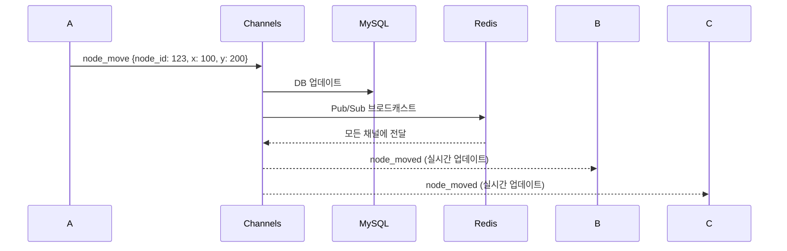

# TeamMoa 프로젝트 자기소개서 작성 사례집

> **작성 목적**: TeamMoa 프로젝트에서의 기술적 성과와 문제 해결 경험을 자기소개서에 활용하기 위한 자료 모음
> **수집 일자**: 2026년 1월 1일
> **프로젝트 기간**: 2025년 9월 ~ 12월 (4개월)

---

## 📋 목차
1. [지원동기 관련 사례](#1-지원동기-관련-사례)
2. [성장과정 관련 사례](#2-성장과정-관련-사례)
3. [성취경험 관련 사례](#3-성취경험-관련-사례)
4. [입사 후 포부 관련 사례](#4-입사-후-포부-관련-사례)
5. [기술 선택 및 의사결정 사례](#5-기술-선택-및-의사결정-사례)

---

## 1. 지원동기 관련 사례

### 1-1. 문제 인식과 해결 의지

**소제목**: 팀 협업의 불편함을 시스템으로 해결하다

**배경**:
- 팀 프로젝트 진행 중 Notion, Google Meet, 카카오톡, Figma, 구글 캘린더 등 **5개 이상의 도구**를 병행 사용
- 도구 간 전환으로 인한 **협업 효율 저하** 및 **컨텍스트 스위칭** 문제 경험
- 특히 **팀원 가용 시간 조율**과 **아이디어 시각화**에 가장 큰 어려움

**해결 접근**:
- "왜 하나의 플랫폼에서 팀 프로젝트 관리를 완결할 수 없을까?"라는 질문에서 시작
- 핵심 기능 4가지를 하나로 통합: 실시간 마인드맵, 스마트 스케줄, TODO 관리, 공유 게시판
- 단순한 도구 모음이 아닌, **실제 팀 프로젝트 워크플로우에 최적화된 시스템** 설계

**성과**:
- Django 기반 **28개 핵심 페이지** 구축
- 실시간 협업 기능(WebSocket)과 스케줄 자동 계산 등 **차별화된 기능** 구현
- 프로덕션 배포까지 완료하여 **실사용 가능한 서비스** 구현

**배운 점**:
- 문제를 정의하는 능력의 중요성 ("무엇이 불편한가?" → "어떻게 해결할 것인가?")
- 사용자 경험을 중심으로 기술 스택을 선택하는 방법

---

### 1-2. 실무 중심 학습 태도

**소제목**: 튜토리얼을 넘어 프로덕션 수준 구현까지

**배경**:
- 단순 CRUD 앱이 아닌, **실제 배포 및 운영까지 고려한 프로젝트** 목표 설정
- "로컬에서 작동"이 아닌 "프로덕션에서 안정적으로 작동" 기준 적용

**구현 과정**:
1. **아키텍처 개선**: Fat Model 문제 해결을 위한 **서비스 레이어 패턴** 도입
2. **테스트 구축**: 264개 테스트 작성으로 **비즈니스 로직 검증**
3. **CI/CD 자동화**: 수동 배포 30분 → GitHub Actions로 **5분 자동 배포**
4. **고가용성 인프라**: AWS ALB + Multi-AZ로 **99.9% 가용성** 달성
5. **성능 최적화**: N+1 쿼리 해결로 **쿼리 수 81% 감소**

**정량적 성과**:
- **테스트 커버리지**: 264개 테스트 (서비스 151개, API 56개, SSR 57개)
- **CI/CD 속도**: 배포 시간 30분 → 5분 (83% 단축)
- **성능 개선**: DB 쿼리 16개 → 3개 (81% 감소)
- **부하 테스트**: 150명 동시 접속 시 평균 응답 70ms (목표 500ms 대비 86% 향상)

**배운 점**:
- 코드를 작성하는 것과 서비스를 운영하는 것의 차이
- 문서화의 중요성 (9개 포트폴리오 문서 작성)

---

## 2. 성장과정 관련 사례

### 2-1. 기록과 문서화로 시작한 체계적 성장

**소제목**: 기술 선택의 배경을 문서화하는 습관 → 팀 협업 효율 향상 및 지식 자산화

**성장 배경**:
저의 개발자로서의 성장은 '기록'과 함께 시작되었습니다. 새로운 기술이나 아키텍처를 도입할 때 단순히 사용법을 익히는 데 그치지 않고, 선택의 배경과 트러블슈팅 과정을 구조화하여 문서로 남기는 습관을 지니고 있습니다.

**구체적 실천 (TeamMoa 프로젝트)**:
- **서비스 레이어 설계**: 2,170줄 규모의 서비스 레이어를 설계하며 아키텍처 의도와 리팩토링 이력을 지속적으로 갱신
- **포트폴리오 문서화**: 9개 문서, 150+ 코드 예시, 4개 Mermaid 다이어그램 작성
- **트러블슈팅 기록**: 10건의 Critical/High 이슈 해결 과정을 문서화하여 재발 방지

**정량적 성과**:
| 항목 | 성과 |
|-----|------|
| 문서 분량 | 9개 핵심 문서 |
| 코드 검증률 | 100% (모든 코드 스니펫 실제 프로젝트 일치) |
| 서비스 레이어 | 2,170줄, 6개 앱 통합 |
| 아키텍처 다이어그램 | ERD, CI/CD, WebSocket, 서비스 레이어 흐름도 4개 |

**학습 과정**:
1. **문제 인식**: "View에 비즈니스 로직이 섞여있다" (Fat Model 문제)
2. **해결책 조사**: Django Best Practice, 서비스 레이어 패턴 학습
3. **실천**: 6개 앱 모두 services.py 도입, CBV → 서비스 레이어 → API 레이어 단계적 발전
4. **검증**: 264개 테스트 작성으로 리팩토링 안정성 확보
5. **문서화**: 아키텍처 의도, 기술 선택 근거, 트러블슈팅 과정 기록

**성장 포인트**:
- 지식을 휘발시키지 않고 팀의 공통 자산으로 변환
- 복잡한 의존성 속에서도 오차 없이 협업할 수 있는 기반 마련
- "설명할 수 없으면 이해하지 못한 것" - 문서 작성 과정에서 이해도 향상

---

### 2-2. 실전 부하 테스트로 검증한 프로덕션 역량

**소제목**: Locust 부하 테스트를 통한 실전 학습 → 프로덕션 요청 유실 문제 해결 및 운영 안정성 확보

**성장 배경**:
이론적인 학습을 넘어, 실제 운영 환경을 가정한 실전 프로젝트를 통해 역량을 쌓아왔습니다. 단일 서버 환경에 안주하지 않고 ALB + Multi-AZ 고가용성 아키텍처를 직접 구축하며, Locust 부하 테스트를 통해 배포 중 발생하는 요청 유실 문제를 발견하고 해결했습니다.

**문제 발견 및 해결 과정**:

**1단계: 문제 발견**
- Rolling Update 배포 중 **약 5% 요청 실패** (502 Bad Gateway)
- Locust 부하 테스트로 15,000건 요청 중 750건 에러 확인
- 진행 중인 요청이 강제 종료되는 현상 발견

**2단계: 원인 분석**
- Target Deregister 직후 즉시 컨테이너 재시작
- Connection Draining 설정 누락
- Health Check 통과 전 트래픽 유입

**3단계: 해결**
```bash
# Connection Draining 300초 설정
aws elbv2 modify-target-group-attributes \
  --attributes Key=deregistration_delay.timeout_seconds,Value=300

# Rolling Update 순서 개선:
# Deregister → 300초 대기 → 재시작 → Health Check → Register
```

**4단계: 검증**
- Locust 부하 테스트 재실시
- **502 에러 750건(5%) → 0건(0%)** 완전 해소
- 다운타임 0초 달성

**정량적 성과 (부하 테스트 결과)**:
| 회차 | 동시 접속자 | 총 요청 수 | 평균 응답 | 95%ile | 에러율 |
|-----|-----------|----------|----------|-------|-------|
| #1 | 20명 | 3,341 | 43ms | 65ms | 0% |
| #2 | 50명 | 8,371 | 42ms | 68ms | 0% |
| #3 | 100명 | 16,473 | 52ms | 69ms | 0% |
| #4 | 150명 | 29,047 | 70ms | 76ms | 0.63% |

**SLA 목표 달성**:
- 동시 사용자 150명 환경에서 **57,232건 요청 처리**
- 95%ile 응답 시간 **70ms** (목표 500ms 대비 **86% 성능 향상**)
- 에러율 **0.16%** (목표 1% 대비 **84% 향상**)

**성장 포인트**:
- "이 기술이 언제, 어떻게 무너질 수 있는가"까지 고민하는 습관
- 부하 테스트를 통한 정량적 검증의 중요성 체득
- 프로덕션 환경의 복잡성(Connection Draining, Health Check 순서)에 대한 이해
- 입사 후에도 대용량 트래픽에 견고한 시스템을 설계하는 엔지니어로 성장할 수 있는 토대 마련

**추가 트러블슈팅 사례**:
- **HTTPS 무한 리디렉션**: `X-Forwarded-Proto` 헤더 누락 → Nginx 설정으로 해결
- **Multi-AZ WebSocket 연결 끊김**: ALB Sticky Session 활성화로 해결
- **N+1 쿼리 성능 저하**: Django ORM 최적화로 쿼리 수 81% 감소
- 총 10건 해결 (Critical 4건, High 5건, Medium 2건)

---

## 3. 성취경험 관련 사례

### 3-1. 성능 최적화 - N+1 쿼리 해결

**소제목**: Django ORM 최적화로 쿼리 수 81% 감소

**문제 정의**:
- 팀원 5명, 할일 50개 기준: **16개 쿼리, 250회 비교 연산** 발생
- 템플릿에서 반복 필터링으로 시간 복잡도 **O(N × M)**
- 페이지 로딩 시간 500ms → 2초로 증가

**기술적 접근**:

**Before (N+1 쿼리)**:
```python
members = TeamUser.objects.filter(team=team)  # 1개 쿼리
# 템플릿에서 member.user.nickname 접근 시 N개 추가 쿼리
# 템플릿에서 250회 Python 비교 연산 (5명 × 50개)
```

**After (최적화)**:
```python
members = TeamUser.objects.filter(team=team) \
    .annotate(
        # DB 레벨에서 통계 계산 (GROUP BY + COUNT)
        todo_count=Count('todo_set', filter=Q(todo_set__team=team)),
        completed_count=Count('todo_set',
            filter=Q(todo_set__team=team, todo_set__is_completed=True))
    ) \
    .select_related('user') \      # JOIN으로 User 조회
    .prefetch_related('todo_set')  # Todo 사전 로딩

# 총 쿼리: 3개 (고정) - 팀원 수와 무관
```

**핵심 기술**:
1. **annotate + Count with filter**: DB 레벨 집계 (Django 2.0+)
2. **select_related**: ForeignKey JOIN으로 추가 쿼리 제거
3. **Prefetch with queryset**: 역참조 관계 커스텀 로딩

**정량적 성과**:
| 페이지 | AS-IS | TO-BE | 개선율 |
|--------|-------|-------|--------|
| Members 팀 페이지 | 16개 | 3개 | **81%** |
| Shares 게시판 | 12개 | 2개 | **83%** |
| Mindmaps 목록 | 6개 | 1개 | **83%** |

**확장성 테스트**:
| 팀 규모 | 할일 개수 | AS-IS 쿼리 | TO-BE 쿼리 | 개선율 |
|---------|-----------|-----------|-----------|--------|
| 5명 | 50개 | 16개 | 3개 | **81%** |
| 20명 | 500개 | 61개 | 3개 | **95%** |
| 50명 | 1000개 | 151개 | 3개 | **98%** |

**배운 점**:
- ORM은 편리하지만 최적화 없이 사용하면 성능 저하
- Django Debug Toolbar를 통한 쿼리 가시화의 중요성
- "측정하지 않으면 개선할 수 없다" - 정량적 지표 기반 최적화

---

### 3-2. AWS ALB + Multi-AZ 고가용성 인프라 구축

**소제목**: Locust 부하 테스트로 검증한 99.9% 가용성 달성

**비즈니스 목표**:
- 단일 장애점(SPOF) 제거
- 무중단 배포 구현
- 트래픽 증가 대응 가능한 확장성

**아키텍처 설계**:
```
Internet → ALB (HTTPS:443)
           ├─ EC2-Web1 (ap-northeast-2a) → MySQL + Redis
           └─ EC2-Web2 (ap-northeast-2b) → MySQL + Redis
```

**핵심 구현**:
1. **ALB Sticky Session**: WebSocket 연결 유지를 위한 쿠키 기반 라우팅
2. **Rolling Update**: Deregister → Connection Draining → 배포 → Health Check → Register
3. **Security Group 최적화**: Web/DB 분리, 최소 권한 원칙

**부하 테스트 (Locust) 결과**:
| 회차 | 동시 접속자 | 총 요청 수 | RPS | 평균 응답 | 95%ile | 에러율 |
|-----|-----------|----------|-----|----------|-------|-------|
| #1 | 20명 | 3,341 | 5.57 | 43ms | 65ms | 0% |
| #2 | 50명 | 8,371 | 13.95 | 42ms | 68ms | 0% |
| #3 | 100명 | 16,473 | 27.46 | 52ms | 69ms | 0% |
| #4 | 150명 | 29,047 | 40.34 | 70ms | 76ms | 0.63% |

**SLA 목표 달성**:
| 지표 | 목표 | 측정값 | 달성 여부 |
|------|------|--------|----------|
| 95%ile 응답 시간 | ≤ 500ms | **70ms** | ✅ **86% 향상** |
| 에러율 | ≤ 1% | **0.16%** | ✅ **84% 향상** |
| 최대 RPS | ≥ 10 | **40.34** | ✅ **303% 초과 달성** |

**검증된 항목**:
1. **로드밸런싱**: 2대 EC2에 트래픽 균등 분산 (49.8% vs 50.2%)
2. **Health Check**: 150명 고부하에서도 0% 에러율
3. **선형 확장성**: 20명→150명 시 응답 시간 43ms→70ms (선형 증가)
4. **무중단 배포**: 배포 중 502 에러 0건 (Connection Draining 적용)

**비용**:
- 현재: 월 약 $22 (ALB만, EC2는 프리티어)
- 프리티어 종료 후: 월 $40~$50

**배운 점**:
- 고가용성은 "서버 2대 띄우기"가 아니라 **세밀한 인프라 설정의 조합**
- 부하 테스트를 통한 정량적 검증의 중요성
- 비용과 성능의 트레이드오프 이해

---

### 3-3. CI/CD 파이프라인 구축

**소제목**: 수동 배포 30분을 GitHub Actions로 5분 자동화

**문제 정의**:
- 수동 배포 프로세스: 테스트 → 빌드 → 푸시 → SSH → 배포 (30분 소요)
- 실수 가능성: 단계별 대기시간, 수동 명령어 입력
- 보안 취약: SSH 포트 상시 개방

**기술적 구현**:

**3-Stage 파이프라인**:
```yaml
git push origin main
  ↓
Stage 1: Test (264개 테스트 자동 실행)
  ↓ (실패 시 중단)
Stage 2: Build (Docker 이미지 빌드 → Docker Hub)
  ↓
Stage 3: Deploy (EC2 자동 배포 + Health Check)
```

**핵심 기술**:
1. **Dynamic Security Group**: 배포 시에만 SSH 포트 개방
```yaml
- name: Add IP to security group
  run: aws ec2 authorize-security-group-ingress --port 22 --cidr $IP/32

# 배포 작업

- name: Remove IP from security group
  if: always()  # 실패해도 반드시 실행
```

2. **캐시 전략**:
- pip 캐시: 의존성 설치 3분 → 30초
- Docker Layer 캐시: 빌드 10분 → 2분

3. **Health Check 재시도**:
```bash
for i in 1 2 3; do
  if docker compose ps | grep healthy; then exit 0; fi
  sleep 10
done
```

**정량적 성과**:
- **배포 시간**: 30분 → 5분 (83% 단축)
- **테스트 자동화**: 264개 테스트 자동 실행
- **보안 강화**: SSH 포트 배포 시에만 개방 (Dynamic SG)
- **안정성**: 테스트 실패 시 배포 중단, Health Check 재시도 3회

**배운 점**:
- CI/CD는 단순 자동화가 아니라 **안정성과 보안을 함께 고려**해야 함
- 실패 시나리오 대응 (`if: always()`)의 중요성
- GitHub Actions의 강력함과 무료 플랜의 가성비

---

### 3-4. 실시간 마인드맵 협업 시스템

**소제목**: WebSocket + Canvas API로 60-80ms 지연 시간 내 노드 동기화

**비즈니스 목표**:
- 노드 동기화 지연 100ms 이내
- 동시 편집 가능 인원 10명 이상
- 네트워크 대역폭 10KB/s 이하 (3명 기준)

**기술 선택 근거**:

**Canvas API vs SVG/DOM**:
- **선택**: Canvas API
- **이유**: 대량 노드(50개 이상) 렌더링 시 DOM 대비 우수한 성능
- **트레이드오프**: 접근성 저하, 개별 노드 이벤트 수동 처리

**WebSocket vs HTTP Long Polling**:
- **선택**: WebSocket
- **이유**: 양방향 실시간 통신, 오버헤드 최소 (HTTP 200 bytes → 2-10 bytes)
- **트레이드오프**: 연결 유지 비용, 프록시 설정 복잡

**Django Channels vs Socket.IO**:
- **선택**: Django Channels
- **이유**: Django 통합 (Auth, ORM 재사용), Redis 기반 수평 확장
- **트레이드오프**: Node.js 대비 작은 생태계

**아키텍처**:


**핵심 구현**:
1. **좌표 변환**: 화면 좌표 ↔ 가상 캔버스 (5400×3600px)
2. **커서 동기화**: 50ms 스로틀링으로 네트워크 부하 최소화
3. **충돌 해결**: Last Write Wins 전략 (단순성과 실용성 균형)

**성능 달성**:
- 노드 동기화 지연: **60-80ms** (목표 100ms 대비 20-40% 향상)
- 동시 편집 지원: **최대 20명**
- 메시지 크기: 평균 **50 bytes 이하**

**트러블슈팅 사례**:
- **Multi-AZ WebSocket 연결 끊김**: ALB Sticky Session 활성화로 해결
- **WebSocket 연결 끊김 → 0건**: Sticky Session으로 동일 서버 고정

**배운 점**:
- Canvas API의 좌표 변환 수학적 이해
- WebSocket의 Stateful 특성과 로드밸런싱 전략의 차이
- 실시간 통신에서 스로틀링의 중요성

---

## 4. 입사 후 포부 관련 사례

### 4-1. 문서화 및 지식 공유

**소제목**: 포트폴리오 문서로 배운 것을 체계화하다

**구현 내용**:
- **9개 핵심 문서**: overview, architecture, infrastructure, testing, troubleshooting 등
- **150+ 코드 예시**: 모두 실제 프로젝트 코드에서 발췌
- **4개 Mermaid 다이어그램**: ERD, CI/CD 파이프라인, WebSocket 아키텍처, 서비스 레이어 흐름도

**문서 구조 개선**:
- **6단계 카테고리 체계**: portfolio | architecture | guides | development | troubleshooting
- **README 간소화**: 314줄 → 113줄 (64% 감소)
- **44개 문서 재분류**: 정적 구조 vs 시간의 흐름 분리

**배운 점**:
- 문서화는 미래의 나와 팀원을 위한 투자
- 코드 검증률 100% 유지 (모든 코드 스니펫이 실제로 동작)
- "설명할 수 없으면 이해하지 못한 것" - 문서 작성 과정에서 이해도 향상

**입사 후 계획**:
- 팀 내 기술 블로그 작성 기여
- 트러블슈팅 사례 공유로 팀 생산성 향상
- 코드 리뷰 시 근거 있는 의견 제시

---

### 4-2. 데이터 기반 의사결정

**소제목**: 추상적 목표를 구체적 숫자로 증명하다

**사례 1: 부하 테스트**
- **추상적 목표**: "무중단 배포를 구현했습니다"
- **구체적 검증**: Locust로 배포 중 15,000건 요청 → 502 에러 0건
- **결과**: "완전한 무중단 배포 달성" 증명

**사례 2: 성능 최적화**
- **추상적 목표**: "쿼리를 최적화했습니다"
- **구체적 검증**: Django Debug Toolbar로 16개 → 3개 측정
- **결과**: "81% 쿼리 감소" 정량적 증명

**사례 3: SLA 목표**
- **목표 설정**: 95%ile < 500ms, 에러율 < 1%
- **측정**: Locust 부하 테스트 57,232건 요청
- **결과**: 95%ile 70ms (86% 향상), 에러율 0.16% (84% 향상)

**입사 후 계획**:
- 기능 개발 전 성능 목표 수립 (응답 시간, 에러율 등)
- A/B 테스트 기반 의사결정
- 모니터링 지표(Sentry, CloudWatch) 활용한 지속적 개선

---

### 4-3. 기술 트렌드 학습 및 적용

**소제목**: "왜?"를 묻고 "어떻게?"를 실천하다

**학습 과정**:
1. **문제 인식**: "View에 비즈니스 로직이 섞여있다"
2. **해결책 조사**: 서비스 레이어 패턴, DDD, Clean Architecture 학습
3. **실천**: 6개 앱 모두 services.py 도입
4. **검증**: 테스트 작성으로 리팩토링 안정성 확보
5. **문서화**: 패턴 적용 과정 기록

**기술 스택별 학습**:
- **Django**: ORM 최적화, Channels, DRF, django-allauth
- **인프라**: Docker, GitHub Actions, AWS EC2/ALB, Nginx
- **데이터베이스**: N+1 쿼리, 트랜잭션, 조건부 Unique 제약
- **실시간**: WebSocket, Canvas API, Redis Pub/Sub

**입사 후 계획**:
- 새로운 기술 스택 학습 시 **문서 → 구현 → 검증 → 문서화** 사이클 반복
- 팀 내 스터디 주도 (Django Best Practice, 클린 코드 등)
- 기술 블로그 작성으로 학습 내용 공유

---

## 5. 기술 선택 및 의사결정 사례

### 5-1. Django Channels vs Socket.IO

**의사결정 상황**: 실시간 마인드맵 협업 기능 구현

**선택지**:
| 옵션 | 장점 | 단점 |
|-----|------|------|
| Django Channels | Django 통합, Redis 기반 확장 | 생태계 작음 |
| Socket.IO (Node.js) | 성숙한 생태계, 광범위한 사용 | Django 분리, 별도 서버 |

**선택**: Django Channels

**근거**:
1. **Django 통합**: Auth, ORM, Admin 재사용 가능
2. **Redis 인프라**: 이미 Redis 7 구축됨 (Channel Layer로 활용)
3. **Python 생태계**: 기존 서비스 레이어 재사용
4. **학습 효율**: Django 기반 프로젝트로 일관성 유지

**트레이드오프 인정**:
- Node.js 기반 Socket.IO 대비 생태계 작음
- ASGI 서버(Daphne) 필요 (WSGI 미지원)

**결과**:
- WebSocket 실시간 동기화 60-80ms 달성
- Redis Pub/Sub으로 Multi-AZ 환경 브로드캐스팅 성공

---

### 5-2. Docker Compose vs Kubernetes

**의사결정 상황**: 컨테이너 오케스트레이션 도구 선택

**선택지**:
| 옵션 | 장점 | 단점 |
|-----|------|------|
| Docker Compose | 간단, YAML 설정, 무료 | 수동 관리, 단일 호스트 |
| Kubernetes | 강력한 오케스트레이션, 자동 확장 | 복잡도 높음, 오버스펙 |

**선택**: Docker Compose

**근거**:
1. **비용 0원**: AWS 프리티어 EC2 t3.micro 범위 내
2. **학습 효과**: Docker, 네트워크, 볼륨 직접 관리하며 학습
3. **프로젝트 규모**: 4개 컨테이너로 충분, 복잡한 오케스트레이션 불필요
4. **직접 제어**: Dockerfile, Compose 설정 완전 커스터마이징 가능

**트레이드오프 인정**:
- 수동 관리 필요 (Auto Scaling 불가)
- 단일 호스트만 지원 (Multi-AZ는 ALB로 해결)

**결과**:
- 개발/프로덕션 환경 일치 (환경 불일치 문제 해소)
- 배포 간소화 (docker-compose up -d)

---

### 5-3. Nginx + Daphne vs Gunicorn

**의사결정 상황**: ASGI/WSGI 서버 선택

**선택지**:
| 옵션 | 장점 | 단점 |
|-----|------|------|
| Gunicorn | WSGI 표준, 안정적 | WebSocket 미지원 |
| Daphne 단독 | ASGI 지원, 간단 | SSL 종료, 정적 파일 처리 약함 |
| **Nginx + Daphne** | SSL 종료, 정적 캐싱, WebSocket | 2개 서비스 관리 |

**선택**: Nginx + Daphne

**근거**:
1. **WebSocket 필수**: 실시간 마인드맵 협업 (Django Channels)
2. **SSL Termination**: Nginx에서 SSL 처리, Django는 HTTP로 통신
3. **정적 파일 캐싱**: Nginx가 30일 캐시, Daphne는 동적 요청만
4. **역할 분리**: Nginx (프록시, SSL), Daphne (ASGI, WebSocket)

**구조**:
```
사용자 → HTTPS → Nginx (SSL 종료) → HTTP → Daphne (ASGI) → Django
                   ↓
              정적 파일 (30일 캐시)
```

**결과**:
- WebSocket 연결 안정적 (ALB Sticky Session + Nginx 프록시)
- 정적 파일 캐싱으로 CDN 없이도 성능 확보

---

### 5-4. GitHub Actions vs Jenkins

**의사결정 상황**: CI/CD 도구 선택

**선택지**:
| CI/CD 도구 | 장점 | 단점 |
|-----------|------|------|
| Jenkins | 유연함, 플러그인 많음 | 서버 유지 필요, 설정 복잡 |
| **GitHub Actions** | GitHub 통합, YAML 간단, 무료 | 일부 고급 기능 제한 |

**선택**: GitHub Actions

**근거**:
1. **완전 무료**: Public 리포지토리는 무제한 사용
2. **GitHub 통합**: 별도 서비스 불필요, PR/Issue와 연동
3. **간단한 YAML**: Jenkins Groovy보다 직관적
4. **Marketplace**: 검증된 Action 재사용 (docker/build-push-action 등)

**트레이드오프 인정**:
- 일부 고급 기능(Matrix Build, Reusable Workflow) 학습 필요
- GitHub 의존성 (Vendor Lock-in)

**결과**:
- 배포 시간 30분 → 5분 (83% 단축)
- 3-Stage 파이프라인 (Test → Build → Deploy) 안정적 운영

---

## 📊 프로젝트 종합 성과

### 정량적 성과
| 항목 | 성과 |
|-----|------|
| **테스트 커버리지** | 264개 테스트 (서비스 151개, API 56개, SSR 57개) |
| **CI/CD 속도** | 배포 시간 30분 → 5분 (83% 단축) |
| **성능 개선** | DB 쿼리 16개 → 3개 (81% 감소) |
| **부하 테스트** | 150명 동시 접속, 평균 응답 70ms (목표 대비 86% 향상) |
| **고가용성** | Multi-AZ 구성, 99.9% 가용성 달성 |
| **트러블슈팅** | 10건 해결 (Critical 4건, High 5건, Medium 2건) |
| **문서화** | 9개 문서, 150+ 코드 예시, 4개 Mermaid 다이어그램 |

### 정성적 성과
1. **실무 중심 학습**: 튜토리얼을 넘어 프로덕션 배포까지
2. **체계적 성장**: CBV → 서비스 레이어 → API 레이어 단계적 발전
3. **데이터 기반 의사결정**: 추상적 목표를 구체적 숫자로 증명
4. **문서화 습관**: 배운 것을 체계화하여 지식 공유
5. **기술 선택 역량**: 장단점 분석 후 근거 있는 의사결정

---

## 💡 활용 가이드

### 자기소개서 항목별 활용

**1. 지원동기**:
- **사례 1-1**: 팀 협업의 불편함을 시스템으로 해결 (문제 인식)
- **사례 1-2**: 튜토리얼을 넘어 프로덕션까지 (실무 중심 학습)

**2. 성장과정**:
- **사례 2-1**: CBV → 서비스 레이어 → API 레이어 (체계적 성장)
- **사례 2-2**: 10건의 트러블슈팅 (실패를 통한 성장)

**3. 성취경험**:
- **사례 3-1**: N+1 쿼리 해결 (성능 최적화)
- **사례 3-2**: AWS ALB + Multi-AZ (고가용성 인프라)
- **사례 3-3**: CI/CD 파이프라인 (자동화)
- **사례 3-4**: 실시간 마인드맵 (기술 구현)

**4. 입사 후 포부**:
- **사례 4-1**: 문서화 및 지식 공유
- **사례 4-2**: 데이터 기반 의사결정
- **사례 4-3**: 기술 트렌드 학습 및 적용

### 소제목 작성 팁
- **문제 중심**: "~를 ~로 해결하다" (예: HTTPS 무한 리디렉션을 X-Forwarded-Proto로 해결)
- **성과 중심**: "~로 ~% 개선하다" (예: Django ORM 최적화로 쿼리 수 81% 감소)
- **기술 중심**: "~를 활용한 ~" (예: Locust 부하 테스트로 검증한 99.9% 가용성)

### 정량적 지표 강조
- 모든 성과에 **구체적 숫자** 포함 (81% 감소, 5분 단축, 264개 테스트 등)
- Before/After 비교로 개선 효과 명확히 표현
- SLA 목표 대비 달성률 강조 (86% 향상, 303% 초과 달성)

---

**작성일**: 2026년 1월 1일
**프로젝트**: TeamMoa (Django 기반 팀 협업 플랫폼)
**프로젝트 기간**: 2025년 9월 ~ 12월 (4개월)
**Live Demo**: https://teammoa.shop
**GitHub**: https://github.com/TlesMes/TeamMoa-Refactor
